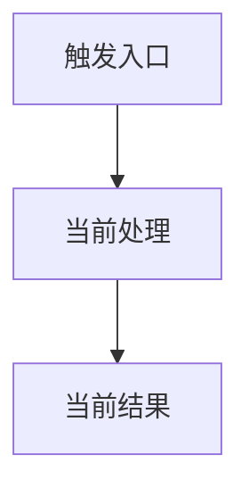
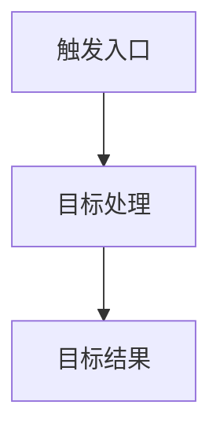

# 代码变更方案：<变更名称>

> 本文档由 `code-change-plan` 生成。
> 当前状态：`WAITING_FOR_APPROVAL`  
> 本文档既是人工评审方案，也是审批后 Codex 的直接执行依据。

## 1. 基本信息与仓库基线

| 字段 | 内容 |
|---|---|
| Plan ID | `<plan-id>` |
| 需求名称 | |
| 仓库根目录 | |
| 当前分支 | |
| 基线 HEAD | |
| 生成时间 | |
| 生效的 AGENTS.md | |
| 分析范围 | |
| 当前状态 | `WAITING_FOR_APPROVAL` |

### 1.1 当前工作区状态

| 类型 | 文件 | 说明 | 是否属于本次变更 |
|---|---|---|---|
| Modified | | | |
| Untracked | | | |

### 1.2 项目验证命令基线

| 类型 | 命令 | 来源 | 可用性 |
|---|---|---|---|
| 格式化 | | | |
| Lint | | | |
| 类型检查 | | | |
| 单元测试 | | | |
| 集成测试 | | | |
| 构建 | | | |
| 代码生成 | | | |

## 2. 需求分析

### 2.1 业务目标

### 2.2 用户可见结果

### 2.3 功能需求

| ID | 需求 | 优先级 | 来源 |
|---|---|---|---|
| REQ-01 | | MUST | 用户需求 |

### 2.4 非功能需求

| ID | 类型 | 要求 | 验证方式 |
|---|---|---|---|
| NFR-01 | 性能/安全/稳定性/兼容性 | | |

### 2.5 非目标

- 

## 3. 假设、约束与待决策项

### 3.1 假设

| ID | 假设 | 依据 | 错误时的影响 |
|---|---|---|---|
| ASM-01 | | | |

### 3.2 约束

| ID | 约束 | 影响 |
|---|---|---|
| CON-01 | | |

### 3.3 待决策项

| ID | 问题 | 可选方案 | 推荐方案 | 不决策的影响 | 决策人 |
|---|---|---|---|---|---|
| DEC-01 | | | | | |

## 4. 验收标准

| ID | 关联需求 | 场景 | 输入/前置条件 | 期望结果 | 验证项 |
|---|---|---|---|---|---|
| AC-01 | REQ-01 | | | | V-01 |

## 5. 当前实现分析

### 5.1 相关模块和职责

| 模块 | 路径 | 当前职责 | 与本次变更的关系 |
|---|---|---|---|
| | | | |

### 5.2 关键入口、调用方和实现

| 类型 | 文件/符号 | 当前行为 | 证据 |
|---|---|---|---|
| 入口 | | | |
| 调用方 | | | |
| 实现 | | | |
| 外部依赖 | | | |

### 5.3 数据、配置、脚本和文档现状

| 类型 | 对象 | 路径/名称 | 当前用途 |
|---|---|---|---|
| 数据 | | | |
| 配置 | | | |
| 脚本 | | | |
| 测试 | | | |
| 文档 | | | |
| 监控 | | | |

## 6. 当前流程

### 6.1 当前功能流程



### 6.2 当前调用链

### 6.3 当前数据流

### 6.4 当前配置流

### 6.5 当前异常、兼容和回退路径

## 7. 差距分析

| ID | 当前状态 | 目标状态 | 差距类型 | 影响 |
|---|---|---|---|---|
| GAP-01 | | | 缺失能力/错误行为/重复实现/配置不一致/测试缺失/文档过时 | |

## 8. 目标方案

### 8.1 方案概述

### 8.2 关键设计决策

| ID | 决策 | 原因 | 被否方案 | 影响 |
|---|---|---|---|---|
| DD-01 | | | | |

### 8.3 接口与数据结构调整

### 8.4 配置调整

### 8.5 异常处理与降级

### 8.6 兼容和迁移策略

### 8.7 日志、指标和告警调整

## 9. 目标流程

### 9.1 目标功能流程



### 9.2 目标调用链

### 9.3 目标数据流

### 9.4 目标配置流

### 9.5 目标异常、兼容和回退路径

## 10. 修改前后对比

| 维度 | 修改前 | 修改后 | 兼容性影响 |
|---|---|---|---|
| 用户入口 | | | |
| 核心流程 | | | |
| 调用链 | | | |
| 数据流 | | | |
| 接口/消息 | | | |
| 配置 | | | |
| 数据存储 | | | |
| 脚本 | | | |
| 测试 | | | |
| 监控 | | | |
| 文档 | | | |
| 运维 | | | |

## 11. 修改单元

### CU-01：<修改单元名称>

| 字段 | 内容 |
|---|---|
| 目标 | |
| 关联需求 | REQ-01 |
| 关联验收标准 | AC-01 |
| 前置依赖 | |
| 涉及文件 | |
| 涉及符号 | |
| 影响的旧逻辑 | LR-01 |
| 完成条件 | |
| 局部验证 | V-01 |

#### 修改内容

1. 
2. 
3. 

#### 不修改的内容

- 

## 12. 全项目影响矩阵

| ID | 影响项 | 文件/位置 | 类型 | 优先级 | 关联 CU |
|----|--------|----------|------|--------|---------|
| IMP-01 | | | | MUST_CHANGE | CU-01 |

## 13. 旧逻辑退役矩阵

| ID | 关联 CU | 文件路径 | 符号 | 退役动作 | 验证项 | 状态 |
|----|--------|---------|------|---------|--------|------|
| LR-01 | CU-01 | | | 删除/替换/迁移/限期兼容 | V-xx | PLANNED |

## 14. 文件变更清单

| 文件路径 | 动作 | 关联 CU | 说明 | 禁止事项 |
|---------|------|--------|------|---------|
| | 修改 | CU-01 | | |

## 15. 实施顺序

| 步骤 | 文件 | 动作 | 前置条件 | 完成标准 |
|------|------|------|---------|---------|
| 1 | | 修改 | | |

## 16. 测试与验证方案

| ID | 层级 | 必需 | 类型 | 命令 | 覆盖项 | 期望结果 |
|----|------|------|------|------|--------|---------|
| V-01 | targeted | 是 | command | | CU-01 | |

## 17. 需求—修改—验证追踪矩阵

### REQ → AC → CU 追踪

| REQ | AC | CU | 文件 |
|-----|-----|-----|------|
| REQ-01 | AC-01 | CU-01 | |

### LR → CU → V 追踪

| LR | CU | 文件 | V |
|----|-----|------|---|
| LR-01 | CU-01 | | V-xx |

## 18. 发布与回滚方案

### 18.1 发布前置条件

### 18.2 发布顺序

### 18.3 灰度和监控

### 18.4 停止发布条件

### 18.5 回滚触发条件

### 18.6 回滚步骤

### 18.7 数据恢复或补偿

## 19. 风险

| ID | 风险 | 等级 | 触发条件 | 影响 | 缓解措施 | 验证项 |
|----|------|------|---------|------|---------|--------|
| RISK-01 | | HIGH/MEDIUM/LOW | | | | |

## 20. 执行契约

审批后，执行 Codex 必须遵守：

1. 完整阅读本文档后再修改代码
2. 执行前核对审批状态、分支、HEAD 和工作区基线
3. 严格按照实施顺序执行
4. 只修改文件变更清单中的文件
5. 严格完成旧逻辑退役矩阵
6. 不得保留未经批准的新旧双逻辑
7. 每个修改单元完成后运行对应局部验证
8. 完成后运行全部标记为必需的验证项
9. 发现计划外影响或新的设计决策时立即停止
10. 默认不执行 `git add`、`git commit`、`git push`、破坏性 reset 或历史重写
11. 最终输出修改文件、删除或迁移的旧资产、验证结果、未执行项、方案偏差和残余风险

### 20.1 必须停止并申请修订的情况

出现以下任意情况，状态标记为 `PLAN_AMENDMENT_REQUIRED`：

- 必须修改文件清单之外的文件
- 新发现接口、Schema、配置或数据迁移变化
- 发现退役矩阵遗漏的旧资产
- 方案中的指令互相冲突
- 测试证明方案定义的业务行为不正确
- 安全、权限、兼容或性能假设失效
- 当前分支、HEAD 或工作区基线已漂移

### 20.2 禁止事项

- 不得自行扩大需求范围
- 不得自行改变已经批准的业务决策
- 不得保留无明确用途的旧代码
- 不得新增未经批准的临时兼容层
- 不得通过跳过测试来声明完成
- 不得将"命令未运行"视为"验证通过"

## 21. 完成条件与状态

### VERIFIED
只有同时满足以下条件才能使用：
- 所有批准的修改单元已完成
- 所有必需验证已通过
- 所有旧逻辑退役项已关闭
- 没有计划外文件修改
- 最终 Diff 审核通过

### IMPLEMENTED_NOT_FULLY_VERIFIED
代码修改完成，但存在无法运行的必需验证。必须列出未运行项和原因，不得声明完全验证。

### BLOCKED
由于技术错误、环境问题或外部依赖无法继续实施或验证。

### PLAN_AMENDMENT_REQUIRED
原方案存在遗漏或必须改变。

## 22. 审批记录

| 字段 | 内容 |
|---|---|
| 审批状态 | `WAITING_FOR_APPROVAL` |
| 审批范围 | |
| 审批人 | |
| 审批时间 | |
| 审批意见 | |
| 方案修订版本 | V1 |

允许状态：

```text
WAITING_FOR_APPROVAL
APPROVED
APPROVED_WITH_CHANGES
REJECTED
SUPERSEDED
```

## 23. 直接执行提示词

审批完成后，在新的 Codex 会话中使用：

```text
读取并严格执行以下已批准的代码变更方案：

<本方案文件路径>

要求：
1. 先核对方案审批状态、当前分支、HEAD 和工作区基线
2. 严格按照修改单元、文件变更清单和实施顺序执行
3. 完整处理旧逻辑退役矩阵，不得出现未经批准的新旧逻辑双活
4. 每个修改单元完成后执行局部验证
5. 完成后运行全部必需验证和最终 Diff 审核
6. 发现计划外影响立即停止并标记 PLAN_AMENDMENT_REQUIRED
7. 不执行 git add、git commit 或 git push
8. 最后报告实际修改、旧逻辑清理、验证结果、未执行项、方案偏差和残余风险
```