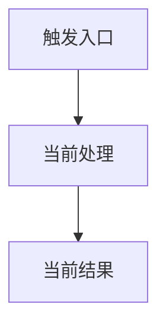
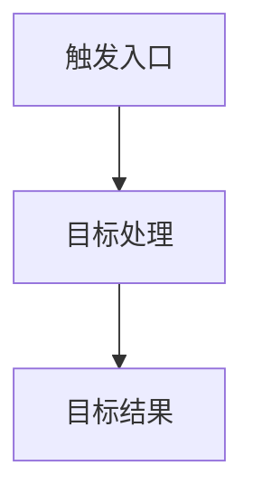

# 代码变更方案：<变更名称>

> 本文档由 `code-change-plan` 生成。
> 当前状态：`WAITING_FOR_APPROVAL`
> 本文档既是人工评审方案，也是审批后 Codex 的直接执行依据。

## 1. 基本信息与需求分析

### 1.1 基本信息

| 字段 | 内容 |
|---|---|
| Plan ID | `<plan-id>` |
| 需求名称 | |
| 仓库根目录 | |
| 当前分支 | |
| 基线 HEAD | |
| 生成时间 | |
| 生效的 AGENTS.md | |
| 分析范围 | |
| 当前状态 | `WAITING_FOR_APPROVAL` |

#### 工作区状态

| 类型 | 文件 | 说明 | 是否属于本次变更 |
|---|---|---|---|
| Modified | | | |
| Untracked | | | |

#### 项目验证命令基线

| 类型 | 命令 | 来源 | 可用性 |
|---|---|---|---|
| 构建 | | | |
| 格式化 | | | |
| Lint | | | |
| 单元测试 | | | |
| 集成测试 | | | |

### 1.2 业务目标

1. 
2. 
3. 

### 1.3 功能需求

| ID | 需求 | 优先级 | 来源 |
|---|---|---|---|
| REQ-01 | | MUST | 用户需求 |

### 1.4 验收标准

| ID | 关联需求 | 场景 | 输入 / 前置条件 | 期望结果 | 验证项 |
|---|---|---|---|---|---|
| AC-01 | REQ-01 | | | | V-01 |

### 1.5 待决策项

| ID | 问题 | 可选方案 | 推荐方案 | 不决策的影响 | 决策人 |
|---|---|---|---|---|---|
| DEC-01 | | | | | |

### 1.6 非目标

- 

## 2. 当前实现与差距

### 2.1 相关模块与职责

| 模块 | 路径 | 当前职责 | 与本次变更的关系 |
|---|---|---|---|
| | | | |

### 2.2 关键代码位置

| 类型 | 文件 / 符号 | 当前行为 | 证据 |
|---|---|---|---|
| 入口 | | | |
| 调用方 | | | |
| 实现 | | | |
| 外部依赖 | | | |

### 2.3 当前功能流程

涉及两个及以上模块或流程分支时绘制 Mermaid 图；单文件改动写“略”。



### 2.4 差距分析

| ID | 当前状态 | 目标状态 | 差距类型 | 影响 |
|---|---|---|---|---|
| GAP-01 | | | 缺失能力 / 错误行为 / 重复实现 / 配置不一致 / 测试缺失 / 文档过时 | |

## 3. 目标方案与对比

### 3.1 方案概述


### 3.2 关键设计决策

| ID | 决策 | 原因 | 被否方案 | 影响 |
|---|---|---|---|---|
| DD-01 | | | | |

### 3.3 接口 / 配置 / 数据调整

| 类型 | 项 | 当前 | 目标 | 兼容性 |
|---|---|---|---|---|
| 接口 | | | | |
| 配置 | | | | |
| 数据 | | | | |

### 3.4 目标功能流程

涉及两个及以上模块或流程分支时绘制 Mermaid 图；单文件改动写“略”。



### 3.5 修改前后对比

| 维度 | 修改前 | 修改后 | 兼容性影响 |
|---|---|---|---|
| 核心流程 | | | |
| 调用链 | | | |
| 数据流 | | | |
| 配置 | | | |
| 接口 / 消息 | | | |
| 脚本 | | | |
| 测试 | | | |
| 文档 | | | |
| 监控 | | | |

## 4. 影响范围与文件清单

### 4.1 修改单元

| ID | 目标 | 关联需求 | 关联 AC | 涉及文件 | 影响的旧逻辑 | 局部验证 |
|---|---|---|---|---|---|---|
| CU-01 | | REQ-01 | AC-01 | | LR-01 | V-01 |

#### CU-01 修改内容

1. 
2. 

### 4.2 全项目影响矩阵

| ID | 影响项 | 文件 / 位置 | 优先级 | 关联 CU |
|---|---|---|---|---|
| IMP-01 | | | MUST_CHANGE / SHOULD_CHANGE | CU-01 |

### 4.3 旧逻辑退役矩阵

| ID | 关联 CU | 文件路径 | 符号 | 退役动作 | 验证项 | 状态 |
|---|---|---|---|---|---|---|
| LR-01 | CU-01 | | | 删除 / 替换 / 迁移 / 限期兼容 | V-xx | PLANNED |

### 4.4 文件变更清单

| 文件路径 | 动作 | 关联 CU | 说明 | 禁止事项 |
|---|---|---|---|---|
| | 修改 / 新增 / 删除 / 重命名 | CU-01 | | |

## 5. 实施顺序

| 步骤 | 文件 | 动作 | 前置条件 | 完成标准 |
|---|---|---|---|---|
| 1 | | 修改 | | |

## 6. 测试、验证与完成

### 6.1 验证方案

| ID | 层级 | 必需 | 命令 | 覆盖项 | 期望结果 |
|---|---|---|---|---|---|
| V-01 | 单元 / 集成 / 手动 | 是 | | CU-01 | |

### 6.2 追踪矩阵

#### REQ -> AC -> CU -> V

| REQ | AC | CU | 文件 | V |
|---|---|---|---|---|
| REQ-01 | AC-01 | CU-01 | | V-01 |

#### LR -> CU -> V

| LR | CU | 文件 | V |
|---|---|---|---|
| LR-01 | CU-01 | | V-xx |

### 6.3 发布与回滚

**发布前置条件**：

**回滚触发条件**：

**回滚步骤**：

### 6.4 完成条件

- **VERIFIED**：所有 CU 完成 + 所有必需验证通过 + 旧逻辑全部退役 + 无计划外修改
- **IMPLEMENTED_NOT_FULLY_VERIFIED**：代码完成但无法运行部分验证（需列出原因）
- **BLOCKED**：技术错误 / 环境问题 / 外部依赖阻塞
- **PLAN_AMENDMENT_REQUIRED**：方案不完整或必须调整

## 7. 执行契约与审批

### 7.1 执行规则

审批后，执行 Codex 必须遵守：

1. 完整阅读本文档后再修改代码
2. 执行前核对审批状态、分支、HEAD 和工作区基线
3. 严格按照实施顺序执行
4. 只修改文件变更清单中的文件
5. 严格完成旧逻辑退役矩阵
6. 不得保留未经批准的新旧双逻辑
7. 每个修改单元完成后运行对应局部验证
8. 完成后运行全部标记为必需的验证项
9. 发现计划外影响或新的设计决策时立即停止
10. 默认不执行 `git add`、`git commit`、`git push`、破坏性 reset 或历史重写
11. 最终输出修改文件、删除或迁移的旧资产、验证结果、未执行项、方案偏差和残余风险
12. Windows 环境下文件编辑统一使用 Python 临时脚本，显式指定 encoding：
    - Go 源文件 -> `encoding="utf-8"`
    - Markdown 文档 -> 先读前 3 字节判断 BOM（`\xef\xbb\xbf`），写时保持一致
    - 不得使用 PowerShell `Set-Content` / `Out-File` 直接覆写源文件
    - 不得使用 `[System.IO.File]::WriteAllLines` 修改 Go 源文件
13. `apply_patch` 工具不可用时，降级为 Python 临时脚本（写入临时 `.py` -> 执行 -> 删除），不得因工具不可用而跳过修改单元

### 7.2 停止条件与禁止事项

#### 必须停止并标记 PLAN_AMENDMENT_REQUIRED

- 必须修改文件清单之外的文件
- 新发现接口、Schema、配置或数据迁移变化
- 发现退役矩阵遗漏的旧资产
- 方案中的指令互相冲突
- 测试证明方案定义的业务行为不正确
- 安全、权限、兼容或性能假设失效
- 当前分支、HEAD 或工作区基线已漂移

#### 禁止事项

- 不得自行扩大需求范围
- 不得自行改变已经批准的业务决策
- 不得保留无明确用途的旧代码
- 不得新增未经批准的临时兼容层
- 不得通过跳过测试来声明完成
- 不得将“命令未运行”视为“验证通过”

### 7.3 风险

| ID | 风险 | 等级 | 触发条件 | 影响 | 缓解措施 |
|---|---|---|---|---|---|
| RISK-01 | | HIGH / MEDIUM / LOW | | | |

### 7.4 审批记录

| 字段 | 内容 |
|---|---|
| 审批状态 | `WAITING_FOR_APPROVAL` |
| 审批范围 | |
| 审批人 | |
| 审批时间 | |
| 审批意见 | |
| 方案修订版本 | V1 |

允许状态：

```text
WAITING_FOR_APPROVAL
APPROVED
APPROVED_WITH_CHANGES
REJECTED
SUPERSEDED
```

### 7.5 执行提示词

审批完成后，在新 Codex 会话中使用：

```text
读取并严格执行以下已批准的代码变更方案：

.codex/change-plans/<plan-id>.md

要求：
1. 先核对方案审批状态、当前分支、HEAD 和工作区基线
2. 严格按照修改单元、文件变更清单和实施顺序执行
3. 完整处理旧逻辑退役矩阵，不得出现新旧逻辑双活
4. 每个修改单元完成后执行局部验证
5. 完成后运行全部必需验证和最终 Diff 审核
6. 发现计划外影响立即停止并标记 PLAN_AMENDMENT_REQUIRED
7. 不执行 git add、git commit 或 git push
8. 最后报告实际修改、旧逻辑清理、验证结果、未执行项、方案偏差和残余风险
```
