# Mermaid Gen Skill

根据用户的描述生成对应的 Mermaid 图表代码。

## 支持的图表类型

### 1. Flowchart (流程图)

**语法**：
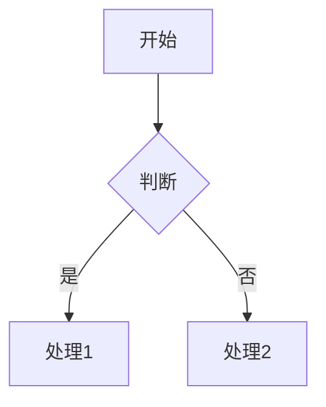

**方向**：
- `TD` - 从上到下 (默认)
- `LR` - 从左到右
- `RL` - 从右到左
- `BT` - 从下到上

**节点形状**：
- `[矩形]` - 默认节点
- `[/圆角矩形/]` - 圆角矩形
- `((圆形))` - 圆形
- `{菱形}` - 判断/决策
- `[/平行四边形/]` - 输入/输出
- `[[子程序]]` - 子程序

**连接线**：
- `A --> B` - 实线箭头
- `A --- B` - 无箭头实线
- `A -.-> B` - 虚线箭头
- `A ==>` - 粗实线箭头
- `A -- 标签 --> B` - 带标签的线

### 2. Sequence Diagram (时序图)

**语法**：
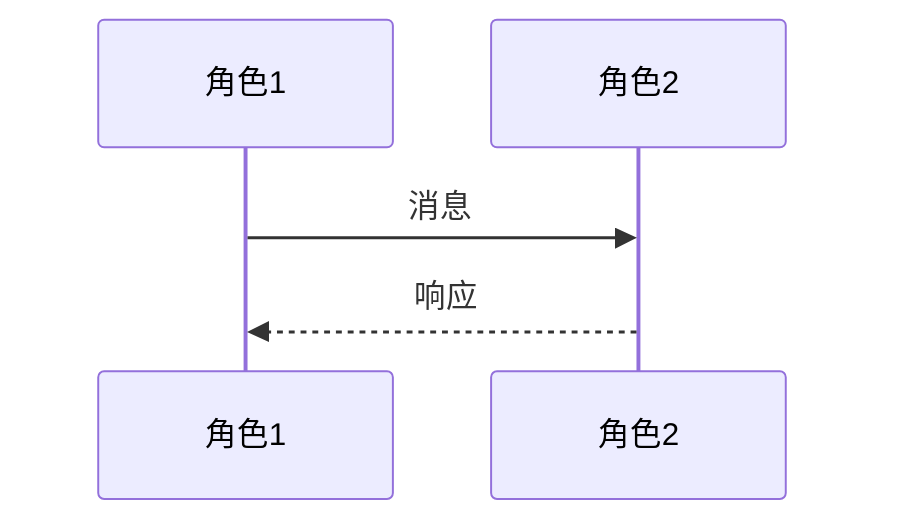

**箭头类型**：
- `->>` - 实线实心箭头（调用/发送）
- `-->>` - 虚线实心箭头（返回/响应）
- `->` - 实线无填充箭头
- `-->` - 虚线无填充箭头
- `-x` - 叉尾箭头（表示失败/丢失）
- `-)` - 异步箭头

**激活区间**：
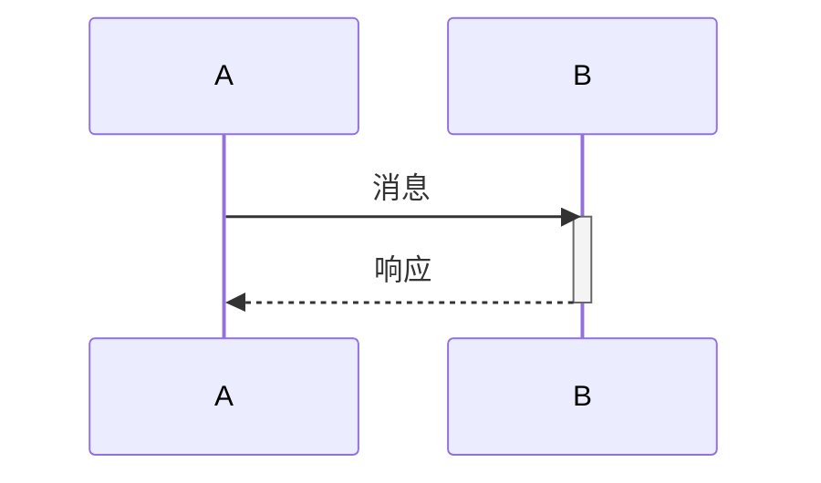

### 3. Class Diagram (类图)

**语法**：
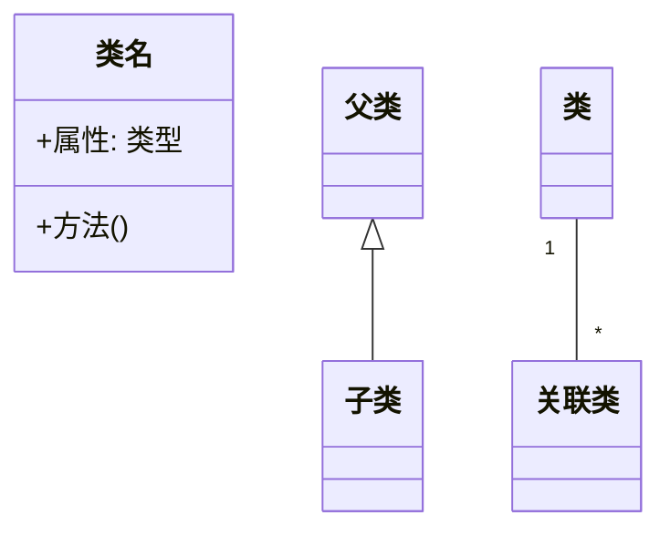

**关系类型**：
- `<|--` - 继承
- `*--` - 组合
- `o--` - 聚合
- `<--` - 关联
- `<--` - 依赖

**可见性**：
- `+` - public
- `-` - private
- `#` - protected
- `~` - package

### 4. ER Diagram (ER图)

**语法**：
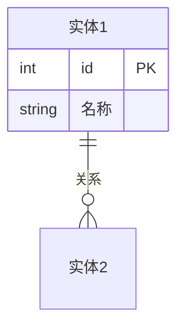

**基数符号**（关系中可组合使用，如 `||--o{` 表示左恰好一、右零或多）：
- `||` - 恰好一个
- `|o` - 零或一个
- `}o` - 零或多个
- `}|` - 一个或多个

### 5. State Diagram (状态图)

**语法**：
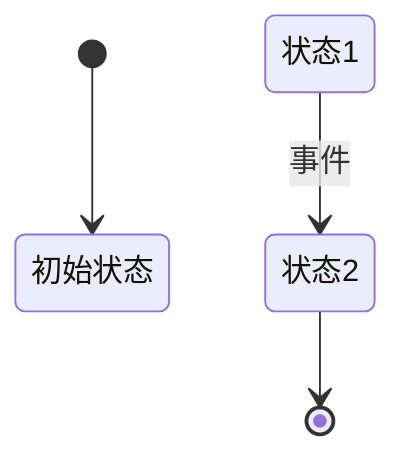

### 6. Gantt Chart (甘特图)

**语法**：
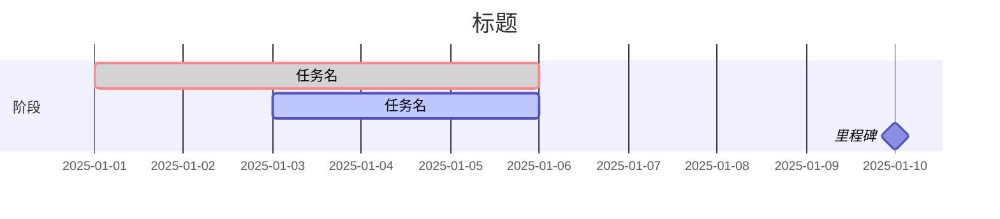

**任务状态**：
- `crit` - 关键任务
- `done` - 已完成
- `active` - 进行中
- `milestone` - 里程碑

### 7. Journey (用户旅程图)

**语法**：
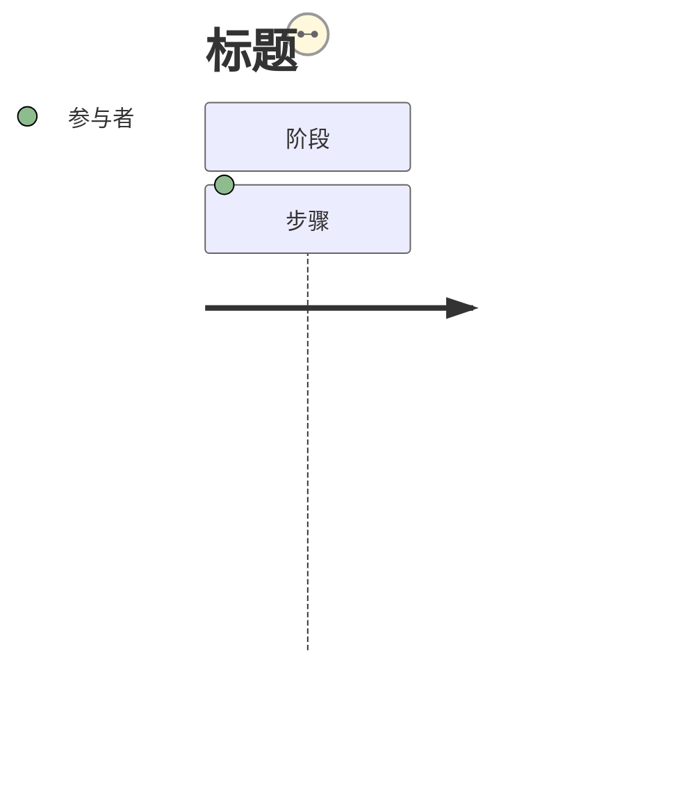

**满意度**：
- 1-5 (5 最满意)

### 8. Git Graph (Git图)

**语法**：


### 9. Pie Chart (饼图)

**语法**：
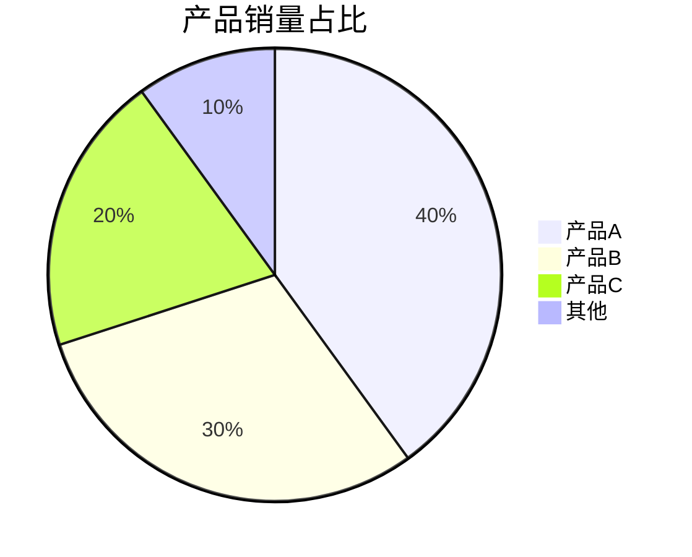

**要点**：
- 数值自动计算百分比
- 支持带引号的标签
- 最多建议 6-8 个分类，过多影响可读性

### 10. Mindmap (思维导图)

**语法**：
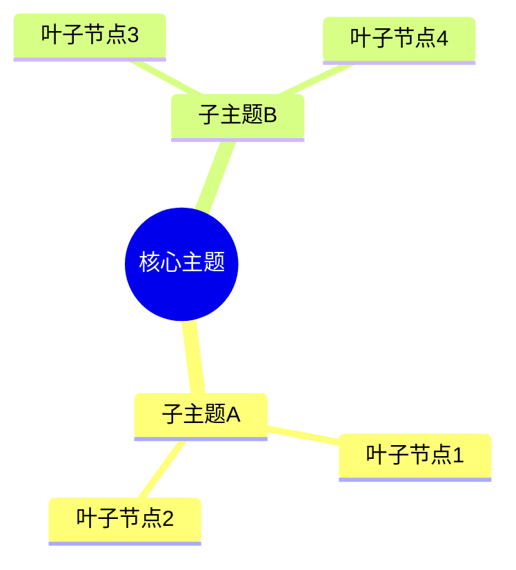

**要点**：
- 使用缩进表示层级（2/4/6空格均可）
- 最多支持 6 级嵌套
- 节点形状：`((圆形))` `[方形]` `(圆角)` `))云形((` `))](爆炸形)[(`
- 支持图标：`::icon(fa fa-star)`

### 11. Timeline (时间线)

**语法**：
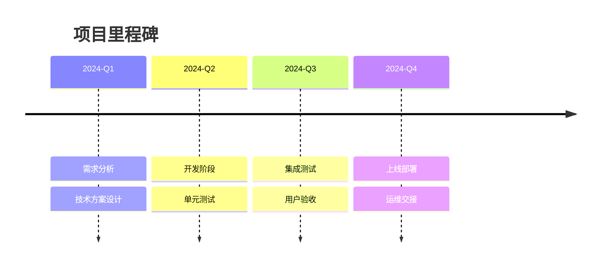

**要点**：
- 每个时间点可以有多条事件（冒号分隔）
- 时间标签放在左侧
- 适合展示里程碑、发布计划

### 12. Quadrant Chart (象限图)

**语法**：
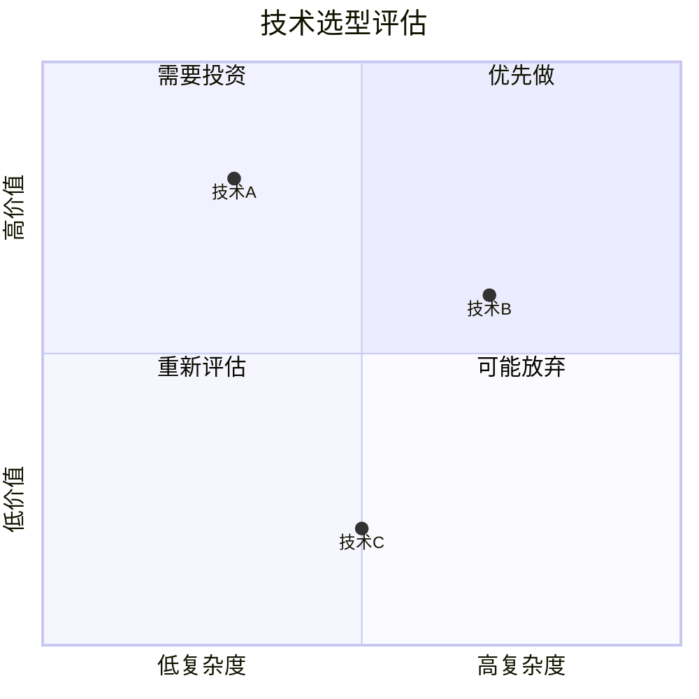

**要点**：
- x/y 坐标范围 0-1
- 4 个象限可自定义标签
- 适合优先级评估、竞品分析

### 13. XY Chart (XY图表)

**语法**：
```mermaid
xychart-beta
    title "月度营收趋势"
    x-axis [1月, 2月, 3月, 4月, 5月, 6月]
    y-axis "营收(万元)" 0 --> 100
    bar [45, 52, 48, 68, 72, 85]
    line [40, 48, 50, 60, 68, 80]
```

**要点**：
- 同时支持 bar（柱状）和 line（折线）
- x-axis 用数组指定标签
- y-axis 指定范围和单位

### 14. Sankey (桑基图)

**语法**：
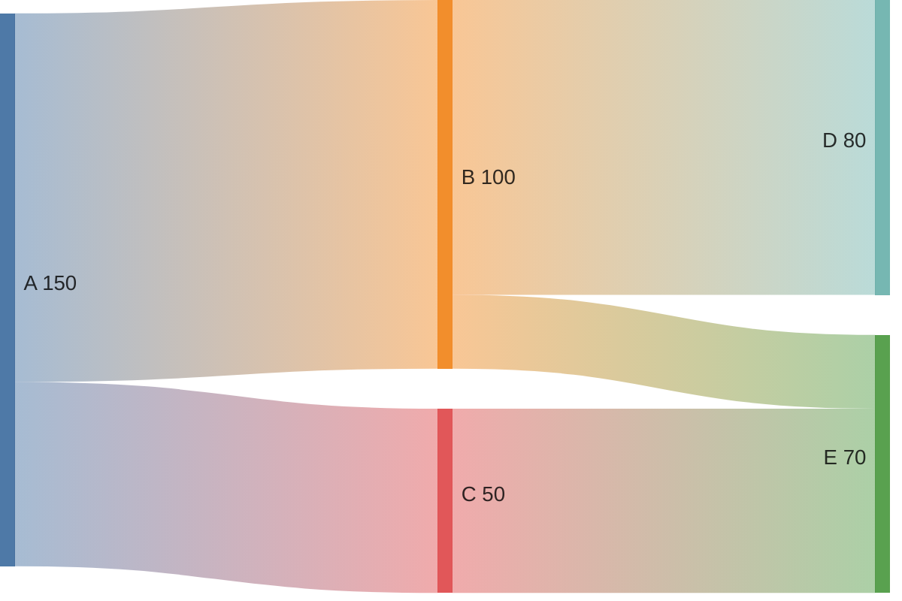

**要点**：
- 每行格式：`源节点, 目标节点, 流量值`
- 自动按流量比例渲染宽度
- 适合展示流量分布、资源流向、转化漏斗

### 15. Block Diagram (框图)

**语法**：
```mermaid
block-beta
    columns 3
    前端 block:UI:3
    后端 block:API:2 数据库 block:DB:1
    基础设施 block:Infra:3
```

**要点**：
- 用 `columns N` 定义列数
- 每个节点格式：`名称 block:显示名:占用列数`
- 适用于系统架构的简化表达

## 工作流程

1. **识别图表类型**：根据用户描述确定使用的 Mermaid 图表类型
2. **确定参与者和节点**：提取所有参与的角色、实体或状态
3. **定义关系**：确定元素之间的连接和关系
4. **生成代码**：按照对应的 Mermaid 语法生成代码
5. **预览验证**：确认语法正确性

## 示例模式

**用户可能的请求**：
- "画一个流程图"
- "生成时序图"
- "创建一个类图"
- "画ER图"
- "用mermaid展示"
- "做一个甘特图"
- "画个饼图"
- "生成思维导图"
- "创建时间线"
- "画象限图"
- "做桑基图"

**回答格式**：
直接输出 Mermaid 代码块，无需额外说明。如果需要，可以提供简短的解释。

## 设计指导

### 配色原则
- 流程图：使用中性色系，保持简洁
- 状态图：参考项目共享色板（蓝 #3498db / 绿 #2ecc71 / 橙 #e67e22 / 红 #e74c3c / 紫 #9b59b6）
- 类图：使用 Mermaid 默认 classDiagram 样式
- 时序图：参与者自动着色，无需手动指定

### 方向选择
- 流程图默认 `TD`（上到下），宽图用 `LR`（左到右）
- 状态图默认 `LR`，便于展示状态转移
- 时序图自动纵向排列

## 输出

### 文件输出
保存为 `.md` 文件至 `output/mermaid/` 目录，文件名为 `<图类型>-<描述>.md`。

### 直接呈现
在对话中以 ` ```mermaid ` 代码块直接呈现，用户可复制到支持 Mermaid 的 Markdown 编辑器中渲染。

### 模板
```markdown
# <图表标题>

<简要描述>

\`\`\`mermaid
<Mermaid 代码>
\`\`\`

## 说明
- 节点说明
- 关键关系解释
```

## 验证清单
- [ ] 语法正确，Mermaid 可解析
- [ ] 节点和关系名称清晰有意义
- [ ] 图表方向（TD/LR）适合内容布局
- [ ] 基数符号和关系类型正确
- [ ] 代码块使用 ` ```mermaid ` 包裹

## 约束

- 所有代码必须包裹在 ` ```mermaid ` 和 ` ``` ` 之间
- 使用中文或英文标签均可，保持一致
- 时序图使用 meaningful 的参与者名称
- ER图必须包含实体之间的关系定义
- 类图必须明确定义属性可见性
- 状态图使用 `stateDiagram-v2` 语法

## 参考

更多示例见 `examples/` 目录下的文件。