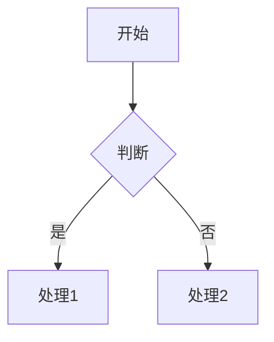
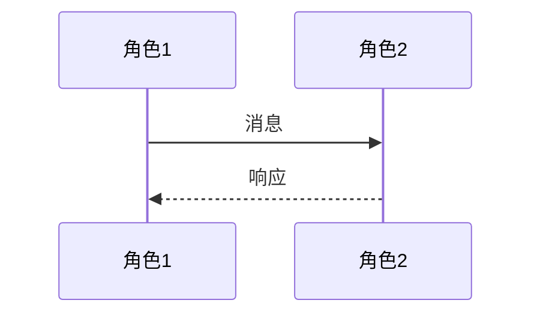
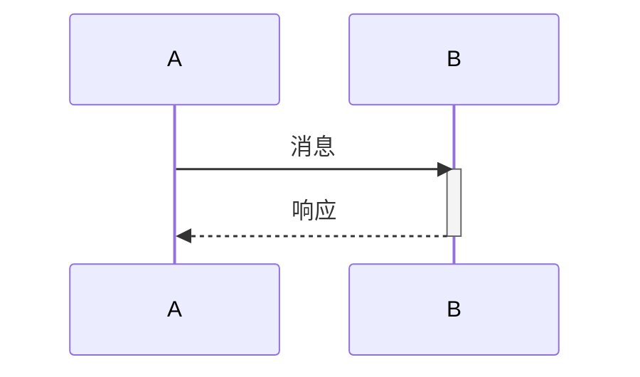
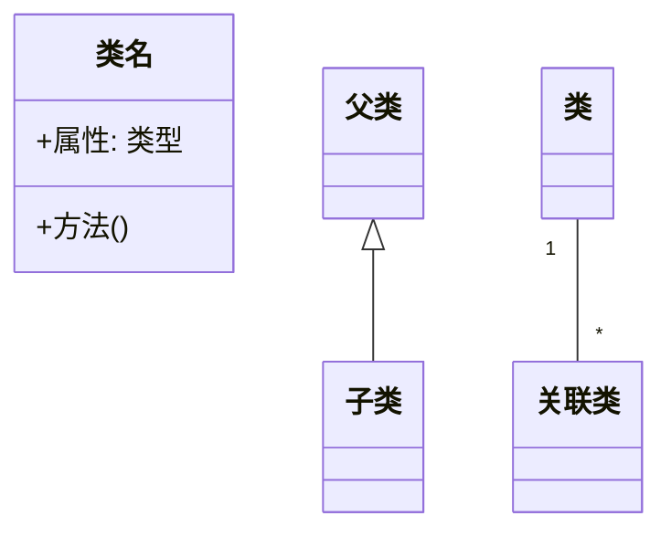
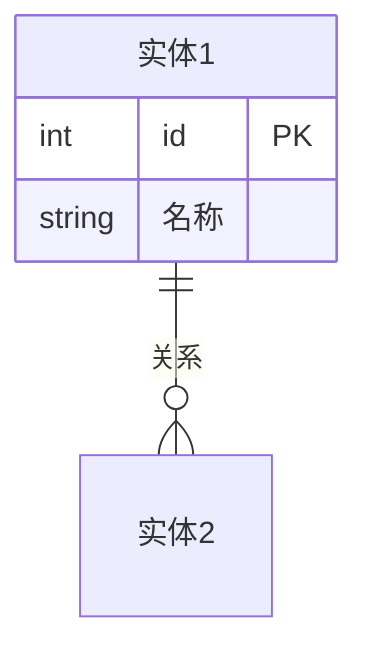
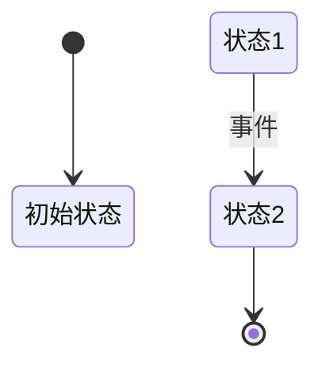
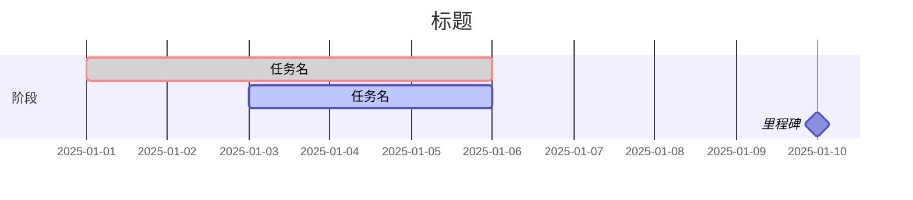
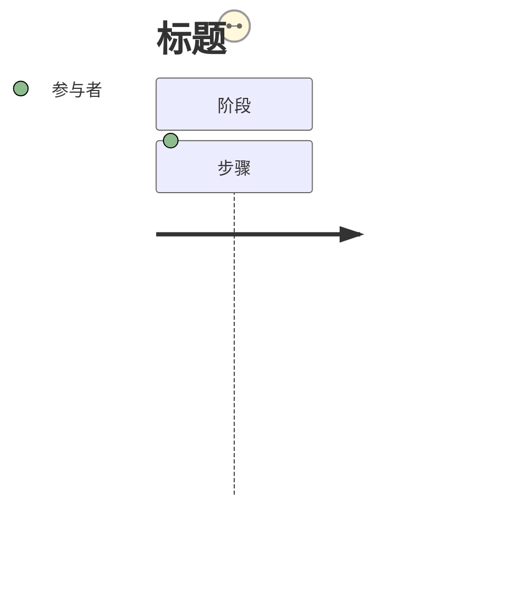

# Mermaid Gen Skill

根据用户的描述生成对应的 Mermaid 图表代码。

## 支持的图表类型

### 1. Flowchart (流程图)

**语法**：


**方向**：
- `TD` - 从上到下 (默认)
- `LR` - 从左到右
- `RL` - 从右到左
- `BT` - 从下到上

**节点形状**：
- `[矩形]` - 默认节点
- `[/圆角矩形/]` - 圆角矩形
- `((圆形))` - 圆形
- `{菱形}` - 判断/决策
- `[/平行四边形/]` - 输入/输出
- `[[子程序]]` - 子程序

**连接线**：
- `A --> B` - 实线箭头
- `A --- B` - 无箭头实线
- `A -.-> B` - 虚线箭头
- `A ==>` - 粗实线箭头
- `A -- 标签 --> B` - 带标签的线

### 2. Sequence Diagram (时序图)

**语法**：


**箭头类型**：
- `->>` - 实线实心箭头
- `-->>` - 虚线实心箭头
- `-x` - 异步消息

**激活区间**：


### 3. Class Diagram (类图)

**语法**：


**关系类型**：
- `<|--` - 继承
- `*--` - 组合
- `o--` - 聚合
- `<--` - 关联
- `<--` - 依赖

**可见性**：
- `+` - public
- `-` - private
- `#` - protected
- `~` - package

### 4. ER Diagram (ER图)

**语法**：


**基数符号**：
- `||` - 正好一个
- `o{` - 零或多个
- `}{` - 零或一个
- `|>` - 一个或多个

### 5. State Diagram (状态图)

**语法**：


### 6. Gantt Chart (甘特图)

**语法**：


**任务状态**：
- `crit` - 关键任务
- `done` - 已完成
- `active` - 进行中
- `milestone` - 里程碑

### 7. Journey (用户旅程图)

**语法**：


**满意度**：
- 1-5 (5 最满意)

### 8. Git Graph (Git图)

**语法**：


## 工作流程

1. **识别图表类型**：根据用户描述确定使用的 Mermaid 图表类型
2. **确定参与者和节点**：提取所有参与的角色、实体或状态
3. **定义关系**：确定元素之间的连接和关系
4. **生成代码**：按照对应的 Mermaid 语法生成代码
5. **预览验证**：确认语法正确性

## 示例模式

**用户可能的请求**：
- "画一个流程图"
- "生成时序图"
- "创建一个类图"
- "画ER图"
- "用mermaid展示"
- "做一个甘特图"

**回答格式**：
直接输出 Mermaid 代码块，无需额外说明。如果需要，可以提供简短的解释。

## 约束

- 所有代码必须包裹在 ` ```mermaid ` 和 ` ``` ` 之间
- 使用中文或英文标签均可，保持一致
- 时序图使用 meaningful 的参与者名称
- ER图必须包含实体之间的关系定义
- 类图必须明确定义属性可见性
- 状态图使用 `stateDiagram-v2` 语法

## 参考

更多示例见 `examples/` 目录下的文件。