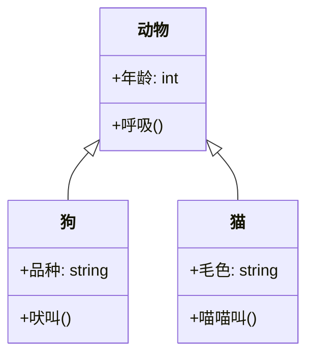
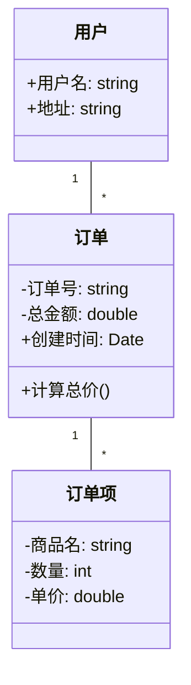

- example 1

```mermaid
classDiagram
    class 动物 {
        +年龄: int
        +呼吸()
    }
    class 狗 {
        +品种: string
        +吠叫()
    }
    class 猫 {
        +毛色: string
        +喵喵叫()
    }
    动物 <|-- 狗
    动物 <|-- 猫
```

- example2

```mermaid
classDiagram
    class 订单 {
        -订单号: string
        -总金额: double
        +创建时间: Date
        +计算总价()
    }
    class 订单项 {
        -商品名: string
        -数量: int
        -单价: double
    }
    class 用户 {
        +用户名: string
        +地址: string
    }
    订单 "1" -- "*" 订单项
    用户 "1" -- "*" 订单  
```