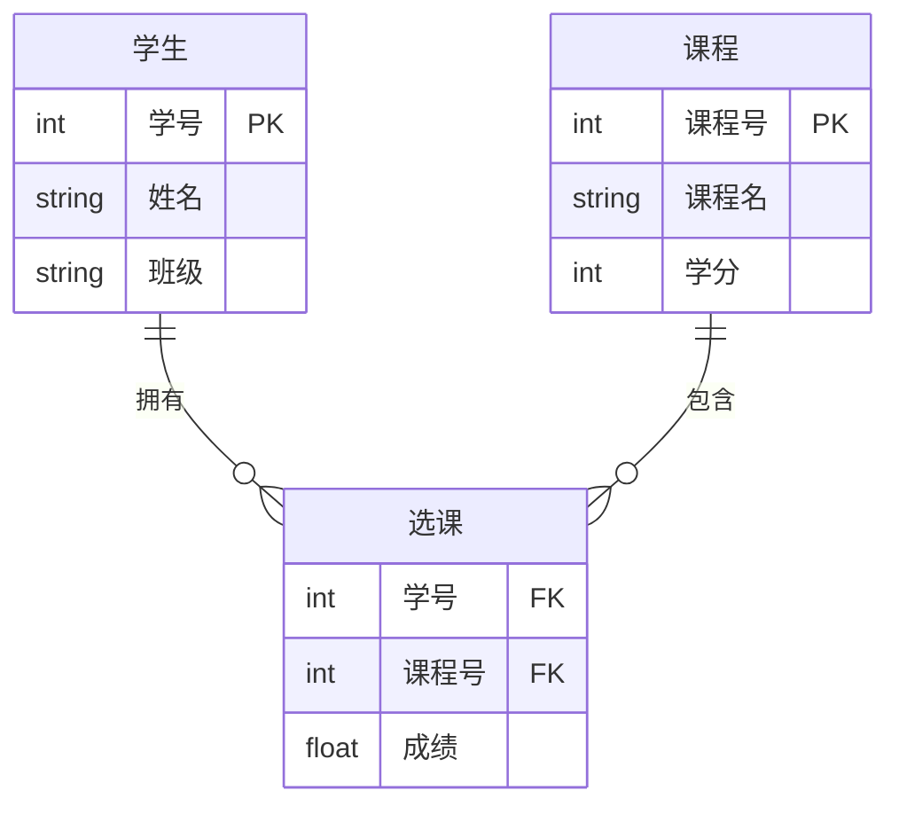
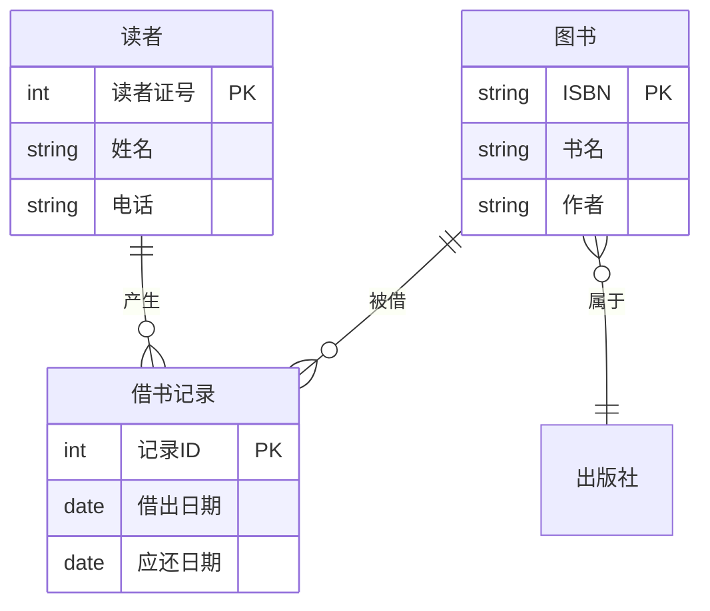

- example1

```mermaid
erDiagram
    学生 ||--o{ 选课 : 拥有
    课程 ||--o{ 选课 : 包含
    学生 {
        int 学号 PK
        string 姓名
        string 班级
    }
    课程 {
        int 课程号 PK
        string 课程名
        int 学分
    }
    选课 {
        int 学号 FK
        int 课程号 FK
        float 成绩
    }
```

- example 2

```mermaid
erDiagram
    读者 ||--o{ 借书记录 : 产生
    图书 ||--o{ 借书记录 : 被借
    图书 }o--|| 出版社 : 属于
    读者 {
        int 读者证号 PK
        string 姓名
        string 电话
    }
    图书 {
        string ISBN PK
        string 书名
        string 作者
    }
    借书记录 {
        int 记录ID PK
        date 借出日期
        date 应还日期
    }
```

