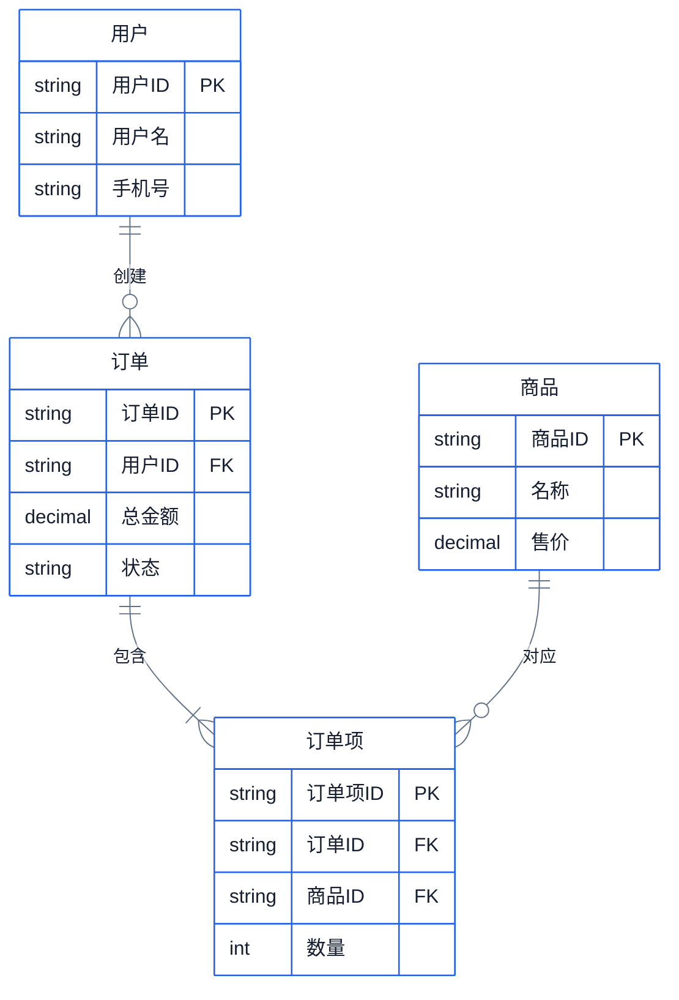

# 用户订单 ER 图

适用于表达数据库实体、核心字段、外键和关系基数。

```mermaid
%%{init: {"theme":"base","themeVariables":{"fontFamily":"Inter, Noto Sans SC, Microsoft YaHei, sans-serif","primaryColor":"#FFFFFF","primaryBorderColor":"#2563EB","primaryTextColor":"#172033","lineColor":"#64748B","background":"#F6F8FB"}}}%%
erDiagram
    用户 ||--o{ 订单 : 创建
    订单 ||--|{ 订单项 : 包含
    商品 ||--o{ 订单项 : 对应
    用户 {
        string 用户ID PK
        string 用户名
        string 手机号
    }
    订单 {
        string 订单ID PK
        string 用户ID FK
        decimal 总金额
        string 状态
    }
    订单项 {
        string 订单项ID PK
        string 订单ID FK
        string 商品ID FK
        int 数量
    }
    商品 {
        string 商品ID PK
        string 名称
        decimal 售价
    }
```

## 说明

- 每条关系包含明确基数。
- 只展示理解关系所需的核心字段。
