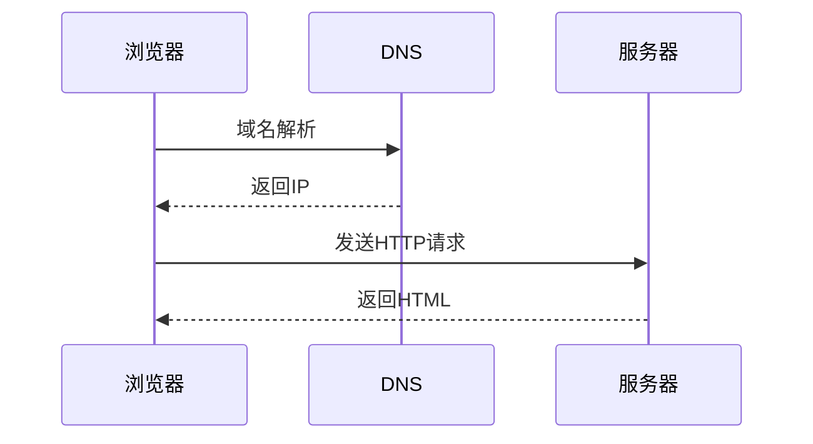

- example 1  
浏览器访问网站


- example 2  
用户注册发送验证码

```mermaid
sequenceDiagram
    participant 用户
    participant 前端
    participant 后端
    participant 短信服务
    用户->>前端: 点击获取验证码
    前端->>后端: 请求验证码
    后端->>短信服务: 发送短信
    短信服务-->>后端: 发送成功
    后端-->>前端: 返回成功状态
    前端-->>用户: 提示“验证码已发送”