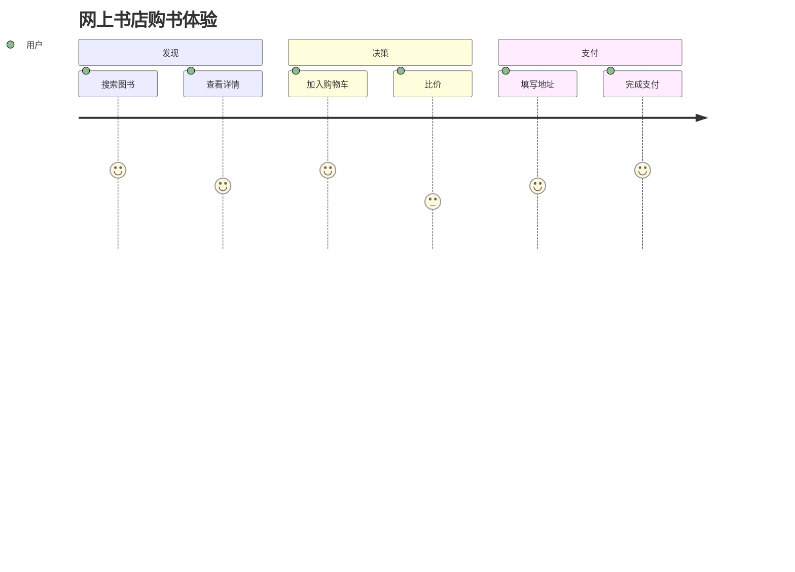
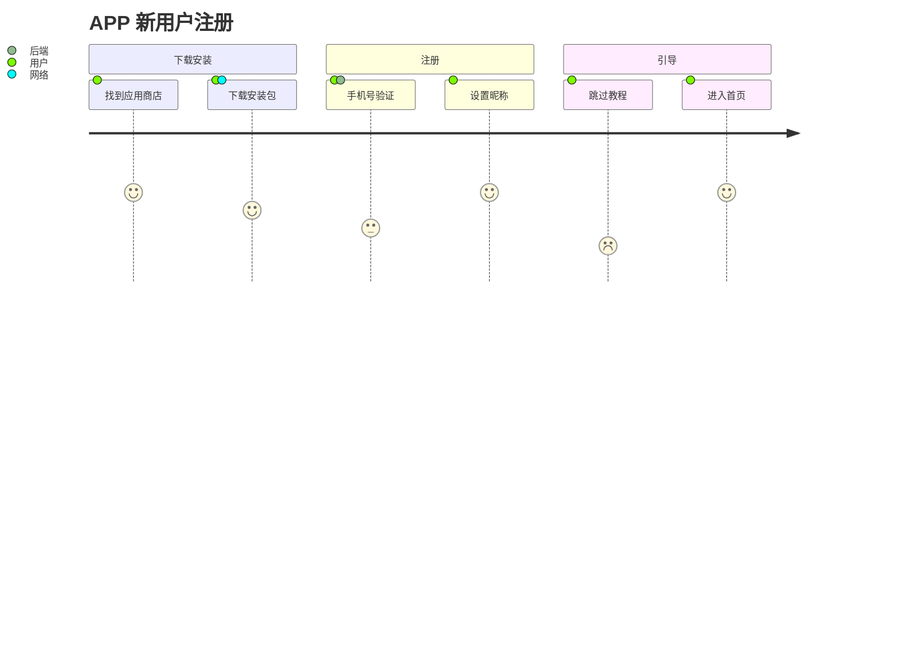

- example 1

```mermaid
journey
    title 网上书店购书体验
    section 发现
      搜索图书: 5: 用户
      查看详情: 4: 用户
    section 决策
      加入购物车: 5: 用户
      比价: 3: 用户
    section 支付
      填写地址: 4: 用户
      完成支付: 5: 用户
```

- example 2

```mermaid
journey
    title APP 新用户注册
    section 下载安装
      找到应用商店: 5: 用户
      下载安装包: 4: 用户, 网络
    section 注册
      手机号验证: 3: 用户, 后端
      设置昵称: 5: 用户
    section 引导
      跳过教程: 2: 用户
      进入首页: 5: 用户
```