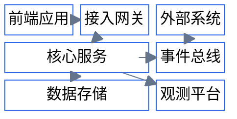

# 应用模块框图

```mermaid
%%{init: {"theme":"base","themeVariables":{"fontFamily":"Inter, Noto Sans SC, Microsoft YaHei, sans-serif","primaryColor":"#FFFFFF","primaryBorderColor":"#2563EB","primaryTextColor":"#172033","lineColor":"#64748B","background":"#F6F8FB"}}}%%
block-beta
    columns 3
    frontend["前端应用"]
    gateway["接入网关"]
    external["外部系统"]
    services["核心服务"]:2
    events["事件总线"]
    database["数据存储"]:2
    observe["观测平台"]
    frontend --> gateway
    gateway --> services
    services --> database
    services --> events
    events --> external
    services --> observe
```

## 说明

- 三列网格保持结构紧凑。
- 复杂调用链应改用时序图。
