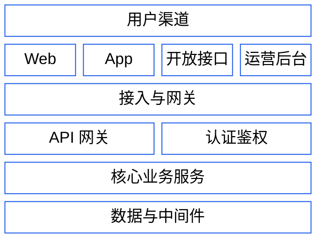

# 应用系统框图

适用于表达静态系统模块和分层关系。

```mermaid
%%{init: {"theme":"base","themeVariables":{"fontFamily":"Inter, Noto Sans SC, Microsoft YaHei, sans-serif","primaryColor":"#FFFFFF","primaryBorderColor":"#2563EB","primaryTextColor":"#172033","lineColor":"#64748B","background":"#F6F8FB"}}}%%
block-beta
    columns 4
    channels["用户渠道"]:4
    web["Web"]
    app["App"]
    openapi["开放接口"]
    admin["运营后台"]
    access["接入与网关"]:4
    gateway["API 网关"]:2
    auth["认证鉴权"]:2
    services["核心业务服务"]:4
    data["数据与中间件"]:4
```

## 说明

- 使用四列网格表达纵向分层和层内横排。
- 静态框图默认不增加箭头；复杂调用关系改用时序图。
