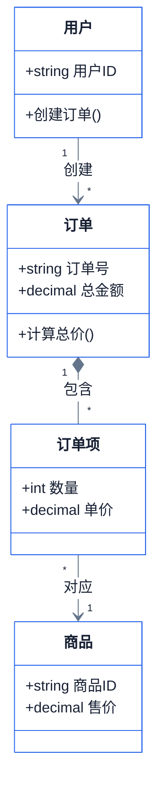

# 订单领域类图

适用于表达领域对象、核心成员和类之间的静态关系。

```mermaid
%%{init: {"theme":"base","themeVariables":{"fontFamily":"Inter, Noto Sans SC, Microsoft YaHei, sans-serif","primaryColor":"#FFFFFF","primaryBorderColor":"#2563EB","primaryTextColor":"#172033","lineColor":"#64748B","background":"#F6F8FB"}}}%%
classDiagram
    class 用户 {
        +string 用户ID
        +创建订单()
    }
    class 订单 {
        +string 订单号
        +decimal 总金额
        +计算总价()
    }
    class 订单项 {
        +int 数量
        +decimal 单价
    }
    class 商品 {
        +string 商品ID
        +decimal 售价
    }
    用户 "1" --> "*" 订单 : 创建
    订单 "1" *-- "*" 订单项 : 包含
    订单项 "*" --> "1" 商品 : 对应
```

## 说明

- 只保留有助于理解领域关系的核心成员。
- 组合、关联和基数使用 Mermaid 原生关系表达。
