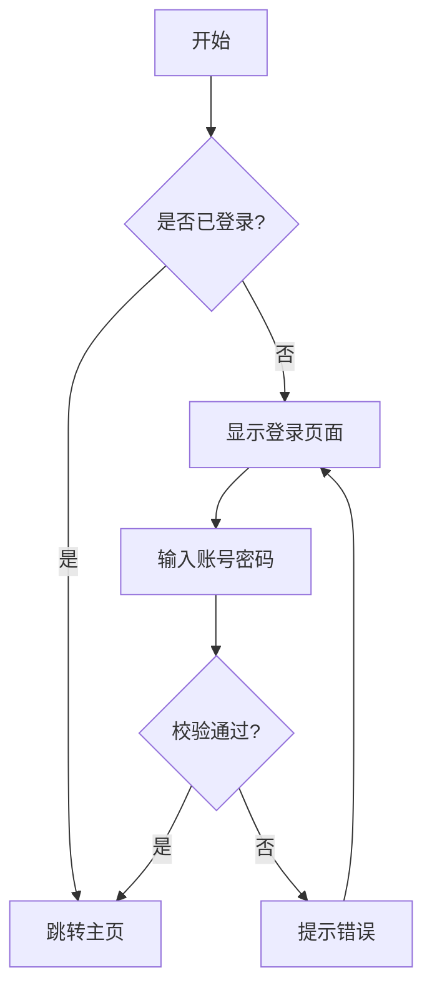
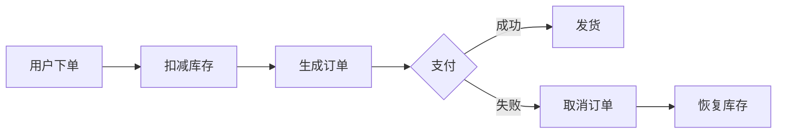

- example 1
竖向流程图

```mermaid
flowchart TD
    A[开始] --> B{是否已登录?}
    B -->|是| C[跳转主页]
    B -->|否| D[显示登录页面]
    D --> E[输入账号密码]
    E --> F{校验通过?}
    F -->|是| C
    F -->|否| G[提示错误]
    G --> D
```

- example2
横向流程图

```mermaid
flowchart LR
    A[用户下单] --> B[扣减库存]
    B --> C[生成订单]
    C --> D{支付}
    D -->|成功| E[发货]
    D -->|失败| F[取消订单]
    F --> G[恢复库存]
```