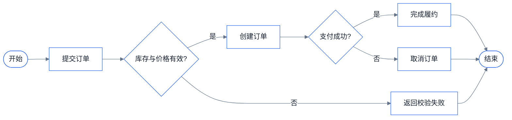

# 订单处理分支流程

适用于包含判断、成功与失败分支的业务流程。

```mermaid
%%{init: {"theme":"base","themeVariables":{"fontFamily":"Inter, Noto Sans SC, Microsoft YaHei, sans-serif","primaryColor":"#FFFFFF","primaryBorderColor":"#2563EB","primaryTextColor":"#172033","lineColor":"#64748B","background":"#F6F8FB"}}}%%
flowchart LR
    start([开始]) --> submit[提交订单]
    submit --> validate{库存与价格有效?}
    validate -->|是| create[创建订单]
    create --> pay{支付成功?}
    pay -->|是| finish[完成履约]
    pay -->|否| cancel[取消订单]
    validate -->|否| reject[返回校验失败]
    cancel --> endNode([结束])
    reject --> endNode
    finish --> endNode
```

## 说明

- 主流程水平排列，失败分支在主轴下方汇聚。
- 每个判断出口都有明确标签和可达终点。
