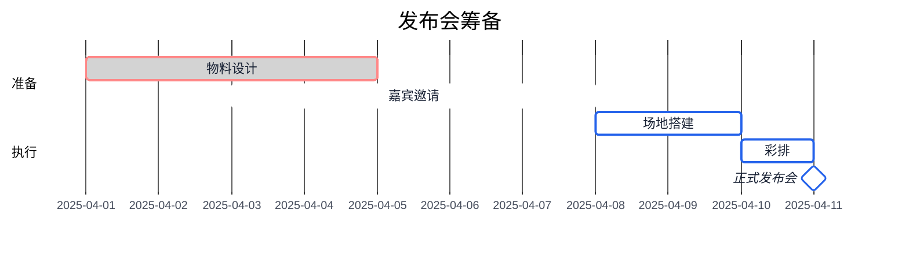

- example1
产品发布倒排期

```mermaid
%%{init: {"theme":"base","themeVariables":{"fontFamily":"Inter, Noto Sans SC, Microsoft YaHei, sans-serif","primaryColor":"#FFFFFF","primaryBorderColor":"#2563EB","primaryTextColor":"#172033","lineColor":"#64748B","background":"#F6F8FB"}}}%%
gantt
    title 发布会筹备
    dateFormat YYYY-MM-DD
    section 准备
    物料设计   :crit, done, 2025-04-01, 4d
    嘉宾邀请   :active, 2025-04-03, 5d
    section 执行
    场地搭建   :2025-04-08, 2d
    彩排       :2025-04-10, 1d
    正式发布会 :milestone, 2025-04-11, 0d
```