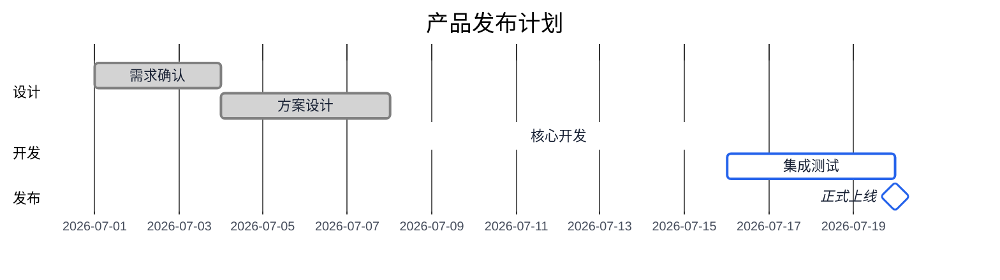

# 产品发布倒排期

适用于按时间展示阶段、任务状态、依赖和里程碑。

```mermaid
%%{init: {"theme":"base","themeVariables":{"fontFamily":"Inter, Noto Sans SC, Microsoft YaHei, sans-serif","primaryColor":"#FFFFFF","primaryBorderColor":"#2563EB","primaryTextColor":"#172033","lineColor":"#64748B","background":"#F6F8FB"}}}%%
gantt
    title 产品发布计划
    dateFormat YYYY-MM-DD
    section 设计
    需求确认 :done, req, 2026-07-01, 3d
    方案设计 :done, design, after req, 4d
    section 开发
    核心开发 :active, dev, after design, 8d
    集成测试 :test, after dev, 4d
    section 发布
    正式上线 :milestone, release, after test, 0d
```

## 说明

- 日期格式统一，阶段使用 `section` 分组。
- 任务依赖使用 `after`，上线使用里程碑。
