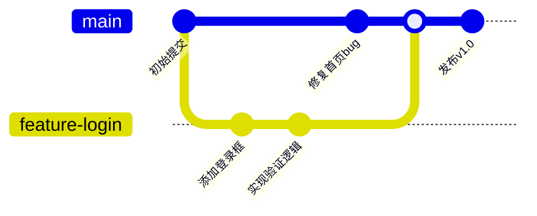
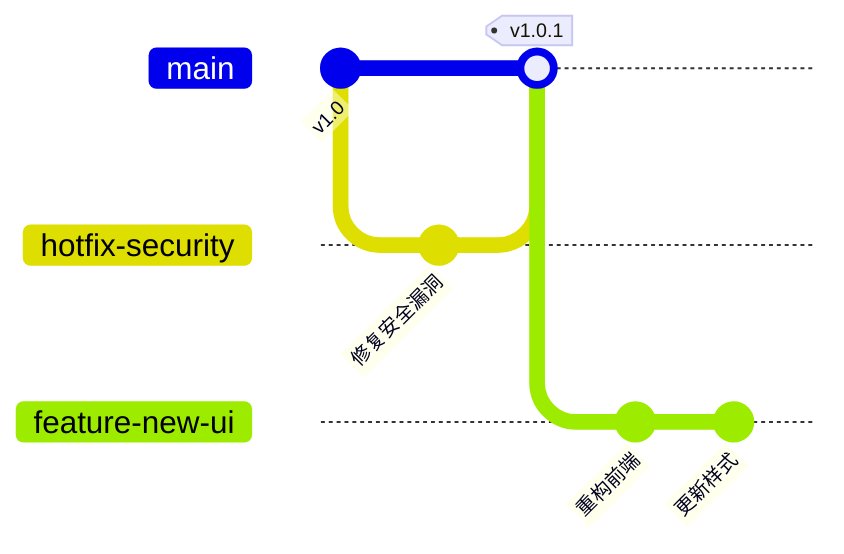

```mermaid
gitGraph
    commit id: "初始提交"
    branch feature-login
    checkout feature-login
    commit id: "添加登录框"
    commit id: "实现验证逻辑"
    checkout main
    commit id: "修复首页bug"
    merge feature-login
    commit id: "发布v1.0"
```

```mermaid
gitGraph
    commit id: "v1.0"
    branch hotfix-security
    checkout hotfix-security
    commit id: "修复安全漏洞"
    checkout main
    merge hotfix-security tag: "v1.0.1"
    branch feature-new-ui
    checkout feature-new-ui
    commit id: "重构前端"
    commit id: "更新样式"
```