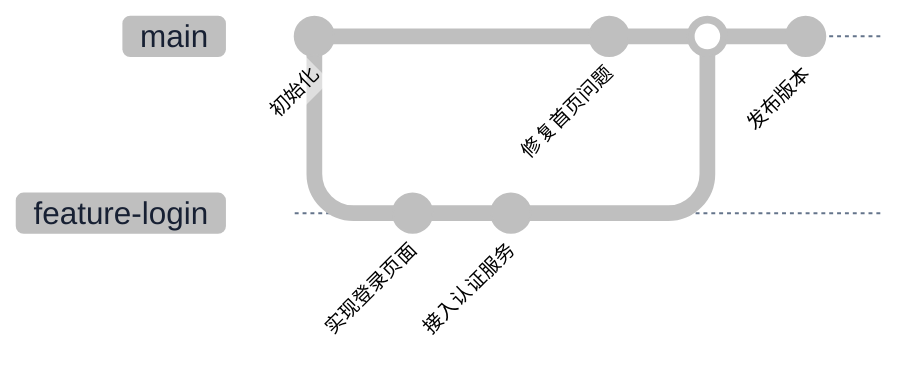

# 功能分支开发图

适用于表达 Git 主干、功能分支、提交和合并顺序。

```mermaid
%%{init: {"theme":"base","themeVariables":{"fontFamily":"Inter, Noto Sans SC, Microsoft YaHei, sans-serif","primaryColor":"#FFFFFF","primaryBorderColor":"#2563EB","primaryTextColor":"#172033","lineColor":"#64748B","background":"#F6F8FB"}}}%%
gitGraph
    commit id: "初始化"
    branch feature-login
    checkout feature-login
    commit id: "实现登录页面"
    commit id: "接入认证服务"
    checkout main
    commit id: "修复首页问题"
    merge feature-login
    commit id: "发布版本"
```

## 说明

- 只展示影响理解的关键提交。
- 分支创建、切换和合并顺序保持明确。
