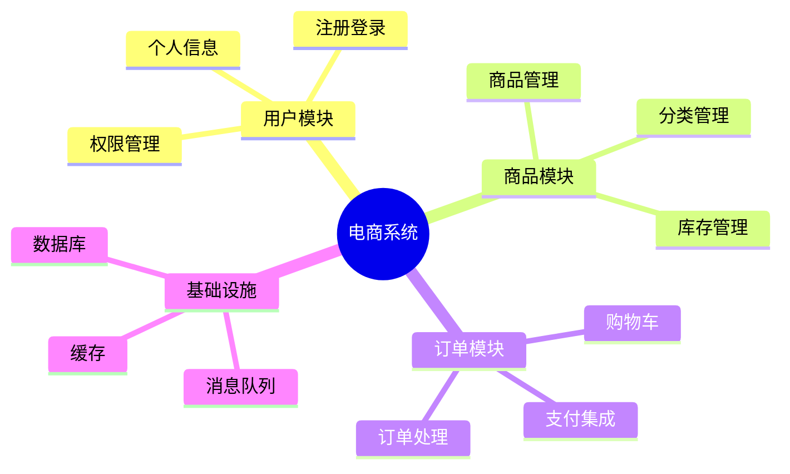

# 项目架构思维导图

系统模块划分与职责。

```mermaid
mindmap
  root((电商系统))
    用户模块
      注册登录
      个人信息
      权限管理
    商品模块
      商品管理
      分类管理
      库存管理
    订单模块
      购物车
      订单处理
      支付集成
    基础设施
      数据库
      缓存
      消息队列
```

## 说明
- 4 大核心模块
- 每个模块下细分 3 个主要子功能
