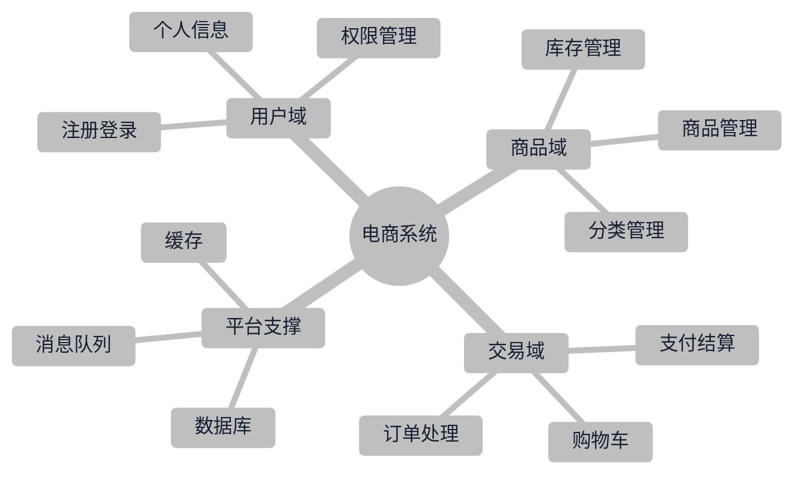

# 电商系统思维导图

适用于表达中心主题和多层概念结构。

```mermaid
%%{init: {"theme":"base","themeVariables":{"fontFamily":"Inter, Noto Sans SC, Microsoft YaHei, sans-serif","primaryColor":"#FFFFFF","primaryBorderColor":"#2563EB","primaryTextColor":"#172033","lineColor":"#64748B","background":"#F6F8FB"}}}%%
mindmap
  root((电商系统))
    用户域
      注册登录
      个人信息
      权限管理
    商品域
      商品管理
      分类管理
      库存管理
    交易域
      购物车
      订单处理
      支付结算
    平台支撑
      数据库
      缓存
      消息队列
```

## 说明

- 使用缩进表达层级，不额外增加连线。
- 层级控制在四层以内。
