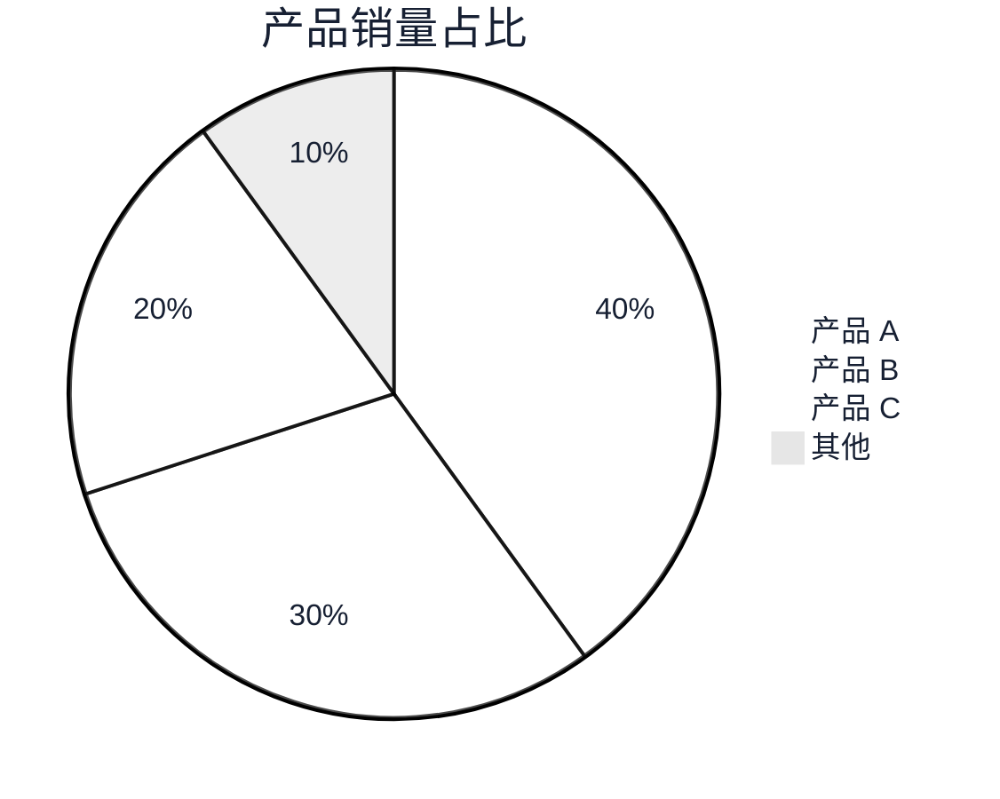

# 产品销量占比

适用于比较少量类别的比例分布。

```mermaid
%%{init: {"theme":"base","themeVariables":{"fontFamily":"Inter, Noto Sans SC, Microsoft YaHei, sans-serif","primaryColor":"#FFFFFF","primaryBorderColor":"#2563EB","primaryTextColor":"#172033","lineColor":"#64748B","background":"#F6F8FB"}}}%%
pie
    title 产品销量占比
    "产品 A" : 40
    "产品 B" : 30
    "产品 C" : 20
    "其他" : 10
```

## 说明

- 类别控制在容易比较的数量内。
- 数据值均为非负数。
