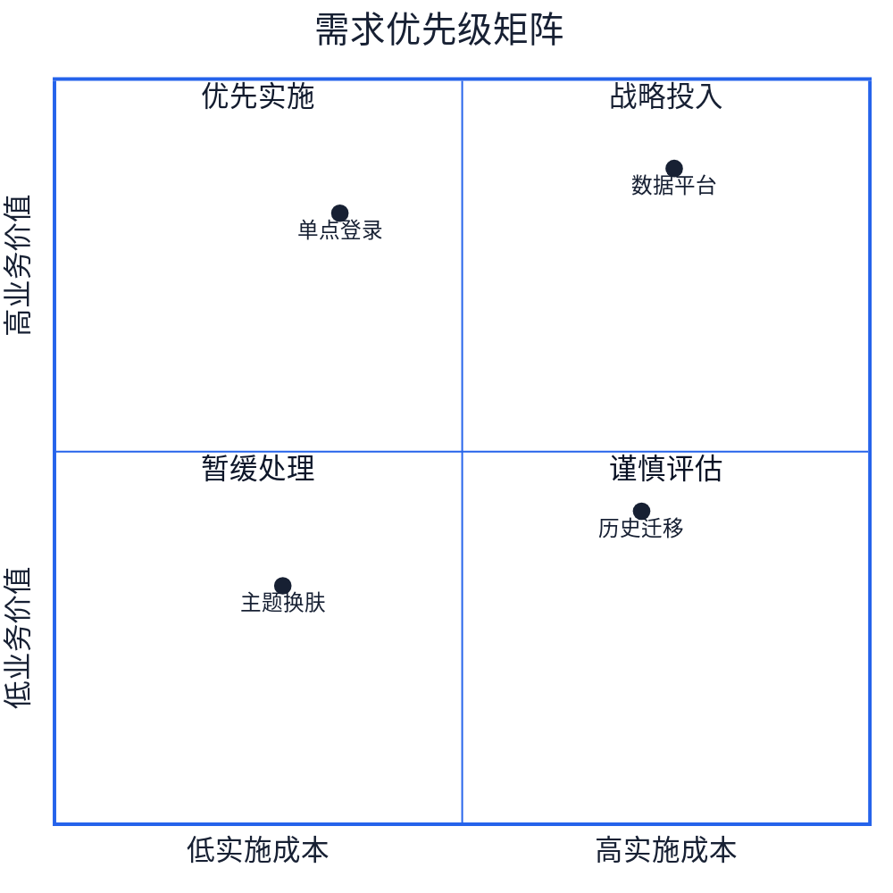

# 需求优先级象限

用于按实施成本和业务价值对需求进行分类。

```mermaid
%%{init: {"theme":"base","themeVariables":{"fontFamily":"Inter, Noto Sans SC, Microsoft YaHei, sans-serif","primaryColor":"#FFFFFF","primaryBorderColor":"#2563EB","primaryTextColor":"#172033","lineColor":"#64748B","background":"#F6F8FB"}}}%%
quadrantChart
    title 需求优先级矩阵
    x-axis 低实施成本 --> 高实施成本
    y-axis 低业务价值 --> 高业务价值
    quadrant-1 战略投入
    quadrant-2 优先实施
    quadrant-3 暂缓处理
    quadrant-4 谨慎评估
    单点登录: [0.35, 0.82]
    数据平台: [0.76, 0.88]
    主题换肤: [0.28, 0.32]
    历史迁移: [0.72, 0.42]
```

## 说明

- 左上象限优先实施。
- 右上象限需要拆分里程碑。
