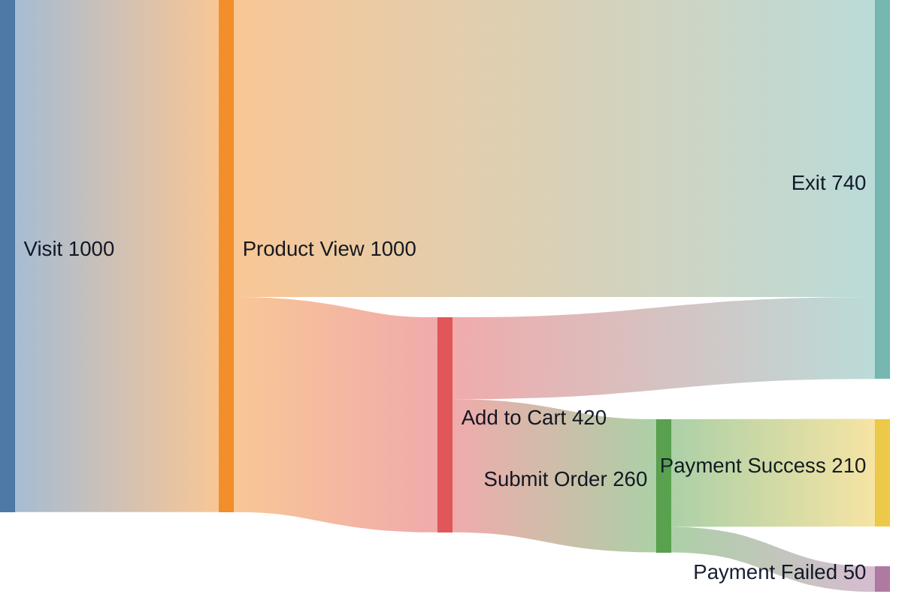

# 用户转化流向

适用于表达来源、去向和流量数量。

```mermaid
%%{init: {"theme":"base","themeVariables":{"fontFamily":"Inter, Noto Sans SC, Microsoft YaHei, sans-serif","primaryColor":"#FFFFFF","primaryBorderColor":"#2563EB","primaryTextColor":"#172033","lineColor":"#64748B","background":"#F6F8FB"}}}%%
sankey-beta
Visit,Product View,1000
Product View,Add to Cart,420
Product View,Exit,580
Add to Cart,Submit Order,260
Add to Cart,Exit,160
Submit Order,Payment Success,210
Submit Order,Payment Failed,50
```

## 说明

- 数值必须为非负数。
- 当前解析器对非 ASCII 标签兼容性不稳定，示例使用英文标签。
