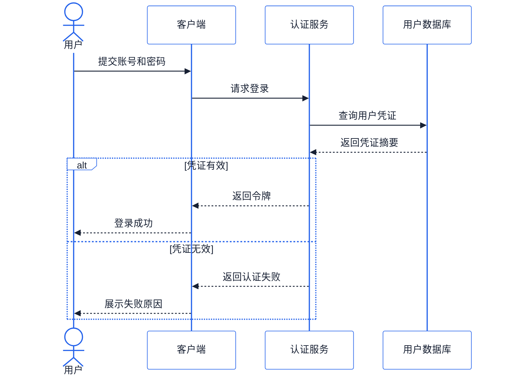

# 用户登录时序图

适用于表达参与者之间按时间顺序发生的请求、条件和返回消息。

```mermaid
%%{init: {"theme":"base","themeVariables":{"fontFamily":"Inter, Noto Sans SC, Microsoft YaHei, sans-serif","primaryColor":"#FFFFFF","primaryBorderColor":"#2563EB","primaryTextColor":"#172033","lineColor":"#64748B","background":"#F6F8FB"}}}%%
sequenceDiagram
    actor U as 用户
    participant C as 客户端
    participant A as 认证服务
    participant D as 用户数据库
    U->>C: 提交账号和密码
    C->>A: 请求登录
    A->>D: 查询用户凭证
    D-->>A: 返回凭证摘要
    alt 凭证有效
        A-->>C: 返回令牌
        C-->>U: 登录成功
    else 凭证无效
        A-->>C: 返回认证失败
        C-->>U: 展示失败原因
    end
```

## 说明

- 请求使用实线箭头，返回使用虚线箭头。
- 条件分支使用 `alt / else / end`，参与者按调用顺序排列。
