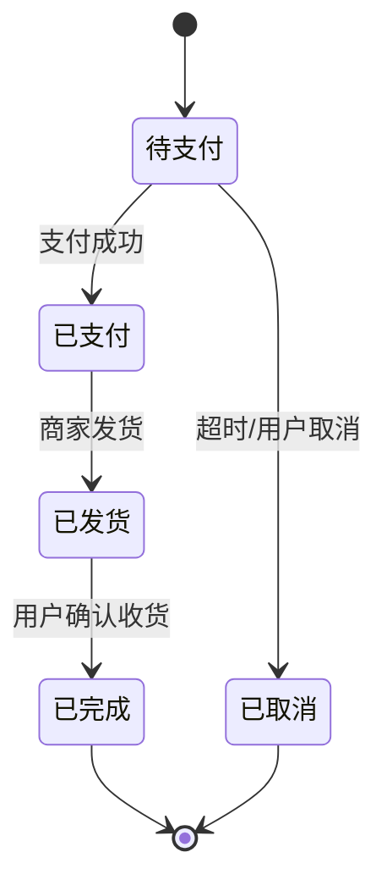
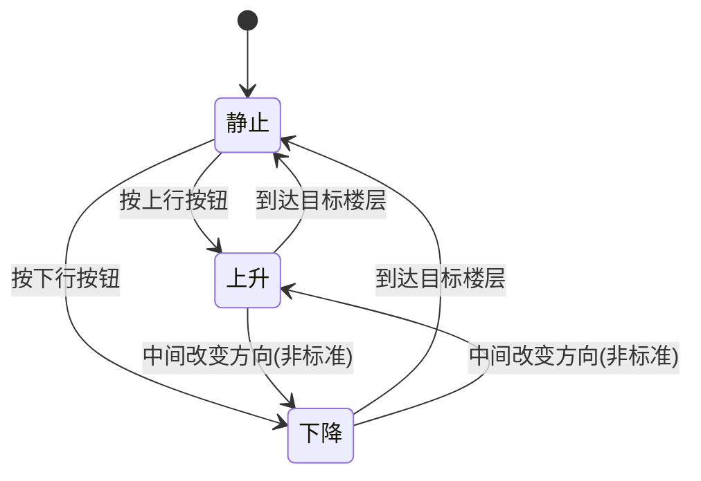

- example 1

```mermaid
stateDiagram-v2
    [*] --> 待支付
    待支付 --> 已支付 : 支付成功
    待支付 --> 已取消 : 超时/用户取消
    已支付 --> 已发货 : 商家发货
    已发货 --> 已完成 : 用户确认收货
    已完成 --> [*]
    已取消 --> [*]
```

- example 2

```mermaid
stateDiagram-v2
    [*] --> 静止
    静止 --> 上升 : 按上行按钮
    静止 --> 下降 : 按下行按钮
    上升 --> 静止 : 到达目标楼层
    下降 --> 静止 : 到达目标楼层
    上升 --> 下降 : 中间改变方向(非标准)
    下降 --> 上升 : 中间改变方向(非标准)
```
