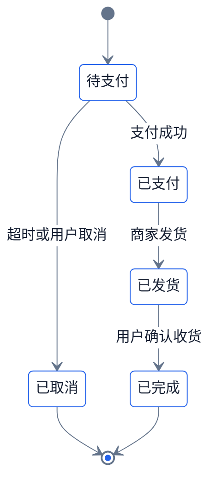

# 订单状态流转图

适用于表达对象从初始状态到终态的变化及触发条件。

```mermaid
%%{init: {"theme":"base","themeVariables":{"fontFamily":"Inter, Noto Sans SC, Microsoft YaHei, sans-serif","primaryColor":"#FFFFFF","primaryBorderColor":"#2563EB","primaryTextColor":"#172033","lineColor":"#64748B","background":"#F6F8FB"}}}%%
stateDiagram-v2
    [*] --> 待支付
    待支付 --> 已支付 : 支付成功
    待支付 --> 已取消 : 超时或用户取消
    已支付 --> 已发货 : 商家发货
    已发货 --> 已完成 : 用户确认收货
    已取消 --> [*]
    已完成 --> [*]
```

## 说明

- 使用 `[*]` 表达初始和终止状态。
- 每条转换都说明触发条件。
