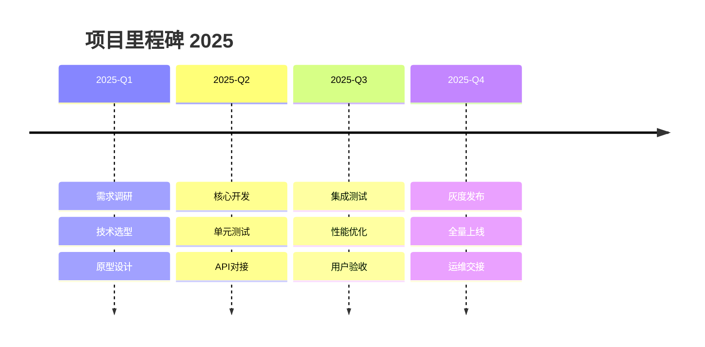

# 项目开发里程碑

2025年产品开发路线图。

```mermaid
timeline
    title 项目里程碑 2025
    2025-Q1 : 需求调研 : 技术选型 : 原型设计
    2025-Q2 : 核心开发 : 单元测试 : API对接
    2025-Q3 : 集成测试 : 性能优化 : 用户验收
    2025-Q4 : 灰度发布 : 全量上线 : 运维交接
```

## 说明
- Q1 重点在规划和设计
- Q2-Q3 为开发和测试阶段
- Q4 为目标上线时间
