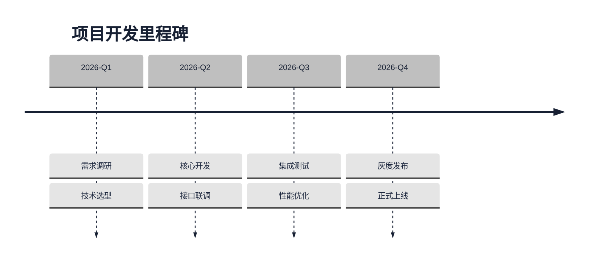

# 项目开发里程碑

适用于按时间顺序表达关键事件和阶段成果。

```mermaid
%%{init: {"theme":"base","themeVariables":{"fontFamily":"Inter, Noto Sans SC, Microsoft YaHei, sans-serif","primaryColor":"#FFFFFF","primaryBorderColor":"#2563EB","primaryTextColor":"#172033","lineColor":"#64748B","background":"#F6F8FB"}}}%%
timeline
    title 项目开发里程碑
    2026-Q1 : 需求调研 : 技术选型
    2026-Q2 : 核心开发 : 接口联调
    2026-Q3 : 集成测试 : 性能优化
    2026-Q4 : 灰度发布 : 正式上线
```

## 说明

- 时间段按顺序排列。
- 每个阶段只保留关键事件。
