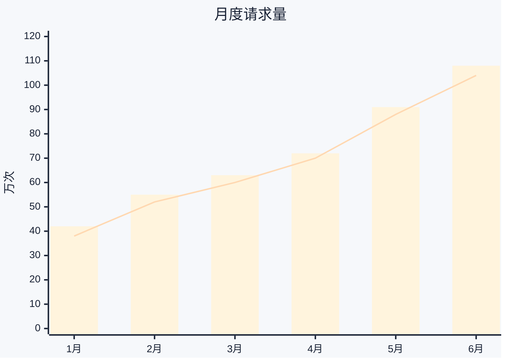

# 月度请求量趋势

适用于比较离散类别上的柱状值和趋势值。

```mermaid
%%{init: {"theme":"base","themeVariables":{"fontFamily":"Inter, Noto Sans SC, Microsoft YaHei, sans-serif","primaryColor":"#FFFFFF","primaryBorderColor":"#2563EB","primaryTextColor":"#172033","lineColor":"#64748B","background":"#F6F8FB"}}}%%
xychart-beta
    title "月度请求量"
    x-axis ["1月", "2月", "3月", "4月", "5月", "6月"]
    y-axis "万次" 0 --> 120
    bar [42, 55, 63, 72, 91, 108]
    line [38, 52, 60, 70, 88, 104]
```

## 说明

- 每个序列的数据数量与横轴类别一致。
- 轴标题包含必要的单位。
