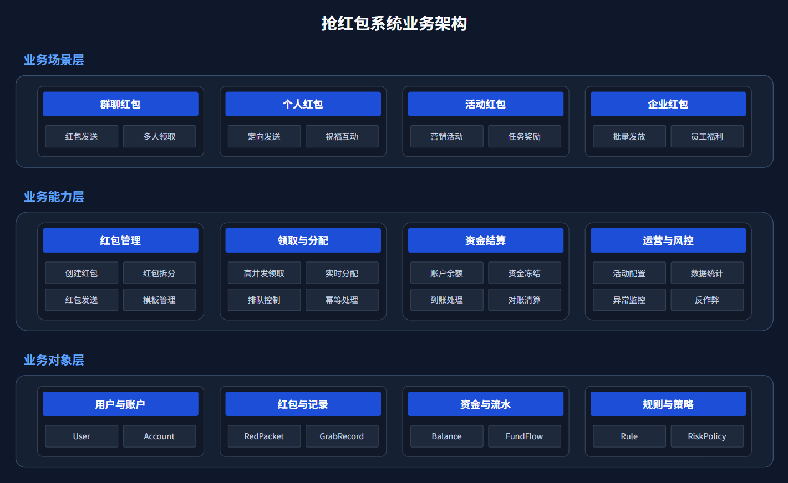
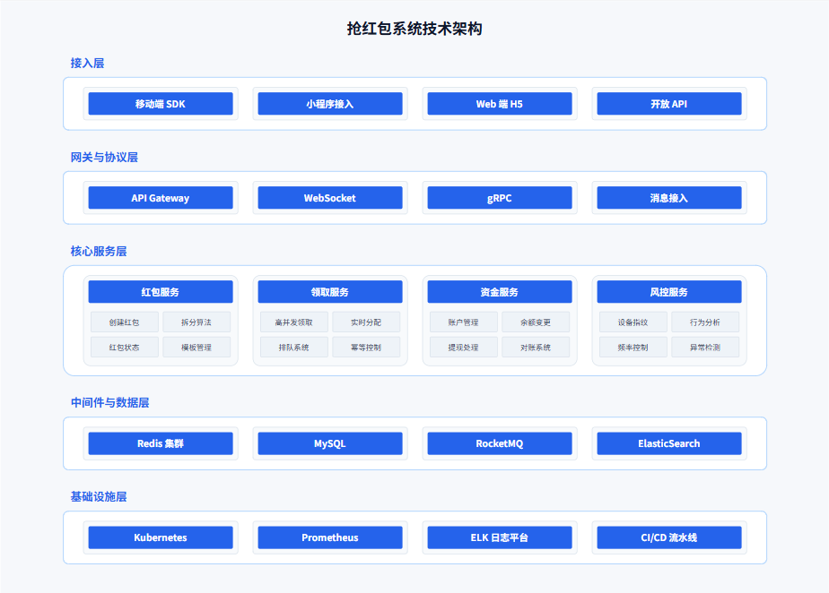
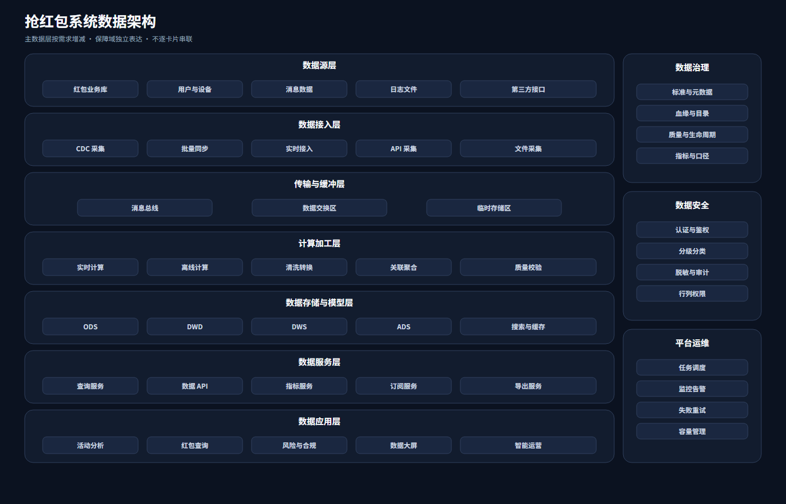
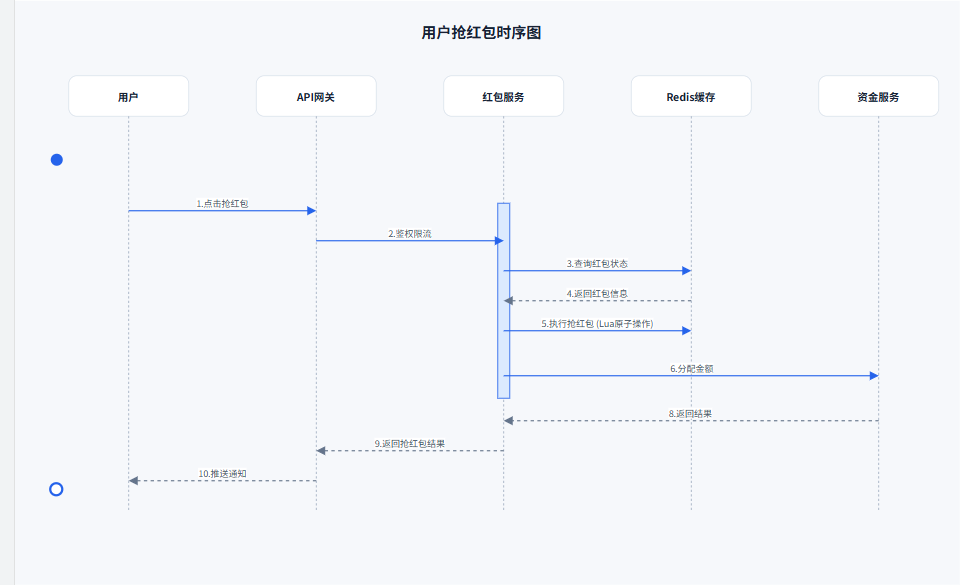
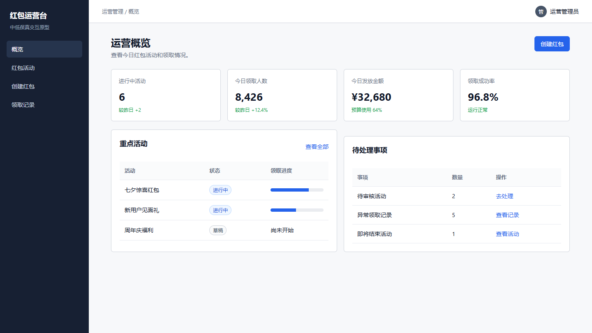
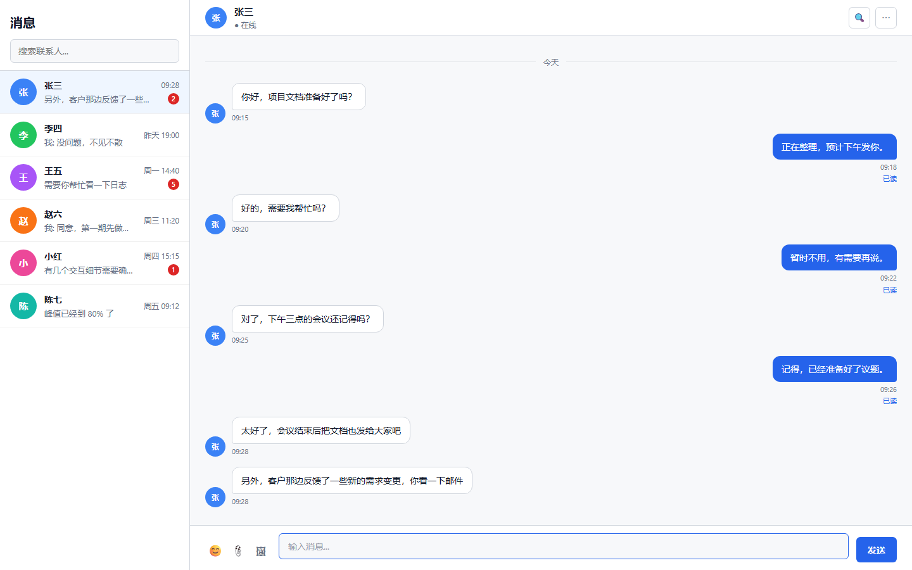

# SKILL-PROJECT

面向 OpenCode 等 Agent 工具的本地 Skill 集合，覆盖技术绘图、交互原型、代码变更分析和合并冲突分析。

## 第一部分：项目 Skills

### Skill 索引

<table>
  <thead>
    <tr>
      <th>分类</th>
      <th>Skill</th>
      <th>适用场景</th>
      <th>主要输出</th>
      <th>使用说明</th>
      <th>示例与验证</th>
    </tr>
  </thead>
  <tbody>
    <tr>
      <td rowspan="3">绘图相关</td>
      <td><code>xml-diagram</code></td>
      <td>生成支持在 Draw.io 中编辑的技术图，包括架构图、流程图、时序图、时间规划图、对比图等，支持深色和浅色背景</td>
      <td>Draw.io XML</td>
      <td colspan="2"><a href="docs/xml-diagram/README.md">文档与示例</a></td>
    </tr>
    <tr>
      <td><code>svg-generator</code></td>
      <td>高质量、可缩放的矢量架构图和技术图，包括架构图、流程图、时序图、时间规划图、对比图等，支持深色和浅色背景</td>
      <td>SVG</td>
      <td colspan="2"><a href="docs/svg-generator/README.md">文档与示例</a></td>
    </tr>
    <tr>
      <td><code>mermaid-gen</code></td>
      <td>复杂流程、时序、ER、状态等自动布局图</td>
      <td>Mermaid Markdown</td>
      <td colspan="2"><a href="docs/mermaid-gen/README.md">文档与示例</a></td>
    </tr>
    <tr>
      <td rowspan="2">原型相关</td>
      <td><code>prototype-design-html</code></td>
      <td>可交互的html原型图</td>
      <td>自包含 HTML</td>
      <td colspan="2"><a href="docs/prototype-design-html/README.md">文档与示例</a></td>
    </tr>
    <tr>
      <td><code>prototype-design-xml</code></td>
      <td>支持drawio编辑的页面原型</td>
      <td>Draw.io XML</td>
      <td colspan="2"><a href="docs/prototype-design-xml/README.md">文档与示例</a></td>
    </tr>
    <tr>
      <td rowspan="2">代码变更相关</td>
      <td><code>code-change-plan</code></td>
      <td>在项目中新增需求或者需求变化时的技术方案、影响范围、实施计划</td>
      <td>Markdown 变更计划</td>
      <td><a href="docs/code-change-plan/README.md">文档</a></td>
      <td><a href="docs/code-change-plan/examples.md">报告示例</a></td>
    </tr>
    <tr>
      <td><code>code-merge-helper</code></td>
      <td>Git 冲突分析、三方对比和解决方案评估</td>
      <td>Markdown 合并分析报告</td>
      <td><a href="docs/code-merge-helper/README.md">文档</a></td>
      <td><a href="docs/code-merge-helper/examples.md">报告示例</a></td>
    </tr>
  </tbody>
</table>

### 如何选择

<table>
  <thead>
    <tr><th>分类</th><th>需求</th><th>推荐 Skill</th></tr>
  </thead>
  <tbody>
    <tr><td rowspan="3">绘图相关</td><td>生成可在 Draw.io 中编辑的技术图、架构图</td><td><code>xml-diagram</code></td></tr>
    <tr><td>生成高质量 SVG 图形</td><td><code>svg-generator</code></td></tr>
    <tr><td>在 Markdown 中维护复杂流程、时序或 ER 图</td><td><code>mermaid-gen</code></td></tr>
    <tr><td rowspan="2">原型相关</td><td>具备交互逻辑的html原型</td><td><code>prototype-design-html</code></td></tr>
    <tr><td>drawio可编辑的原型页面</td><td><code>prototype-design-xml</code></td></tr>
    <tr><td rowspan="2">代码变更相关</td><td>需求变化或者新增需求，与现有实现路径不一致，分析需求、方案和影响范围和实施计划</td><td><code>code-change-plan</code></td></tr>
    <tr><td>合并前分析冲突点和解决方案</td><td><code>code-merge-helper</code></td></tr>
  </tbody>
</table>

### 示例预览

#### 架构图









#### HTML 原型





### 项目结构

```text
.
├── .opencode/
│   └── skills/                 # Skill 执行规则、模板、参考资料和校验脚本
├── docs/
│   └── <skill>/
│       ├── README.md           # 使用说明；绘图/原型类同时包含示例输出
│       ├── examples.md         # 报告型 Skill 的独立输出示例
│       └── images|svg|drawio|html|markdown/
│                               # 示例产物与预览资源（按 Skill 类型存在）
├── CHANGELOG.md                # 项目阶段状态与重要变化
├── LICENSE
└── README.md                   # 项目总索引
```

### 项目使用

1. 安装并配置 OpenCode，按需安装 VS Code OpenCode 插件。
2. 通过对话框安装 Skill：

```text
请为我在[全局/具体项目或者路径]安装 XXXX skill, skill url: https://github.com/BeWaterMyFriend7/SKILL-PROJECT/.opencode/skills/xxx-skill
```

3. 在对话中直接使用：

```text
请使用 XXXX skill 为我 XXX
```

### 项目变化

项目的重要变化见 [CHANGELOG.md](CHANGELOG.md)。

## 第二部分：网上优秀的 Skill 推荐

### 高质量开发流程增强 Skills 或插件

| Skill 名称 | 功能简介 | GitHub 地址 |
| --- | --- | --- |
| grill-me | 需求分析、方案设计提升工具。针对方案逐条审查，帮助把设计考虑得更全面，边界更清晰 | https://github.com/mattpocock/skills |
| codegraph | 代码结构图谱/依赖关系分析工具。生成模块依赖关系图、调用链路图，帮助 AI 理解复杂项目架构，节省 token | https://github.com/colbymchenry/codegraph |
| Understand-Anything | 理解项目代码，建立图谱，进行影响分析和可视化展示 | https://github.com/Egonex-AI/Understand-Anything/blob/main/READMEs/README.zh-CN.md |

### 通用 Agent Skills 推荐

| Skill 名称 | 功能简介 | GitHub 地址 |
| --- | --- | --- |
| tavily-search | 为 Agent 提供实时互联网搜索、网页内容提取与研究能力 | https://github.com/tavily-ai/skills |
| find-skills | 在 Agent Skills 生态中搜索并自动安装所需 Skill | https://github.com/vercel-labs/skills/tree/main/skills/find-skills |
| feishu-doc | 将飞书文档或知识库转换为 AI 可读取的 Markdown 内容 | https://github.com/openclaw/skills/tree/main/skills/autogame-17/feishu-doc |
| self-improving-agent | 通过记录错误、经验和反馈让 Agent 持续自我改进 | https://github.com/peterskoett/self-improving-agent |
| gsd | 一个多 Agent 的软件开发流程系统（研究→规划→执行→验证） | https://github.com/gsd-build/get-shit-done |
| superpowers | 为 AI 编程 Agent 提供完整的开发技能库与自动化工作流 | https://github.com/obra/superpowers |
| skill-creator | 创建和管理 OpenCode Skills 的指南 | https://github.com/anthropics/skills/tree/main/skills |
| add-skill | 从 GitHub 仓库安装 Agent Skills，支持 OpenCode、Claude Code、Codex、Cursor 等 | https://github.com/ahmadawais/add-skill |
| excalidraw-diagram | 程序化创建 Excalidraw 手绘风格图表 | https://github.com/axtonliu/axon-obsidian-visual-skills |
| mermaid-visualizer | 创建带有主题样式的 Mermaid 图表 | https://github.com/axtonliu/axon-obsidian-visual-skills |
| obsidian-canvas-creator | 为 Obsidian 生成 Canvas、Excalidraw 和 Mermaid 可视化内容 | https://github.com/axtonliu/axon-obsidian-visual-skills |
| obsidian-skills | Obsidian 官方 Skills | https://github.com/kepano/obsidian-skills |
| awesome-claude-skills | 精选 Agent Skills 集合 | https://github.com/CompasioHQ/awesome-claude-skills |
| agent-creator-skill | 创建 Agent 的技能清单 | https://github.com/rodrigolagodev/opencode-agent-creator-skill |
| obsidian-excalidraw | 在 Obsidian 中创建 Excalidraw 图形 | https://github.com/wanguiluux/obsidian-common-plugins-skills |
| remotion-skill | 创建动态图 | https://github.com/Ceeon/remotion-skill |
