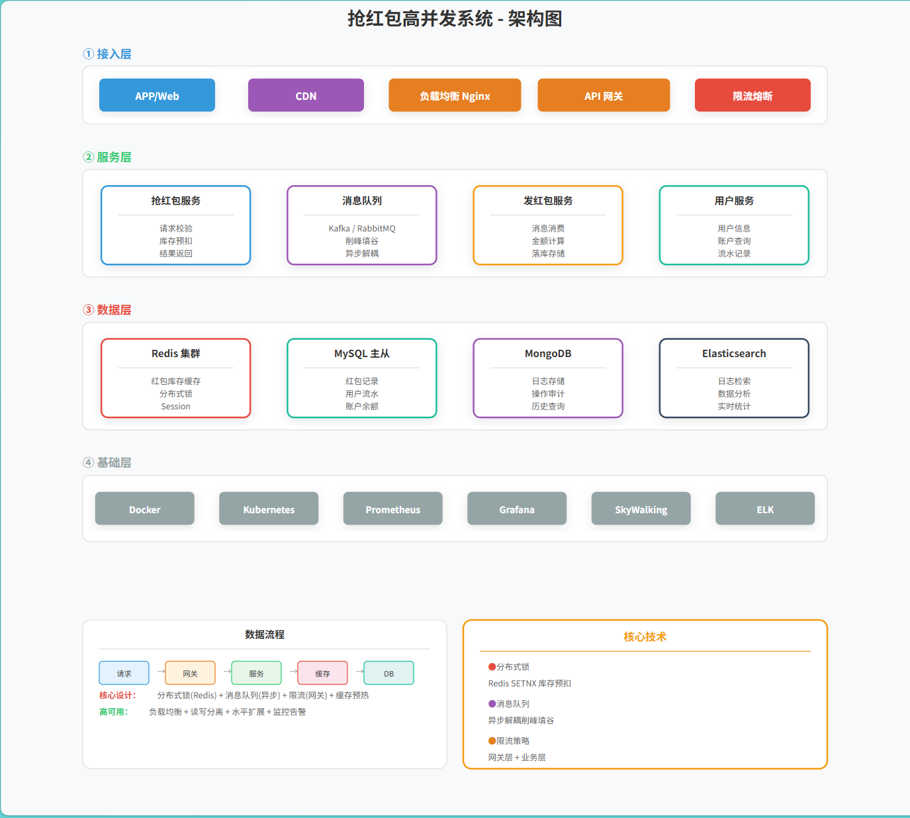
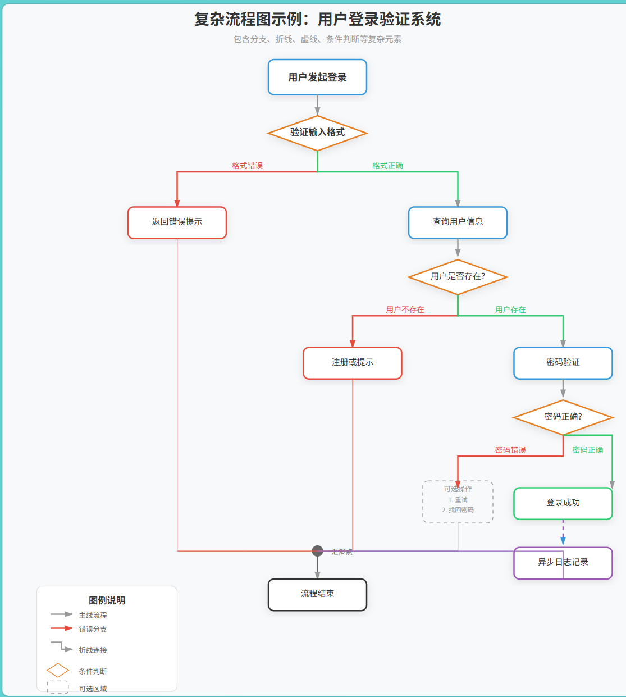
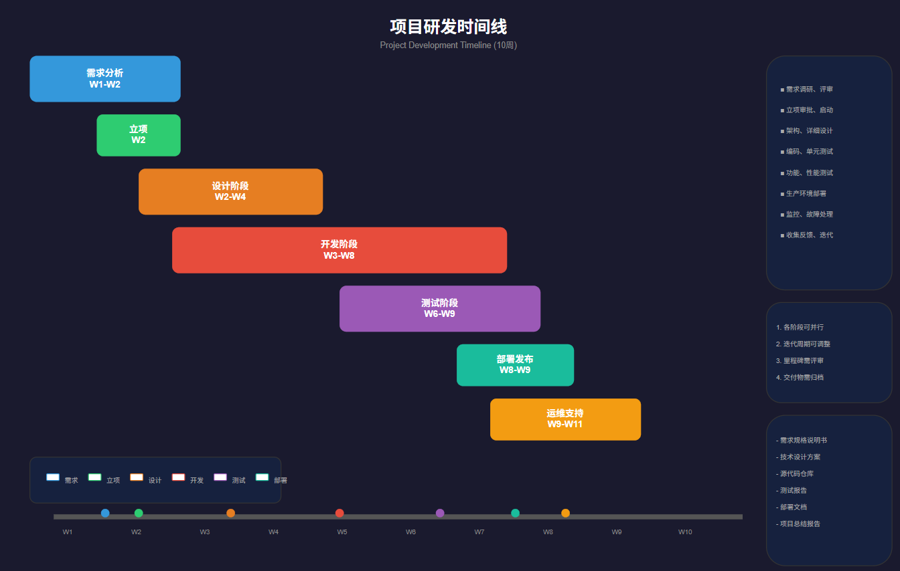
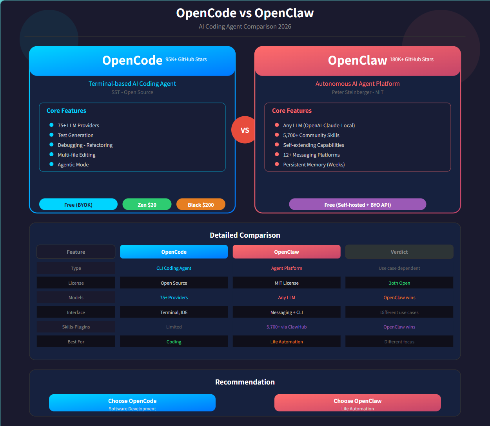
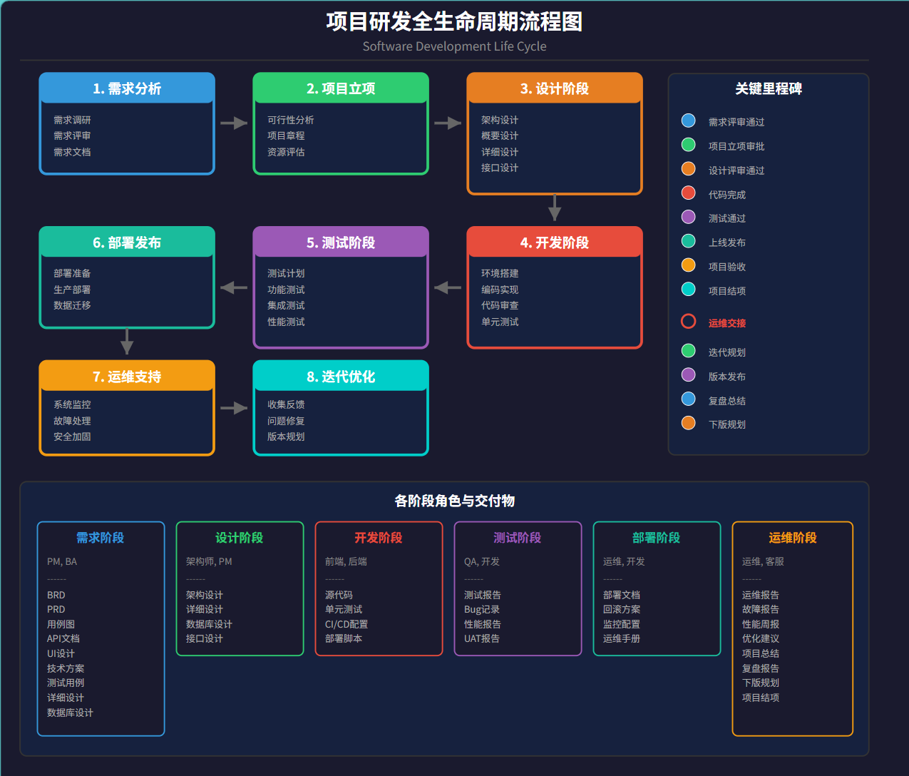

# 网上优秀的skill 推荐
以下是整合后的技能清单表格，按“名称、功能、地址”顺序排列：

| Skill 名称 | 功能简介 | GitHub 地址 |
| --- | --- | --- |
| tavily-search | 为 Agent 提供实时互联网搜索、网页内容提取与研究能力 | https://github.com/tavily-ai/skills |
| find-skills | 在 Agent Skills 生态中搜索并自动安装所需 skill | https://github.com/vercel-labs/skills/tree/main/skills/find-skills |
| feishu-doc | 将飞书文档/知识库转换为 AI 可读取的 Markdown 内容 | https://github.com/openclaw/skills/tree/main/skills/autogame-17/feishu-doc |
| self-improving-agent | 通过记录错误、经验和反馈让 Agent 持续自我改进 | https://github.com/peterskoett/self-improving-agent |
| gsd | 一个多 Agent 的软件开发流程系统（研究→规划→执行→验证） | https://github.com/gsd-build/get-shit-done |
| superpowers | 为 AI 编程 Agent 提供完整的软件开发技能库与自动化开发工作流 | https://github.com/obra/superpowers |
| skill-creator | 创建和管理 OpenCode Skills 的指南，帮助你设计并构建符合规范的技能清单 | https://github.com/igorwarzocha/opencode-workflows |
| add-skill | 从任意 GitHub 仓库安装 agent skills，支持 OpenCode、Claude Code、Codex、Cursor 等。 | https://github.com/ahmadawais/add-skill |
| excalidraw-diagram | 程序化创建 Excalidraw 手绘风格图表，支持流程图、架构图等。 | https://github.com/axtonliu/axon-obsidian-visual-skills |
| mermaid-visualizer | 创建专业的 Mermaid 图表，支持流程图、时序图、状态图等，带有颜色主题样式。 | https://github.com/axtonliu/axon-obsidian-visual-skills |
| obsidian-canvas-creator | 为 Obsidian 生成 Canvas、Excalidraw 和 Mermaid 可视化内容。 | https://github.com/axtonliu/axon-obsidian-visual-skills |
| obsidian-skills | Obsidian 官方 Skills，帮助 AI 正确理解 Obsidian 的使用方式。 | https://github.com/kepano/obsidian-skills |
| awesome-claude-skills | 精选 agent skills 集合。 | https://github.com/CompasioHQ/awesome-claude-skills |
| agent-creator-skill | 创建 agent 的技能清单。 | https://github.com/rodrigolagodev/opencode-agent-creator-skill |
| obsidian-excalidraw | Obsidian 绘制 Excalidraw 的技能清单，实现以下功能：1. 在 Obsidian 中绘制 Excalidraw 技能清单；2. 创建动态图 | https://github.com/wanguiluux/obsidian-common-plugins-skills |
| remotion-skill | 创建动态图。 | https://github.com/Ceeon/remotion-skill |

# 项目介绍

主要skills说明：
- 编码相关skills，输出示例目录：output
  - requirements-analysis 需求分析
  - requirements-review 需求评审
  - prototype-design 原型设计，产出可交互的html
  - technical-design 技术设计，产出技术方案
 

- 绘图相关skill：输出示例：svg-output
  - xml-diagram[推荐] 生成drawio XML 文件，支持drawio 直接编辑
  - svg-generator[推荐] 生成svg图形，支持架构图、流程图、对比图等
  - drawio-diagram 绘制流程图、架构图等
其中上面两个skill 生成的图形基本风格一致，xml-diagram 生成的图形可以直接在drawio中编辑，推荐使用这个skill。实际使用过程中，使用相关skill 生成复杂的流程图效果都不太好，尤其是分支较多的情况下，如果是流程图，建议还是使用mermaid等代码绘图，绘图完再进行相关格式的转换。      
生成的图形 可以参考 相关skill 的示例目录或者svg-output目录
- .opencode\skills\xml-diagram\examples
- .opencode\skills\svg-generator\examples
- svg-output

部分图形预览：
- 架构图
  
- 流程图
- 
- 时间线图
  
- 对比图
  
- 全生命周期图

## 项目结构

``` markdown
.
├── .opencode
|  ├── skills  # agent skills 
├── output # skills 输出示例
```

## 项目使用

- 安装配置好opencode
- vscode 安装 opencode 插件

- skill 安装方法
通过对话框实现，示例：
```markdown
请为我在[全局/具体项目或者路径]安装 XXXX skill, skill url: https://github.com/opencode-ai/skill-XXXX
```
- skill 使用方法：
通过对话框即可使用相关skills，示例：
```markdown
请使用 XXXX skill 为我XXX
```
