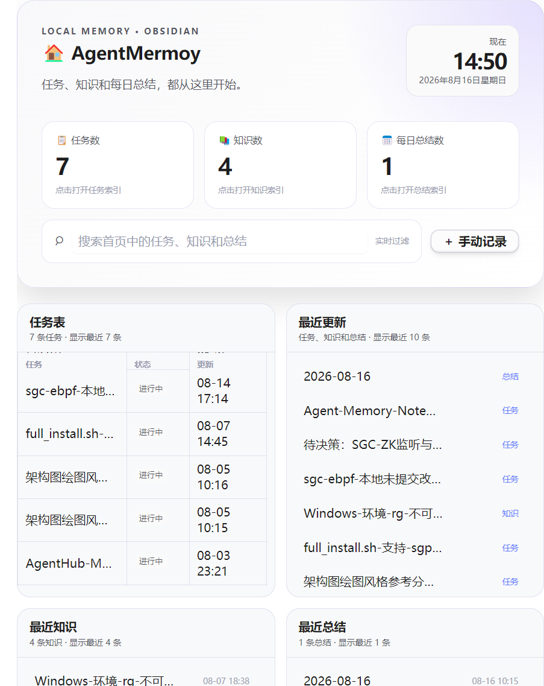
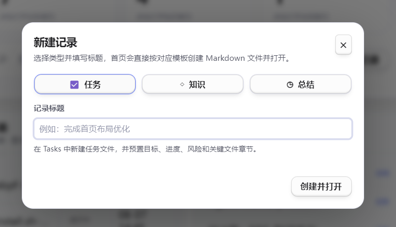

# agent-offline-mermory 使用手册

`agent-offline-mermory` 用本地 Markdown 文件保存 AI 协作记忆，支持 Obsidian 仓库和普通 Markdown 文件夹。记录分为任务、知识和每日总结三类，所有读写都限制在用户配置的记忆根目录内。



## 功能概览

- `Tasks`：保存未完成事项、任务进度、阻塞和恢复工作所需的信息。
- `Knowledge`：保存可复用的问题原因、解决方案、验证方法和经验。
- `Daily`：按日期保存当天完成内容、问题和待办。
- 自动维护三类记录的 `_index.md` 索引。
- Obsidian 模式提供 Dataview 仪表盘、数字统计、首页搜索、最近记录和手动记录入口。
- 经验加载支持 `auto`（默认）和 `manual` 两种模式。
- 普通对话不会自动写入记录；每日总结也不会在任务结束后自动生成。

## 触发方式

主动查询或写入记忆时，需要明确调用 Skill：

```text
$agent-offline-mermory 查询尚未完成的任务
```

也可以说“使用 agent-offline-mermory”，或从 Skill 菜单选择本 Skill。

- **明确触发**：允许查询 `Tasks`、`Knowledge`、`Daily`，以及新建或更新记录。
- **自动回忆**：仅在 `experience_mode=auto` 且任务涉及 Git、代码修改、测试、构建、部署或环境配置等可复用技术流程时，只读检索相关 `Knowledge`，不写入任何内容。
- **不触发**：普通总结、闲聊和一般提问不会读取记忆目录。
- **临时跳过**：说“这次不用加载经验”，只跳过本次经验检索，不修改配置。

## 初始化

安装后必须先初始化。初始化需要确认：

1. `memory_root`：记忆根目录绝对路径。
2. `require_obsidian`：是否要求目录位于 Obsidian Vault 内，默认 `true`。
3. `experience_mode`：选择 `auto` 或 `manual`，默认 `auto`。

### 对话初始化（推荐）

```text
初始化 agent-offline-mermory
```

Agent 会逐项确认配置并完成初始化，不需要用户手敲长命令。

### 命令行初始化

Windows：

```powershell
& "<Skill目录>\scripts\write-memory.ps1" -Action Init
```

Linux 或 macOS：

```sh
sh "<Skill目录>/scripts/write-memory.sh" --action init
```

也可以把 `settings.example.json` 复制为 `settings.json`，填写配置后再执行初始化。

初始化完成后会生成：

```text
<记忆根目录>/
├── <记忆根目录名>.md        # 入口文档；Obsidian 模式下为仪表盘
├── Daily/
│   └── _index.md             # 每日总结索引
├── Tasks/
│   └── _index.md             # 任务索引
└── Knowledge/
    └── _index.md             # 知识索引
```

## Obsidian 首页

当 `require_obsidian=true` 时，入口文档会使用 DataviewJS 渲染仪表盘。需要在 Obsidian 中安装并启用社区插件 **Dataview**，同时允许 JavaScript 查询。

首页包含：

- **任务数、知识数、每日总结数**：点击指标卡直接打开对应目录的索引文件。
- **搜索栏**：实时过滤当前首页中的任务、知识和总结。
- **任务表、最近更新、最近知识、最近总结**：四个区域采用固定高度和纵向滚动。
- **完整标题提示**：列表标题在空间不足时省略，鼠标悬停可查看完整名称。
- **手动记录**：选择任务、知识或总结，直接按对应模板创建文件。

每个列表默认最多显示 10 条。可以修改入口文档 frontmatter：

```yaml
dashboard_limit: 10
```

有效范围为 1–100，超出范围时会自动限制到边界值。

重新执行 `init` 或 `set-root` 时，写入器会自动升级旧版仪表盘，不会删除已有任务、知识或总结。

## 手动记录

点击首页右上方的“手动记录”，弹窗会提供三种类型。



- **任务**：填写标题后，在 `Tasks` 中创建独立文件，并预置目标、进度、风险和关键文件章节。
- **知识**：填写标题后，在 `Knowledge` 中创建独立文件，并预置场景、原因、解决方案和注意事项章节。
- **总结**：不需要填写标题，使用当天日期在 `Daily` 中创建 `YYYY-MM-DD.md`；如果当天文件已经存在，只打开文件，不覆盖内容。

任务和知识文件名包含创建日期、时间和安全处理后的标题。创建成功后，对应 `_index.md` 会立即刷新并自动打开新文件。这个入口只在用户点击并确认后执行，不会自动触发。

## 三类记录模板

### 任务

```markdown
---
type: agent-task
status: active
tags: []
created: "创建时间"
updated: "更新时间"
---

# 任务标题

## 目标

## 进度与下一步

## 阻塞与风险

## 关键文件与命令
```

### 知识

```markdown
---
type: agent-knowledge
tags: []
created: "创建时间"
updated: "更新时间"
---

# 知识标题

## 场景

## 问题与原因

## 解决方案与验证

## 注意事项
```

### 每日总结

```markdown
---
type: agent-daily
date: "YYYY-MM-DD"
created: "创建时间"
updated: "更新时间"
---

# YYYY-MM-DD

## 完成

## 问题

## 待办
```

首页手动记录会创建包含全部空章节的模板。Agent 写入时可以省略没有内容的章节；再次写入当天总结时，会追加到当天文件而不是创建第二份总结。

## 对话使用示例

### 查询待办

```text
$agent-offline-mermory 有哪些待办需要处理？
```

Agent 查询 `Tasks` 中状态为 `active` 的记录，并返回标题、状态、摘要和绝对路径。

### 记录任务交接

```text
$agent-offline-mermory 把当前任务整理成交接文档
```

### 记录可复用经验

```text
$agent-offline-mermory 记录这次 Git 提交踩坑：hooks 没生效，提交前先检查 .git/hooks
```

写入知识前会先只读检索相似经验；没有高相关结果时会明确说明，不会加载无关记录。

### 记录每日总结

```text
$agent-offline-mermory 记录今天的每日总结
```

### 查询经验

```text
$agent-offline-mermory Git 提交有哪些经验？
```

### 更新指定文档

```text
$agent-offline-mermory 把“红包系统部署”这篇任务的下一步更新为：环境变量已配置，开始验证
```

只有用户明确提供文件路径、准确文档名或 Obsidian 链接时，Agent 才会更新已有文档。

### 切换经验加载模式

```text
$agent-offline-mermory 把经验加载模式改成 manual，只在我说用的时候再加载
```

## 经验加载模式

- `auto`：可重复技术流程开始前自动只读检索 `Knowledge`，最多加载 3 条高相关经验。
- `manual`：只有明确调用本 Skill 时才加载经验。
- 没有高相关结果时会继续当前任务，不创建记录，也不会把无关内容当作经验。

## 安全边界

- 所有 Agent 写入必须通过 Skill 自带写入器完成。
- 不得写入已配置记忆根目录之外的位置。
- 不得自行猜测要更新哪个已有文件。
- 查询会跳过 `_index.md`，避免把索引本身当成记录。
- Obsidian 首页手动记录只通过 Vault API 写入当前记忆目录，不会覆盖已有当天总结。
- `settings.json` 保存本地绝对路径，不应提交到 Git。

## 相关文件

- [Skill 执行规则](../../.opencode/skills/agent-offline-mermory/SKILL.md)
- [配置模板](../../.opencode/skills/agent-offline-mermory/settings.example.json)
- [任务模板](../../.opencode/skills/agent-offline-mermory/assets/templates/task-handoff.md)
- [知识模板](../../.opencode/skills/agent-offline-mermory/assets/templates/knowledge-note.md)
- [每日总结模板](../../.opencode/skills/agent-offline-mermory/assets/templates/daily-summary.md)
- [Obsidian 首页模板](../../.opencode/skills/agent-offline-mermory/assets/templates/dashboard-obsidian.md)
