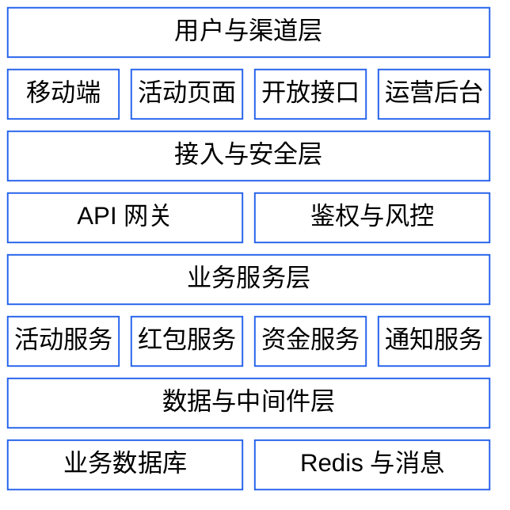

# 抢红包系统框图

使用 `block-beta` 表达静态系统分层，整体纵向排列、层内横向展开，默认不添加箭头。

```mermaid
%%{init: {"theme":"base","themeVariables":{"fontFamily":"Inter, Noto Sans SC, Microsoft YaHei, sans-serif","primaryColor":"#FFFFFF","primaryBorderColor":"#2563EB","primaryTextColor":"#172033","lineColor":"#64748B","background":"#F6F8FB"}}}%%
block-beta
    columns 4
    channels["用户与渠道层"]:4
    app["移动端"]
    web["活动页面"]
    openapi["开放接口"]
    admin["运营后台"]
    access["接入与安全层"]:4
    gateway["API 网关"]:2
    security["鉴权与风控"]:2
    business["业务服务层"]:4
    activity["活动服务"]
    packet["红包服务"]
    fund["资金服务"]
    notice["通知服务"]
    data["数据与中间件层"]:4
    database["业务数据库"]:2
    cache["Redis 与消息"]:2
```

## 说明

- 四列网格保证同层模块均匀分布。
- 静态层级通过空间位置表达，不使用无意义箭头。
