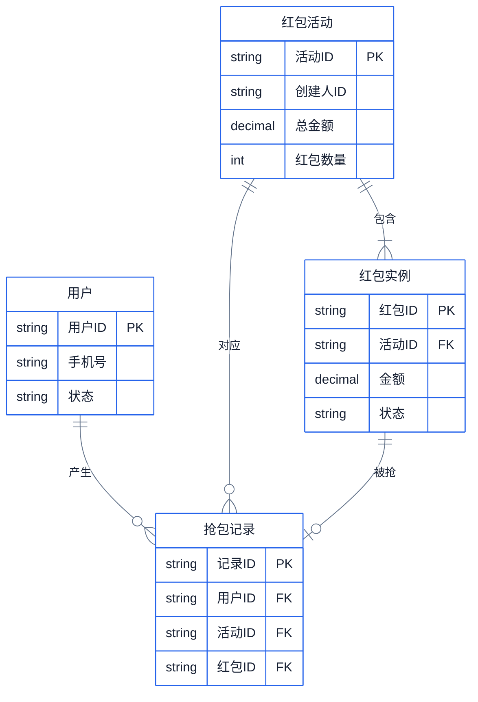

# 抢红包系统 ER 图

使用 `erDiagram` 表达活动、红包实例、抢包记录和用户之间的关系。

```mermaid
%%{init: {"theme":"base","themeVariables":{"fontFamily":"Inter, Noto Sans SC, Microsoft YaHei, sans-serif","primaryColor":"#FFFFFF","primaryBorderColor":"#2563EB","primaryTextColor":"#172033","lineColor":"#64748B","background":"#F6F8FB"}}}%%
erDiagram
    用户 ||--o{ 抢包记录 : 产生
    红包活动 ||--|{ 红包实例 : 包含
    红包活动 ||--o{ 抢包记录 : 对应
    红包实例 ||--o| 抢包记录 : 被抢
    用户 {
        string 用户ID PK
        string 手机号
        string 状态
    }
    红包活动 {
        string 活动ID PK
        string 创建人ID
        decimal 总金额
        int 红包数量
    }
    红包实例 {
        string 红包ID PK
        string 活动ID FK
        decimal 金额
        string 状态
    }
    抢包记录 {
        string 记录ID PK
        string 用户ID FK
        string 活动ID FK
        string 红包ID FK
    }
```

## 说明

- 所有关系均包含明确基数。
- 只保留理解领域关系所需的核心字段。
