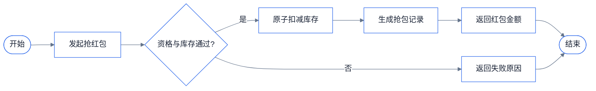

# 用户抢红包主要流程

使用 `flowchart` 表达资格判断、成功与失败分支。

```mermaid
%%{init: {"theme":"base","themeVariables":{"fontFamily":"Inter, Noto Sans SC, Microsoft YaHei, sans-serif","primaryColor":"#FFFFFF","primaryBorderColor":"#2563EB","primaryTextColor":"#172033","lineColor":"#64748B","background":"#F6F8FB"}}}%%
flowchart LR
    start([开始]) --> request[发起抢红包]
    request --> validate{资格与库存通过?}
    validate -->|是| deduct[原子扣减库存]
    deduct --> record[生成抢包记录]
    record --> success[返回红包金额]
    validate -->|否| failure[返回失败原因]
    success --> endNode([结束])
    failure --> endNode
```

## 说明

- 主流程水平排列，失败分支在下方汇聚。
- 判断出口使用明确的“是/否”标签。
