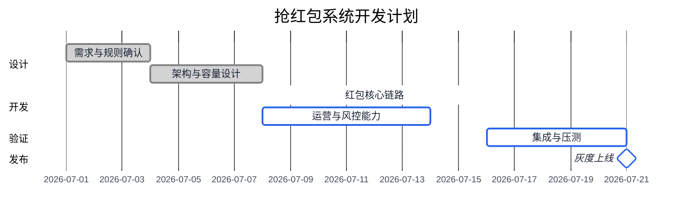

# 抢红包系统开发计划

使用 `gantt` 表达设计、开发、验证和上线阶段。

```mermaid
%%{init: {"theme":"base","themeVariables":{"fontFamily":"Inter, Noto Sans SC, Microsoft YaHei, sans-serif","primaryColor":"#FFFFFF","primaryBorderColor":"#2563EB","primaryTextColor":"#172033","lineColor":"#64748B","background":"#F6F8FB"}}}%%
gantt
    title 抢红包系统开发计划
    dateFormat YYYY-MM-DD
    section 设计
    需求与规则确认 :done, req, 2026-07-01, 3d
    架构与容量设计 :done, design, after req, 4d
    section 开发
    红包核心链路 :active, core, after design, 8d
    运营与风控能力 :ops, after design, 6d
    section 验证
    集成与压测 :test, after core, 5d
    section 发布
    灰度上线 :milestone, release, after test, 0d
```

## 说明

- 阶段、依赖和里程碑明确。
- 核心链路和运营能力可以并行开发。
