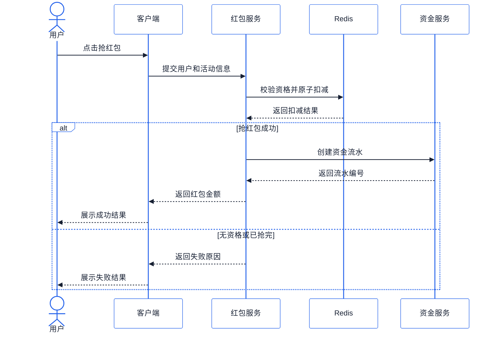

# 用户抢红包时序图

使用 `sequenceDiagram` 表达请求、原子扣减和结果返回。

```mermaid
%%{init: {"theme":"base","themeVariables":{"fontFamily":"Inter, Noto Sans SC, Microsoft YaHei, sans-serif","primaryColor":"#FFFFFF","primaryBorderColor":"#2563EB","primaryTextColor":"#172033","lineColor":"#64748B","background":"#F6F8FB"}}}%%
sequenceDiagram
    actor U as 用户
    participant C as 客户端
    participant P as 红包服务
    participant R as Redis
    participant F as 资金服务
    U->>C: 点击抢红包
    C->>P: 提交用户和活动信息
    P->>R: 校验资格并原子扣减
    R-->>P: 返回扣减结果
    alt 抢红包成功
        P->>F: 创建资金流水
        F-->>P: 返回流水编号
        P-->>C: 返回红包金额
        C-->>U: 展示成功结果
    else 无资格或已抢完
        P-->>C: 返回失败原因
        C-->>U: 展示失败结果
    end
```

## 说明

- 消息按时间向下排列。
- 成功与失败通过 `alt / else` 表达。
