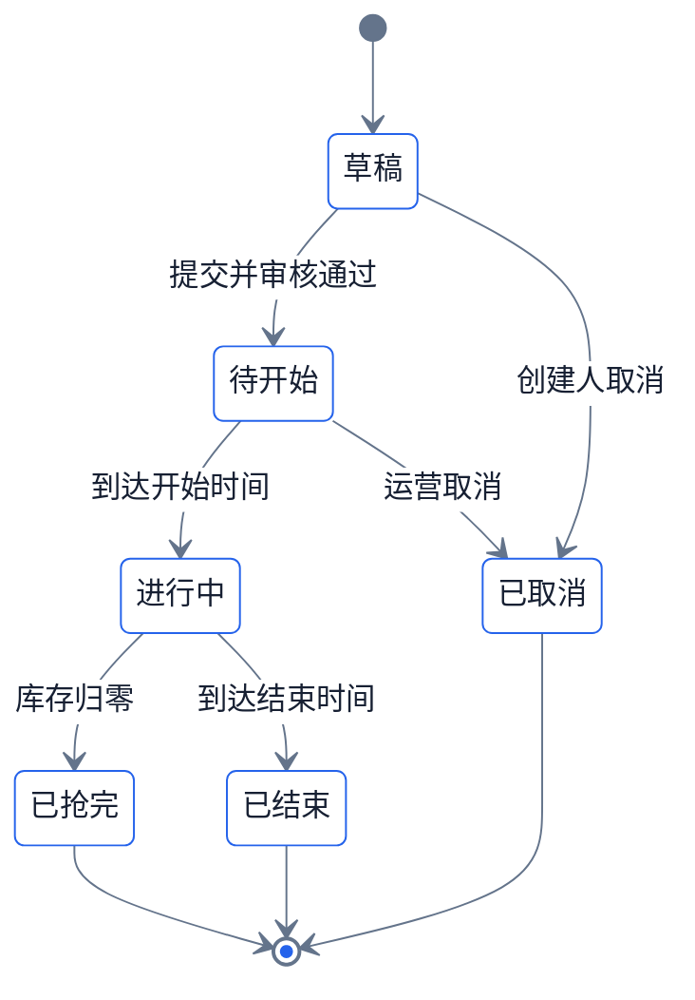

# 红包活动状态图

使用 `stateDiagram-v2` 表达红包活动从创建到结束的状态变化。

```mermaid
%%{init: {"theme":"base","themeVariables":{"fontFamily":"Inter, Noto Sans SC, Microsoft YaHei, sans-serif","primaryColor":"#FFFFFF","primaryBorderColor":"#2563EB","primaryTextColor":"#172033","lineColor":"#64748B","background":"#F6F8FB"}}}%%
stateDiagram-v2
    [*] --> 草稿
    草稿 --> 待开始 : 提交并审核通过
    待开始 --> 进行中 : 到达开始时间
    进行中 --> 已抢完 : 库存归零
    进行中 --> 已结束 : 到达结束时间
    草稿 --> 已取消 : 创建人取消
    待开始 --> 已取消 : 运营取消
    已抢完 --> [*]
    已结束 --> [*]
    已取消 --> [*]
```

## 说明

- 初始和终止状态明确。
- 每条转换均标明触发条件。
