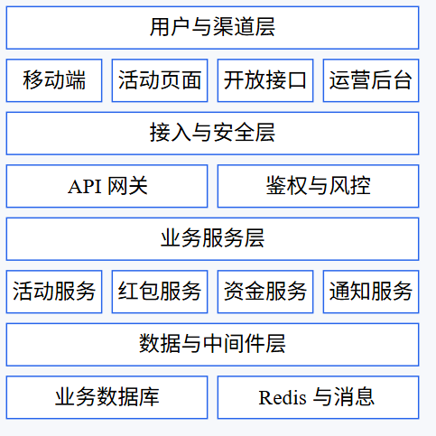
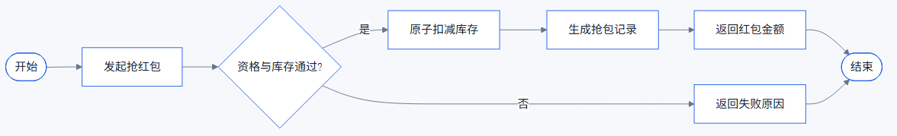
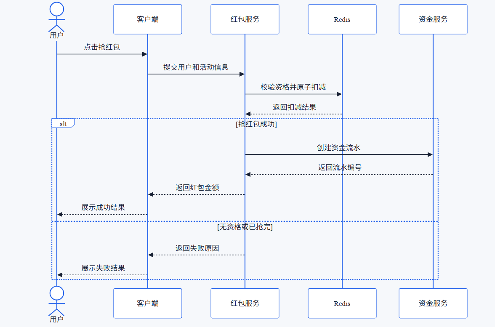
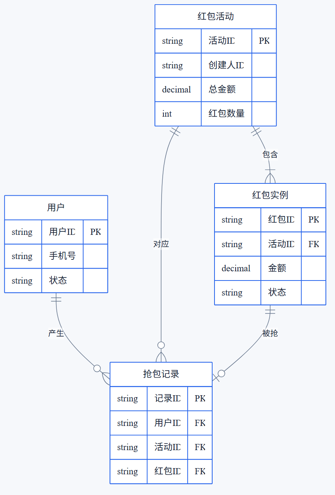
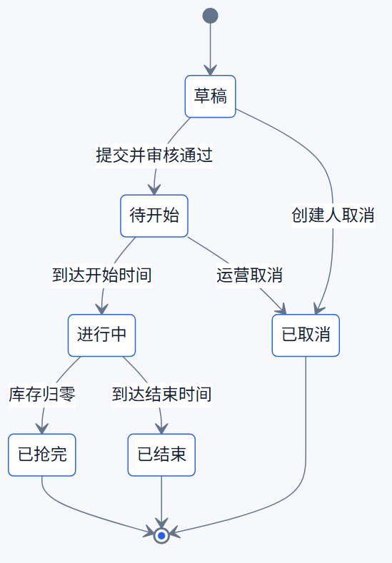
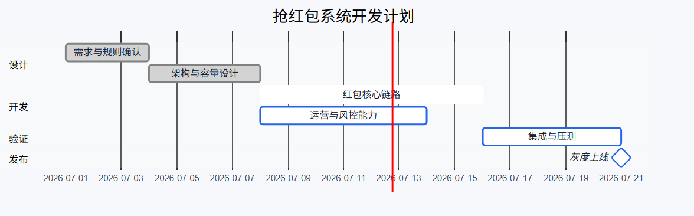

> 现在有一个抢红包系统，请使用 mermaid-gen 绘制系统框图、用户抢红包主要流程图、用户抢红包时序图、ER 图、红包活动状态图和系统开发计划。

测试环境：Mermaid CLI 11.16.0，Chrome Headless。

## 文件索引

| 图形类型 | Markdown |
| --- | --- |
| 系统框图 | [architecture-red-packet.md](markdown/architecture-red-packet.md) |
| 主要流程图 | [flow-red-packet.md](markdown/flow-red-packet.md) |
| 时序图 | [sequence-red-packet.md](markdown/sequence-red-packet.md) |
| ER 图 | [er-red-packet.md](markdown/er-red-packet.md) |
| 状态图 | [state-red-packet.md](markdown/state-red-packet.md) |
| 开发计划 | [gantt-red-packet.md](markdown/gantt-red-packet.md) |

## 渲染截图

### 系统框图

### 主要流程图

### 时序图

### ER 图

### 状态图

### 开发计划

## 验证范围

- Markdown 围栏完整且每个文件只有一个 Mermaid block。
- 图型、固定主题和类型专属语义检查通过。
- 所有案例使用 Mermaid CLI 11.16.0 完成真实渲染。
