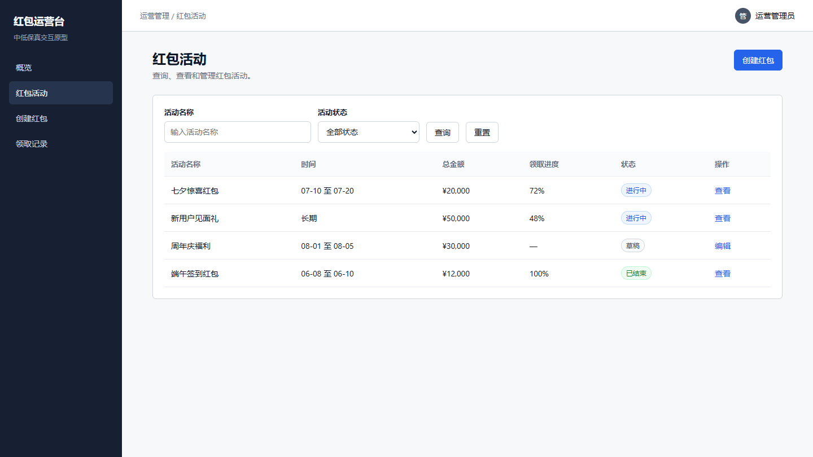
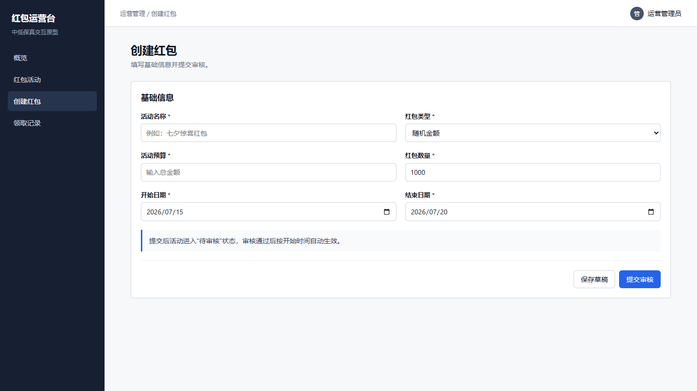

> 现在有一个抢红包系统，请使用 prototype-design-html 绘制红包运营后台原型，包含运营概览、红包活动列表、创建红包和领取记录。要求页面之间可以切换，活动可以查询，详情弹窗可以打开和关闭，创建红包需要表单校验；整体采用简约浅色原型风格，不使用阴影、渐变和背景网格。

测试环境：Codex Desktop，本地 Chromium 浏览器，桌面视口 1440×810 和 1280×720。

## 文件索引

| 原型 | 文件 |
| --- | --- |
| 红包运营后台 HTML 原型 | [red-packet-prototype.html](html/red-packet-prototype.html) |

## 浏览器截图

### 运营概览

### 红包活动列表

### 创建红包

## 验证范围

- 概览、活动、创建和领取记录四个页面可以切换。
- 活动名称与状态查询、重置和空结果状态可用。
- 活动详情弹窗可以打开、关闭并点击遮罩关闭。
- 创建表单可以显示必填错误，填写有效内容后可以提交。
- 浏览器控制台无错误，页面无外部资源依赖。
- 1440×810 和 1280×720 下无元素重叠、文字截断和异常大面积空白。
