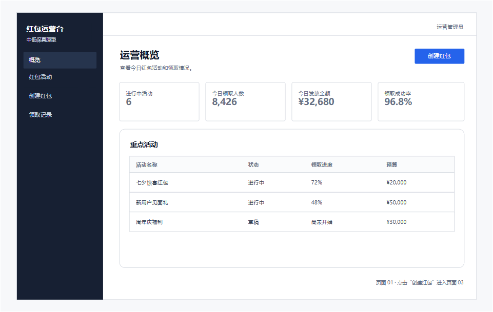
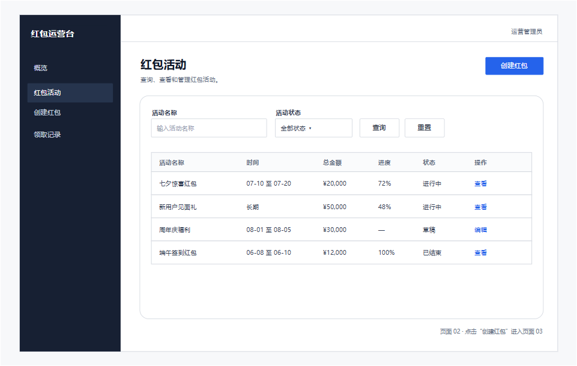
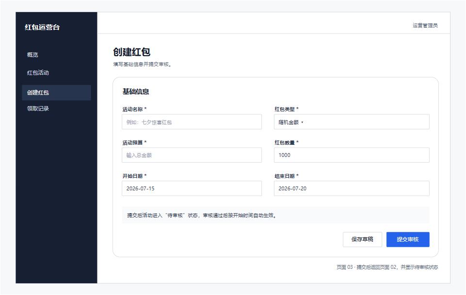

# prototype-design-xml 测试示例

测试环境：Codex Desktop，app.diagrams.net、viewer.diagrams.net，Chrome 浏览器。

## 示例一：红包运营后台

> 现在有一个抢红包系统，请使用 prototype-design-xml 绘制红包运营后台原型，包含运营概览、红包活动列表和创建红包。每个主要页面使用独立的 Draw.io 页面，使用页面编号和文字说明表达跳转；整体采用简约浅色原型风格，不使用阴影、渐变、背景网格和大量箭头。

### 页面截图

#### 运营概览

#### 红包活动列表

#### 创建红包

## 示例二：消息聊天

> 请使用 prototype-design-xml 绘制移动端消息聊天页面原型，包含页面标题、联系人头像和在线状态、左右消息气泡、消息时间、输入框、附件入口和发送按钮；整体采用简约浅色风格，不输出 DSL 文件。

### 页面截图

## 文件索引

| 原型 | 文件 |
| --- | --- |
| 红包运营后台 Draw.io 原型 | [red-packet-prototype.drawio](drawio/red-packet-prototype.drawio) |
| 消息聊天 Draw.io 原型 | [chat-prototype.drawio](drawio/chat-prototype.drawio) |

## 验证范围

- 文件包含运营概览、红包活动和创建红包三个独立 diagram page。
- XML 可以解析，`mxCell` ID 唯一，元素父级和页面名称完整。
- 文件已在 app.diagrams.net 中成功打开，三个页面均完成真实渲染检查。
- 页面标题和区域标题为独立文字元素。
- 无背景网格、渐变、装饰性阴影和页面跳转箭头。
- 页面布局均匀，无元素重叠、文字截断和异常大面积空白。
- 消息聊天原型为单个 `Chat Prototype` 页面，画布 375×667，包含 20 个 `mxCell`，页面组件保持可编辑。
- 消息聊天原型已在 diagrams.net viewer 中完成真实渲染检查，页面内容完整且未生成 DSL 文件。
