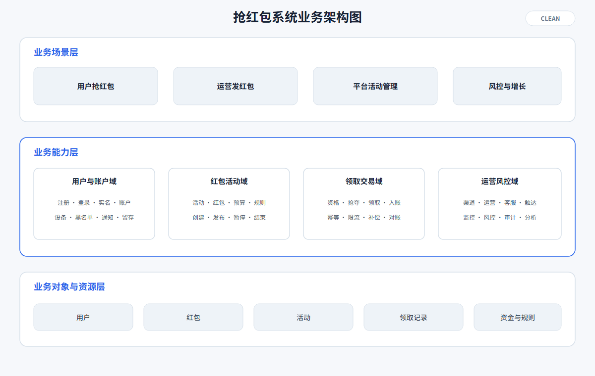
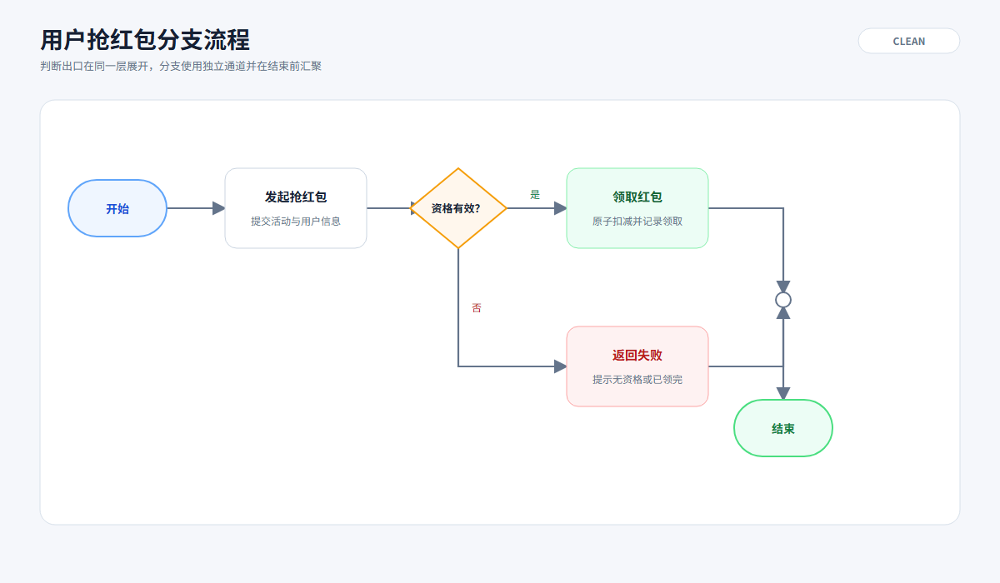
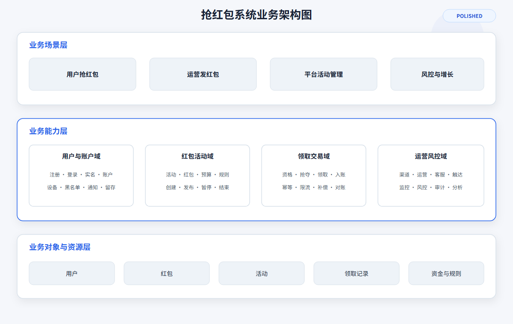
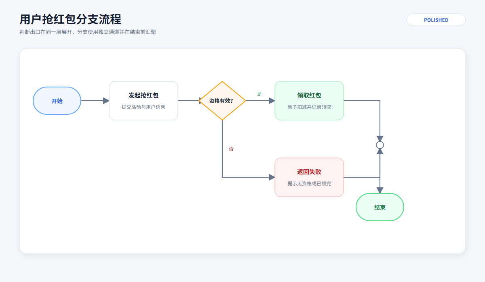
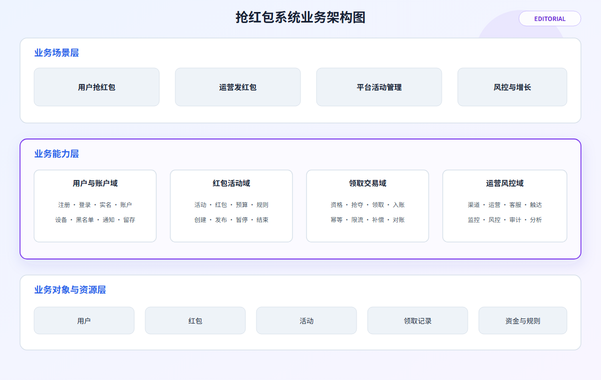
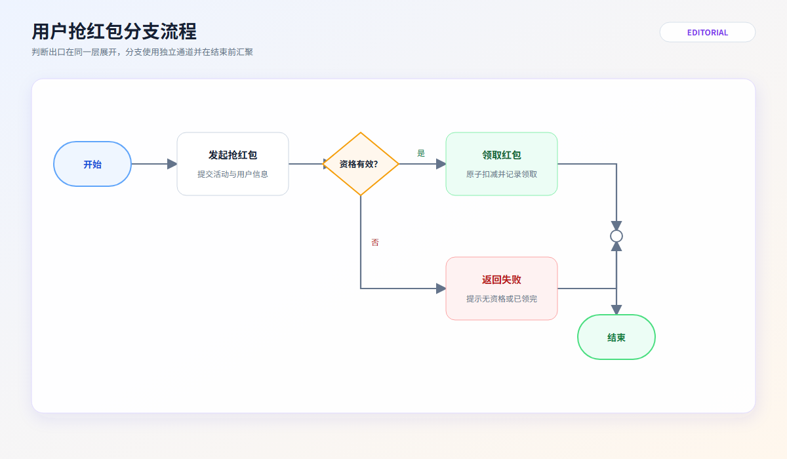

> 现在有一个抢红包系统，请使用 svg-generator 绘制系统的业务架构图和用户抢红包的主要分支流程图，clean、polished、editorial 三种质感模式都需要。

测试环境：Codex Desktop，本机 Google Chrome SVG 渲染。

本轮使用完全相同的业务内容和主要几何结构对比三种质感模式。`clean` 侧重清晰和克制，`polished` 增加轻量层次与阴影，`editorial` 使用一种低对比度渐变和一个视觉焦点。三种模式均保持节点、文字、层级和流程关系不变。

## SVG 文件索引

| 图形类型 | Clean | Polished | Editorial |
| --- | --- | --- | --- |
| 业务架构图 | [architecture-business-clean-red-packet.svg](svg/architecture-business-clean-red-packet.svg) | [architecture-business-polished-red-packet.svg](svg/architecture-business-polished-red-packet.svg) | [architecture-business-editorial-red-packet.svg](svg/architecture-business-editorial-red-packet.svg) |
| 用户抢红包分支流程图 | [flow-branching-clean-red-packet.svg](svg/flow-branching-clean-red-packet.svg) | [flow-branching-polished-red-packet.svg](svg/flow-branching-polished-red-packet.svg) | [flow-branching-editorial-red-packet.svg](svg/flow-branching-editorial-red-packet.svg) |

## 三种模式对比

### Clean

业务架构图：

分支流程图：

### Polished

业务架构图：

分支流程图：

### Editorial

业务架构图：

分支流程图：

## 模式差异说明

- `clean`：不使用渐变和投影，以纯色背景、统一边框和明确层级为主。
- `polished`：使用极轻阴影、柔和表面层次和小面积模式标识，保持技术图的正式感。
- `editorial`：仅使用一种低对比度渐变，并加强业务能力层或流程主体的视觉焦点，没有增加无语义元素。

## 验证结果

- 6 个 SVG 文件均通过严格结构和视觉规则校验。
- 6 个 SVG 文件均通过本机 Chrome 真实渲染。
- 已检查三种模式下的颜色搭配、布局均匀性、元素重叠、字体清晰度、箭头和连线路径以及画布留白。
- 三种模式的业务内容、节点关系和主要几何结构保持一致，差异仅限质感表达。
