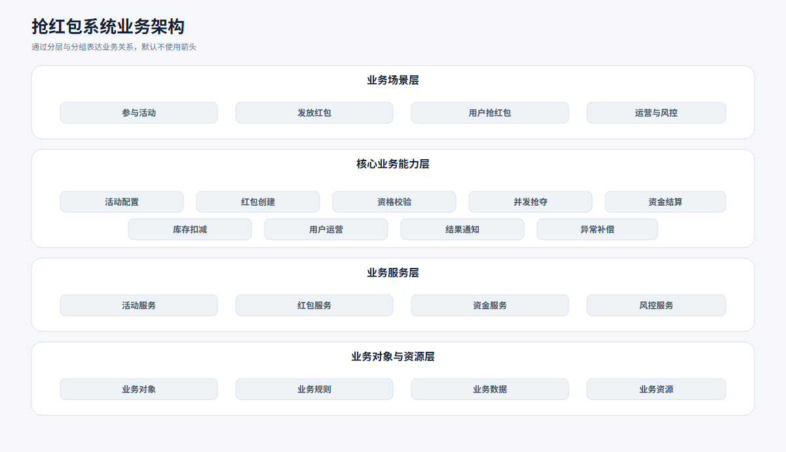
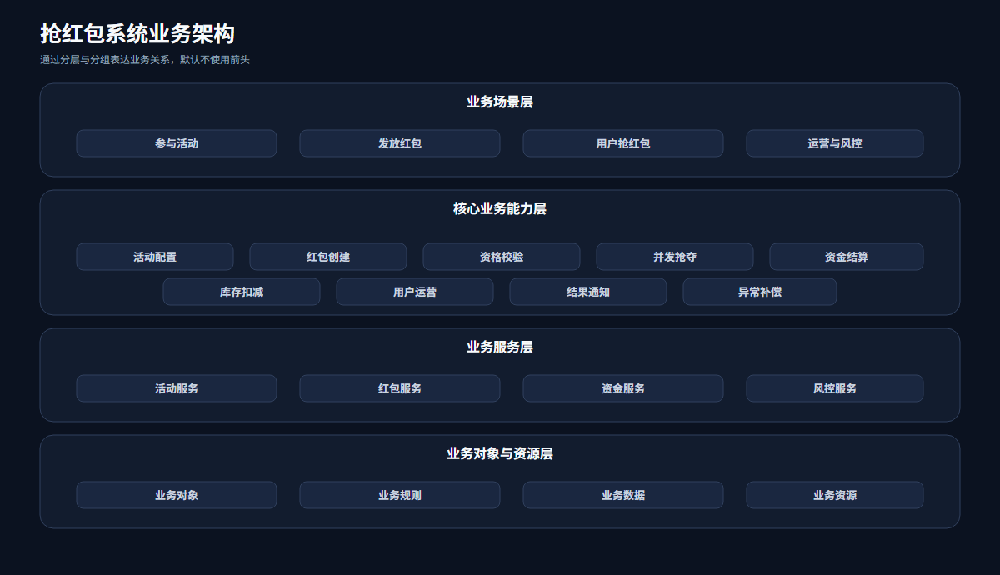
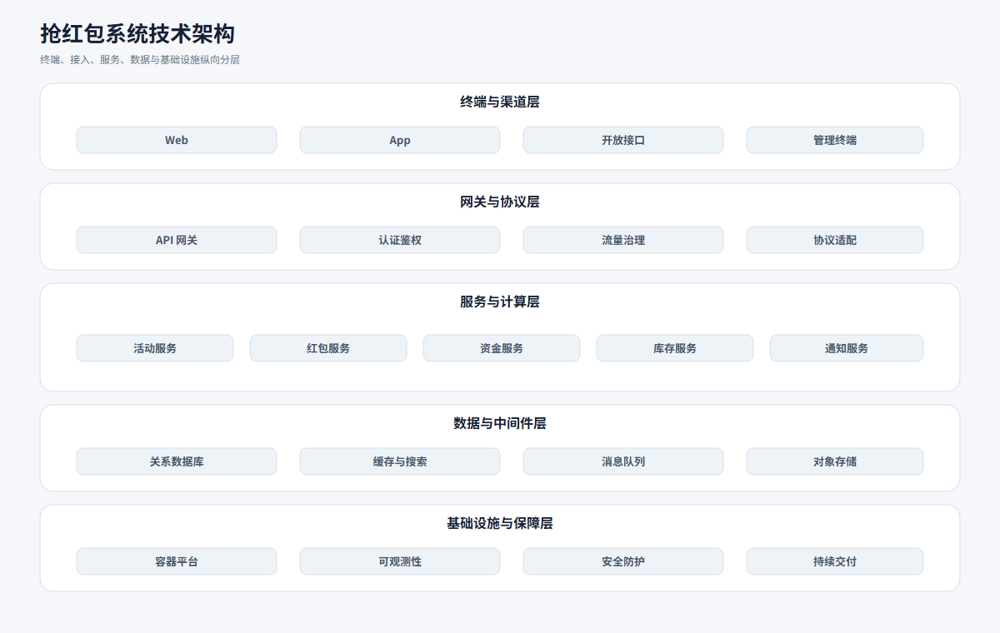
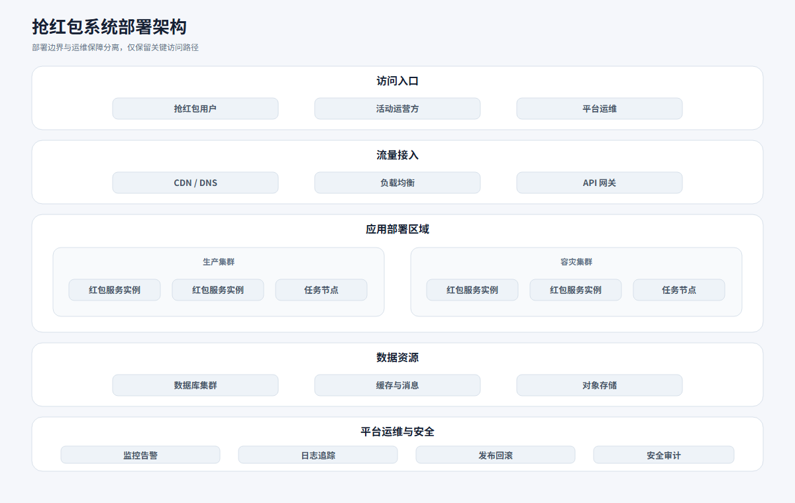
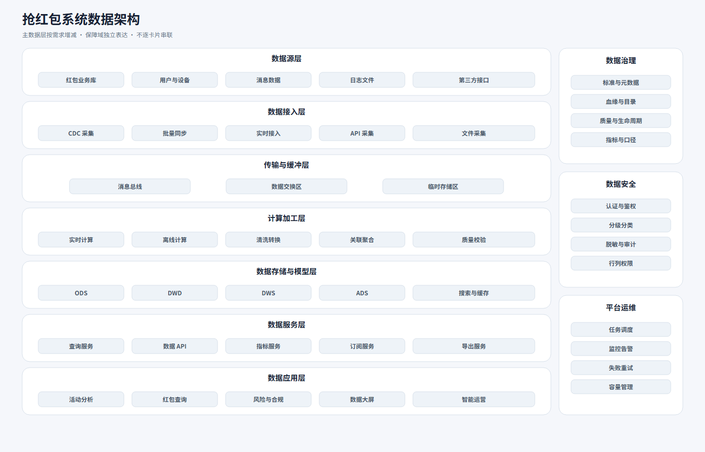
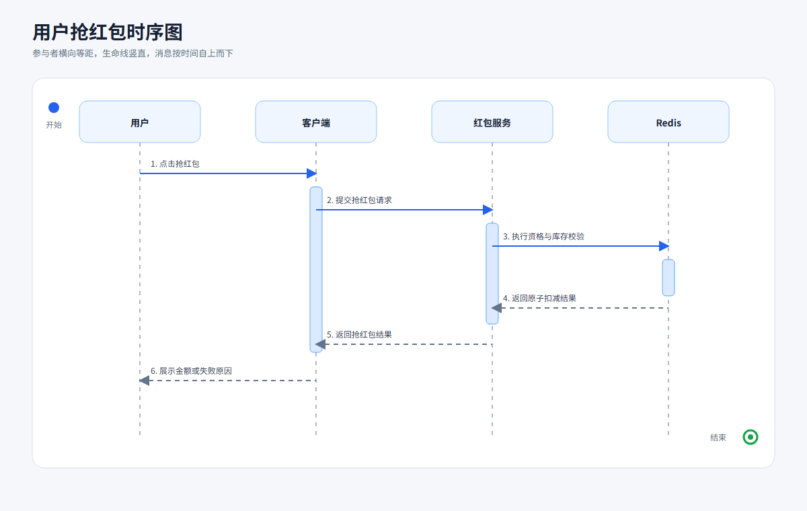
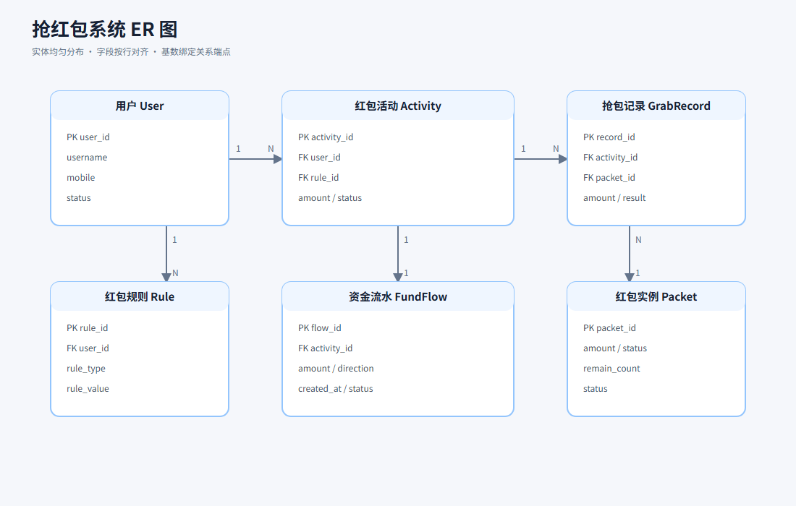
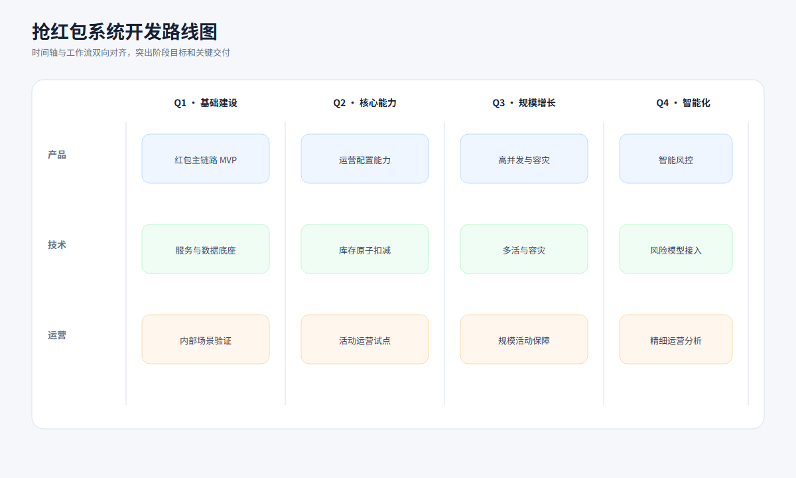

> 现在有一个抢红包的系统，请使用 svg-generator 绘制系统的业务架构图、技术架构图、部署架构图、主要流程图、用户抢红包的时序图、ER 图、功能总结图、系统开发关键节点图、系统开发路线图和数据架构图。深色背景和浅色背景都需要。

测试环境：Codex Desktop，本机 Google Chrome SVG 渲染。

本轮使用同一套统一视觉风格生成浅色和深色版本。两种主题的内容、节点关系和主要几何结构保持一致，只切换画布、表面、边框、文字和语义颜色。

## SVG 文件索引

| 图形类型 | 浅色 | 深色 |
| --- | --- | --- |
| 业务架构图 | [architecture-business-light-red-packet.svg](svg/architecture-business-light-red-packet.svg) | [architecture-business-dark-red-packet.svg](svg/architecture-business-dark-red-packet.svg) |
| 技术架构图 | [architecture-technical-light-red-packet.svg](svg/architecture-technical-light-red-packet.svg) | [architecture-technical-dark-red-packet.svg](svg/architecture-technical-dark-red-packet.svg) |
| 部署架构图 | [architecture-deployment-light-red-packet.svg](svg/architecture-deployment-light-red-packet.svg) | [architecture-deployment-dark-red-packet.svg](svg/architecture-deployment-dark-red-packet.svg) |
| 数据架构图 | [architecture-data-light-red-packet.svg](svg/architecture-data-light-red-packet.svg) | [architecture-data-dark-red-packet.svg](svg/architecture-data-dark-red-packet.svg) |
| 主要流程图 | [flow-branching-main-light-red-packet.svg](svg/flow-branching-main-light-red-packet.svg) | [flow-branching-main-dark-red-packet.svg](svg/flow-branching-main-dark-red-packet.svg) |
| 用户抢红包时序图 | [sequence-grab-light-red-packet.svg](svg/sequence-grab-light-red-packet.svg) | [sequence-grab-dark-red-packet.svg](svg/sequence-grab-dark-red-packet.svg) |
| ER 图 | [relationship-er-light-red-packet.svg](svg/relationship-er-light-red-packet.svg) | [relationship-er-dark-red-packet.svg](svg/relationship-er-dark-red-packet.svg) |
| 功能总结图 | [summary-function-light-red-packet.svg](svg/summary-function-light-red-packet.svg) | [summary-function-dark-red-packet.svg](svg/summary-function-dark-red-packet.svg) |
| 开发关键节点图 | [timeline-project-milestones-light-red-packet.svg](svg/timeline-project-milestones-light-red-packet.svg) | [timeline-project-milestones-dark-red-packet.svg](svg/timeline-project-milestones-dark-red-packet.svg) |
| 开发路线图 | [project-roadmap-light-red-packet.svg](svg/project-roadmap-light-red-packet.svg) | [project-roadmap-dark-red-packet.svg](svg/project-roadmap-dark-red-packet.svg) |

## 代表性截图

### 业务架构图

### 技术架构图

### 部署架构图

### 数据架构图

### 主要流程图

### 用户抢红包时序图

### ER 图

### 开发路线图

## 验证范围

- 检查 SVG XML、引用、唯一 id、可访问性信息和外部资源。
- 检查节点元数据、元素重叠、字号、颜色数量、画布利用率和留白均衡。
- 检查架构三级卡片高度和箭头数量。
- 检查流程起止节点、时序参与者生命线和 ER 关系基数。
- 使用本机 Chrome 对全部 SVG 进行真实渲染。
