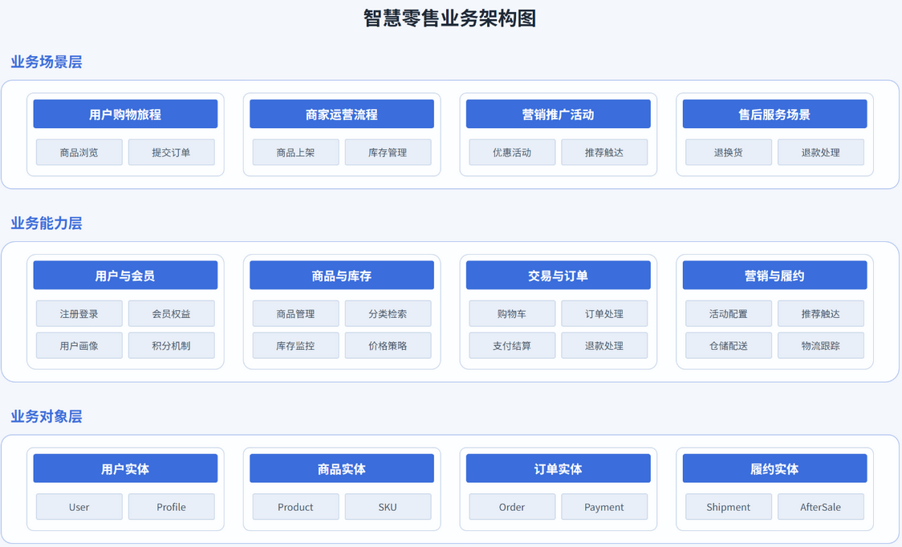
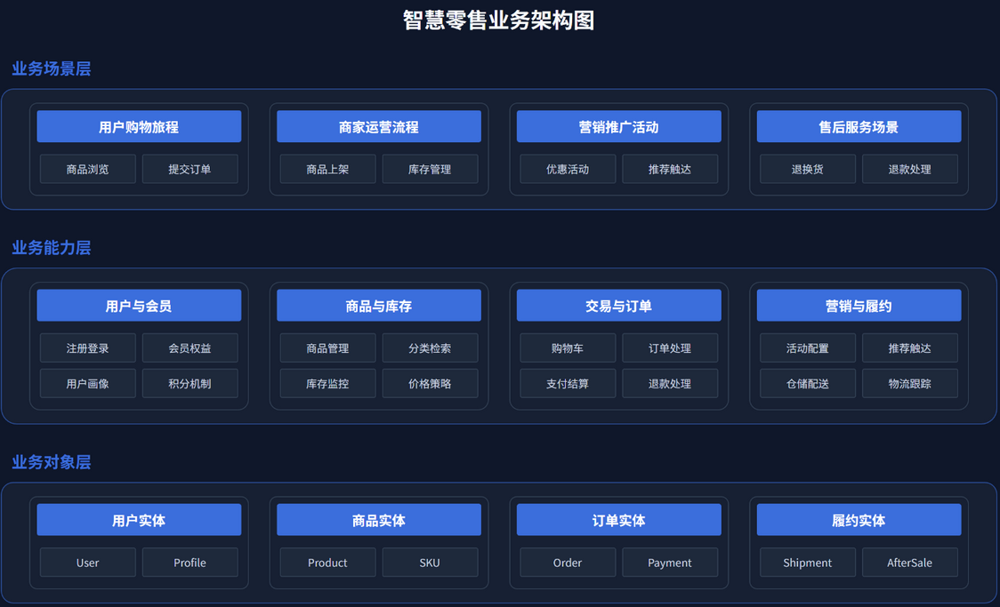
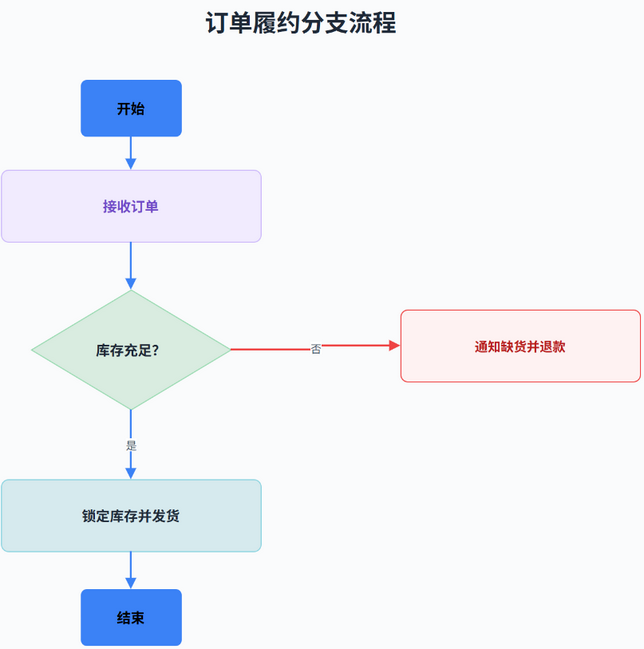
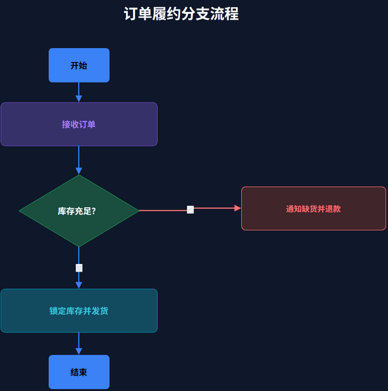
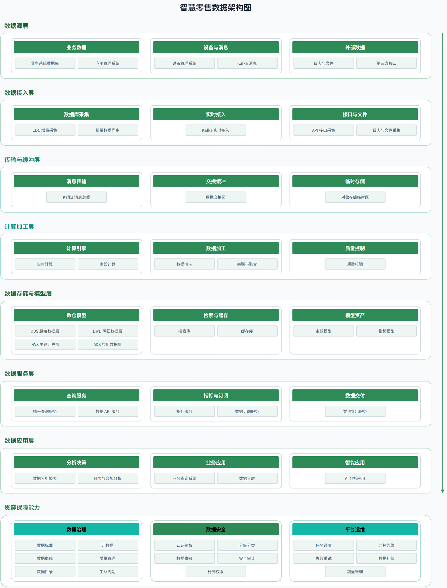
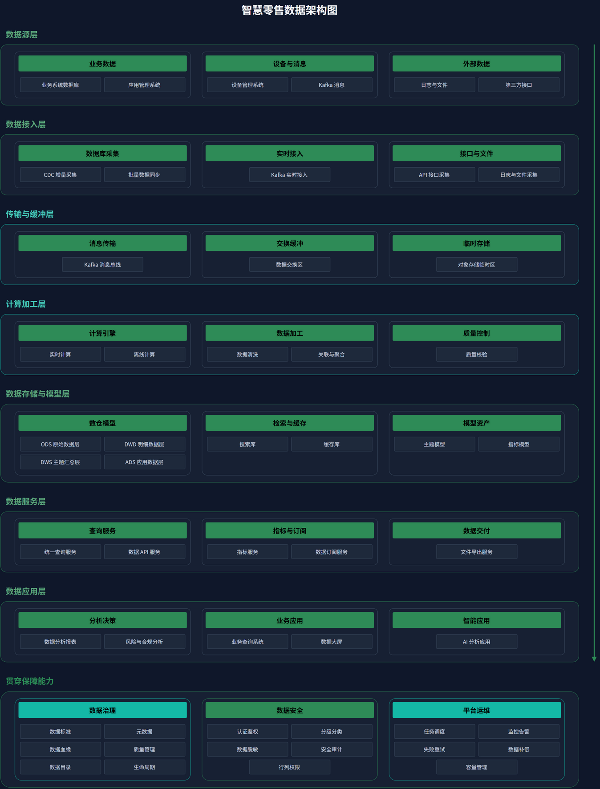
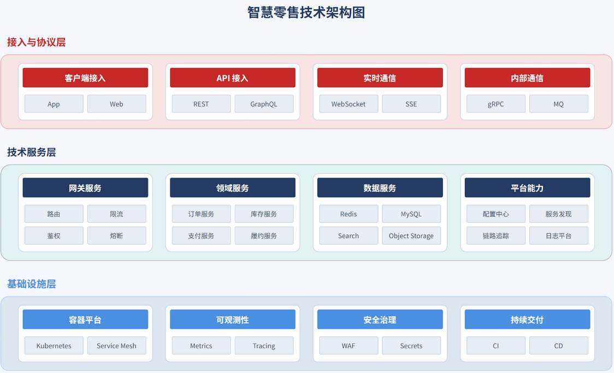
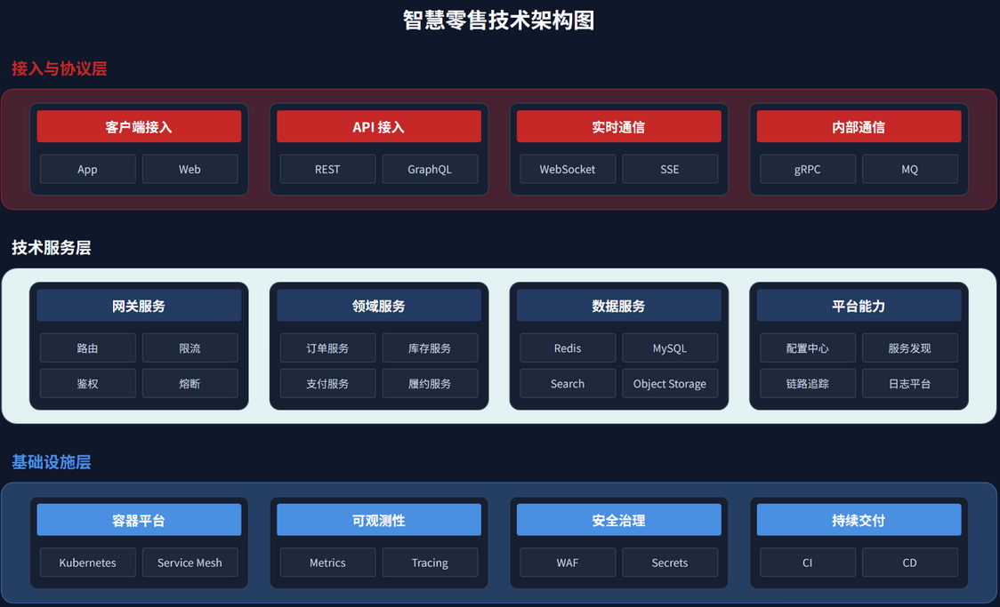

# xml-diagram 使用说明

`xml-diagram` 生成可在 Draw.io/diagrams.net 中继续编辑的技术图，适合架构、流程、时序、关系、规划和结构化信息图。只需要浏览器展示时使用 `svg-generator`。

## 快速使用

```text
请使用 xml-diagram 绘制智慧零售平台的业务架构图。
使用 Tech Blue｜科技蓝（默认）浅色主题，保持纵向分层，只为入口和核心能力添加少量图标。
```

未提供颜色信号时，Skill 会询问一次主题；仍未指定则使用默认科技蓝浅色模式。

## 主题

| 主题名称（严格按用户文字） | 键 | 适合的视觉感受 |
| --- | --- | --- |
| Tech Blue｜科技蓝（默认） | `tech-blue` | 专业、清晰、企业科技感 |
| Vibrant ｜活力 | `vibrant` | 颜色丰富但克制，不使用彩虹式随机配色 |
| Mint green｜清爽绿 | `mint-green` | 轻盈、清爽、数据感 |
| Steady Red & Blue｜稳重红蓝 | `steady-red-blue` | 稳重、清晰、企业感 |

每个主题都包含 primary、secondary、tertiary、accent 多个结构色。用户可以覆盖部分或全部色槽；浅色与深色版本保持相同内容和几何结构。

## 生成流程

1. 明确图形类型、核心结论、内容层级和阅读方向。
2. 选择主题与显示模式，生成自然语言 DSL。
3. 匹配 Draw.io 模板并计算画布、区域、卡片和连线。
4. 生成可编辑 XML，执行严格结构和视觉规则校验。
5. 使用 diagrams.net 真实渲染，修正重叠、文字、连线和空白。

架构图固定使用 `vertical-stack` 纵向分层。顶部信息带、辅助列、说明卡片、编号流程、焦点节点和底部总结带只在内容需要时加入。图标通常 0～4 个，但不设置硬上限。

## 智慧零售示例集

以下 10 类示例均重新生成浅色和深色版本，共 20 个 Draw.io 文件。

| 图形类型 | 主题 | 浅色 | 深色 |
| --- | --- | --- | --- |
| 业务架构 | 科技蓝 | [文件](drawio/architecture-business-tech-blue-light-smart-retail.drawio) | [文件](drawio/architecture-business-tech-blue-dark-smart-retail.drawio) |
| 技术架构 | Steady Red & Blue｜稳重红蓝 | [文件](drawio/architecture-technical-steady-red-blue-light-smart-retail.drawio) | [文件](drawio/architecture-technical-steady-red-blue-dark-smart-retail.drawio) |
| 部署架构 | 科技蓝 | [文件](drawio/architecture-deployment-tech-blue-light-smart-retail.drawio) | [文件](drawio/architecture-deployment-tech-blue-dark-smart-retail.drawio) |
| 数据架构 | Mint green｜清爽绿 | [文件](drawio/architecture-data-mint-green-light-smart-retail.drawio) | [文件](drawio/architecture-data-mint-green-dark-smart-retail.drawio) |
| 分支流程 | Vibrant ｜活力 | [文件](drawio/flow-branching-vibrant-light-smart-retail.drawio) | [文件](drawio/flow-branching-vibrant-dark-smart-retail.drawio) |
| 时序图 | 科技蓝 | [文件](drawio/sequence-tech-blue-light-smart-retail.drawio) | [文件](drawio/sequence-tech-blue-dark-smart-retail.drawio) |
| ER 图 | Mint green｜清爽绿 | [文件](drawio/relationship-er-mint-green-light-smart-retail.drawio) | [文件](drawio/relationship-er-mint-green-dark-smart-retail.drawio) |
| 核心能力 | Vibrant ｜活力 | [文件](drawio/summary-vibrant-light-smart-retail.drawio) | [文件](drawio/summary-vibrant-dark-smart-retail.drawio) |
| 交付里程碑 | 科技蓝 | [文件](drawio/timeline-tech-blue-light-smart-retail.drawio) | [文件](drawio/timeline-tech-blue-dark-smart-retail.drawio) |
| 演进路线图 | Steady Red & Blue｜稳重红蓝 | [文件](drawio/roadmap-steady-red-blue-light-smart-retail.drawio) | [文件](drawio/roadmap-steady-red-blue-dark-smart-retail.drawio) |

## 主题截图

### Tech Blue｜科技蓝（默认）





### Vibrant ｜活力





### Mint green｜清爽绿





### Steady Red & Blue｜稳重红蓝





其他截图覆盖部署、数据、时序、ER、总结、时间线和路线图，位于 [images](images/)。

## 验证结果

- Skill 内 21 个示例和文档侧 20 个 Draw.io 文件均通过严格校验。
- 文档截图由本机 diagrams.net CLI 从对应 `.drawio` 文件重新导出。
- 已检查浅色/深色一致性、主题色角色、元素重叠、文字对比度、连线和画布利用率。
