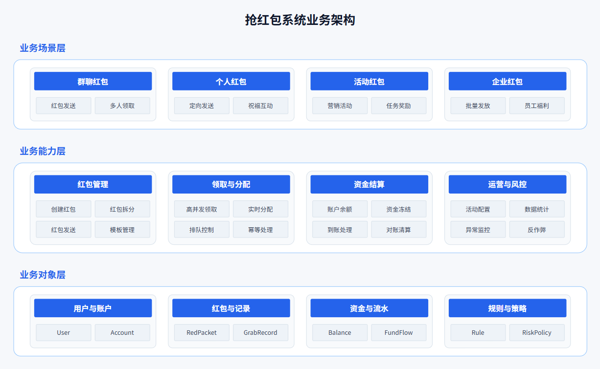
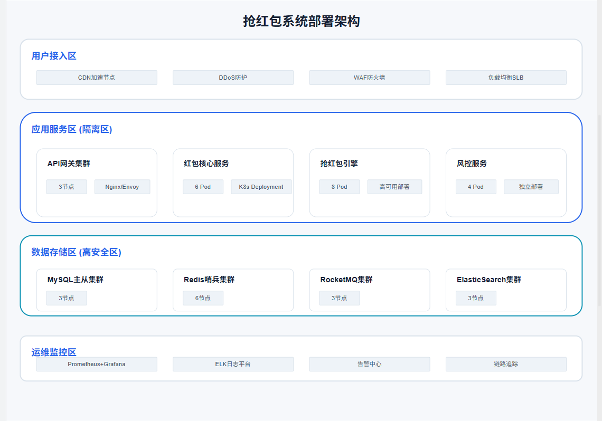
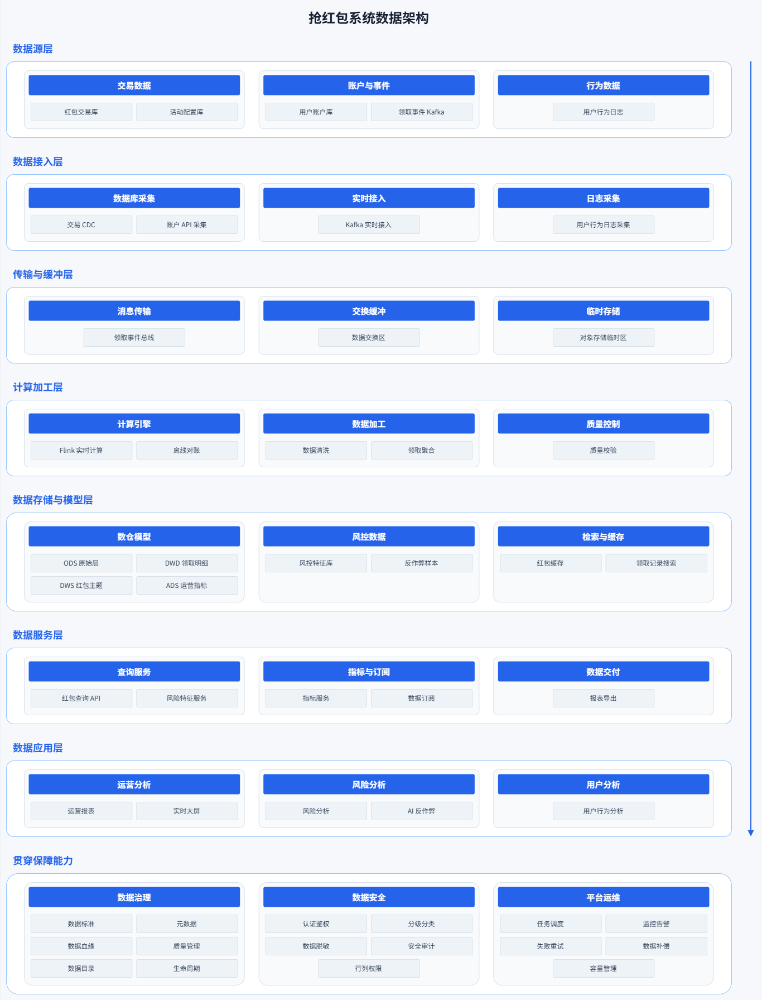
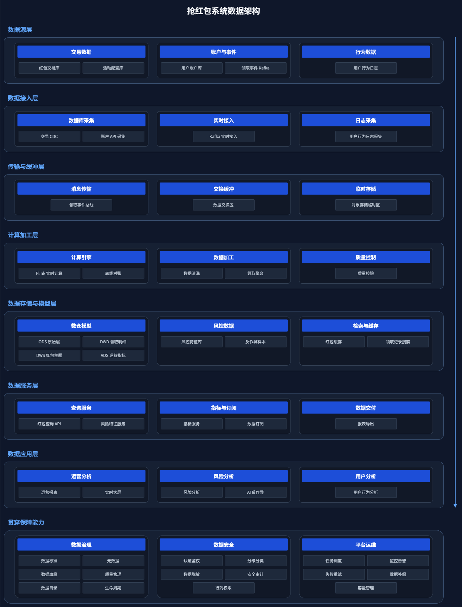
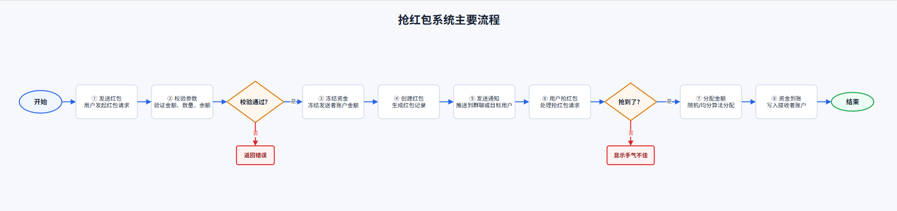
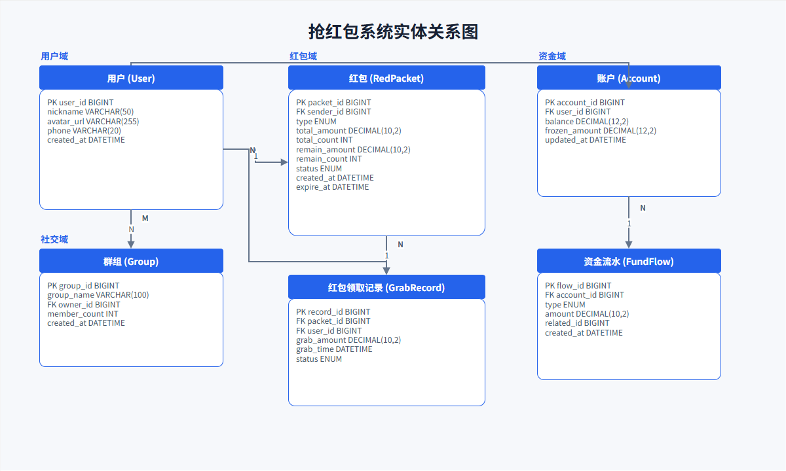
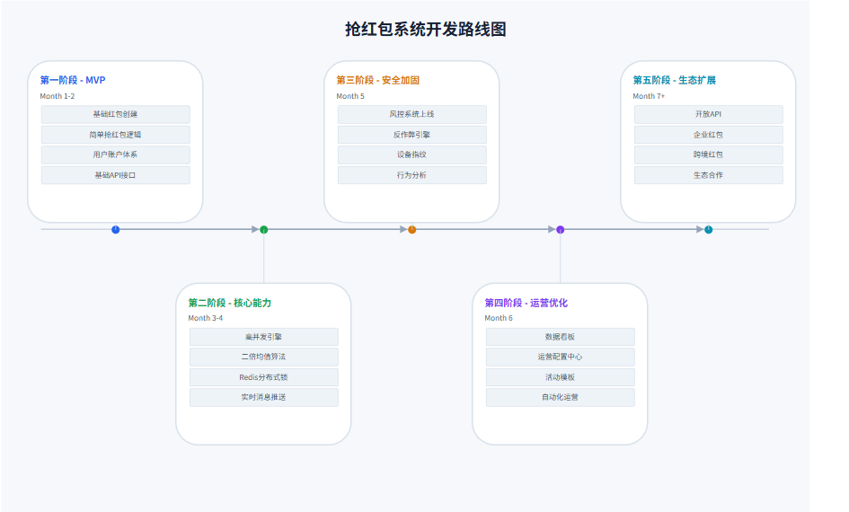

# xml-diagram 使用说明

## 第一部分：Skill 使用说明

### 适用场景

- 生成可在 Draw.io 或 diagrams.net 中继续编辑的技术图。
- 绘制业务、应用、技术、部署、数据架构，以及流程、状态、时序和关系图。
- 只需浏览器展示的高质量矢量图时使用 `svg-generator`。

### 快速使用

```text
请使用 xml-diagram 绘制抢红包系统的业务架构图和用户抢红包时序图。
```

### 支持的图类型

- 业务架构图、应用架构图、技术架构图、部署架构图、数据架构图
- 线性流程图、分支流程图、生命周期图、状态图
- 时序图
- ER 图、依赖关系图、知识关系图
- 对比图、决策矩阵、SWOT 分析图
- 时间线、路线图、总结图
- 更多

### 核心流程

1. 确认图形类型、信息层级和主题。
2. 规划元素、布局、颜色和连线。
3. 匹配模板并生成 Draw.io XML。
4. 检查颜色、布局、重叠、字体、连线和画布留白。
5. 使用校验器检查 XML，并通过 Draw.io 真实渲染。
6. 修正问题后输出最终文件。

## 第二部分：Skill 示例输出

> 现在有一个抢红包系统，请使用 xml-diagram 绘制系统的业务架构图、技术架构图、部署架构图、数据架构图、主要流程图、用户抢红包时序图、ER 图、功能总结图、系统开发关键节点图和系统开发路线图。深色背景和浅色背景都需要。

测试环境：OpenCode，Mimo v2.5 Free 模型。

本轮以抢红包系统架构图作为布局验证案例。业务、技术、部署和数据架构统一采用一级标题外置、一级容器独立、二级标题条居中、内容标签紧凑网格的结构；数据架构示例中的七层仅作为候选内容框架，浅色和深色版本保持完全一致的坐标与尺寸。

### Draw.io 文件索引

| 图形类型 | 浅色版本 | 深色版本 |
| --- | --- | --- |
| 业务架构图 | [architecture-business-light-red-packet.drawio](drawio/architecture-business-light-red-packet.drawio) | [architecture-business-dark-red-packet.drawio](drawio/architecture-business-dark-red-packet.drawio) |
| 技术架构图 | [architecture-technical-light-red-packet.drawio](drawio/architecture-technical-light-red-packet.drawio) | [architecture-technical-dark-red-packet.drawio](drawio/architecture-technical-dark-red-packet.drawio) |
| 部署架构图 | [architecture-deployment-light-red-packet.drawio](drawio/architecture-deployment-light-red-packet.drawio) | [architecture-deployment-dark-red-packet.drawio](drawio/architecture-deployment-dark-red-packet.drawio) |
| 数据架构图 | [architecture-data-light-red-packet.drawio](drawio/architecture-data-light-red-packet.drawio) | [architecture-data-dark-red-packet.drawio](drawio/architecture-data-dark-red-packet.drawio) |
| 主要流程图 | [flow-branching-main-light-red-packet.drawio](drawio/flow-branching-main-light-red-packet.drawio) | [flow-branching-main-dark-red-packet.drawio](drawio/flow-branching-main-dark-red-packet.drawio) |
| 用户抢红包时序图 | [sequence-grab-light-red-packet.drawio](drawio/sequence-grab-light-red-packet.drawio) | [sequence-grab-dark-red-packet.drawio](drawio/sequence-grab-dark-red-packet.drawio) |
| ER 图 | [relationship-er-light-red-packet.drawio](drawio/relationship-er-light-red-packet.drawio) | [relationship-er-dark-red-packet.drawio](drawio/relationship-er-dark-red-packet.drawio) |
| 功能总结图 | [summary-function-light-red-packet.drawio](drawio/summary-function-light-red-packet.drawio) | [summary-function-dark-red-packet.drawio](drawio/summary-function-dark-red-packet.drawio) |
| 系统开发关键节点图 | [timeline-project-milestones-light-red-packet.drawio](drawio/timeline-project-milestones-light-red-packet.drawio) | [timeline-project-milestones-dark-red-packet.drawio](drawio/timeline-project-milestones-dark-red-packet.drawio) |
| 系统开发路线图 | [project-roadmap-light-red-packet.drawio](drawio/project-roadmap-light-red-packet.drawio) | [project-roadmap-dark-red-packet.drawio](drawio/project-roadmap-dark-red-packet.drawio) |

### 代表截图

#### 业务架构图（浅色）



#### 业务架构图（深色）


#### 技术架构图


#### 部署架构图



#### 数据架构图





#### 主要流程图



#### 用户抢红包时序图


#### ER 图



#### 系统开发路线图



### 验证结果

- 20 个 Draw.io 文件已通过严格 XML 校验；各组浅色与深色版本保持相同坐标和尺寸。
- 抢红包业务、技术、部署和数据架构图已通过 diagrams.net 真实渲染验证。
- 已重点检查一级标题与容器间距、二级标题居中、同级卡片均匀分布、元素重叠、字体清晰度和画布留白；数据架构与其他架构使用同一套组件、间距和配色规范，未发现遮挡或局部挤压。
