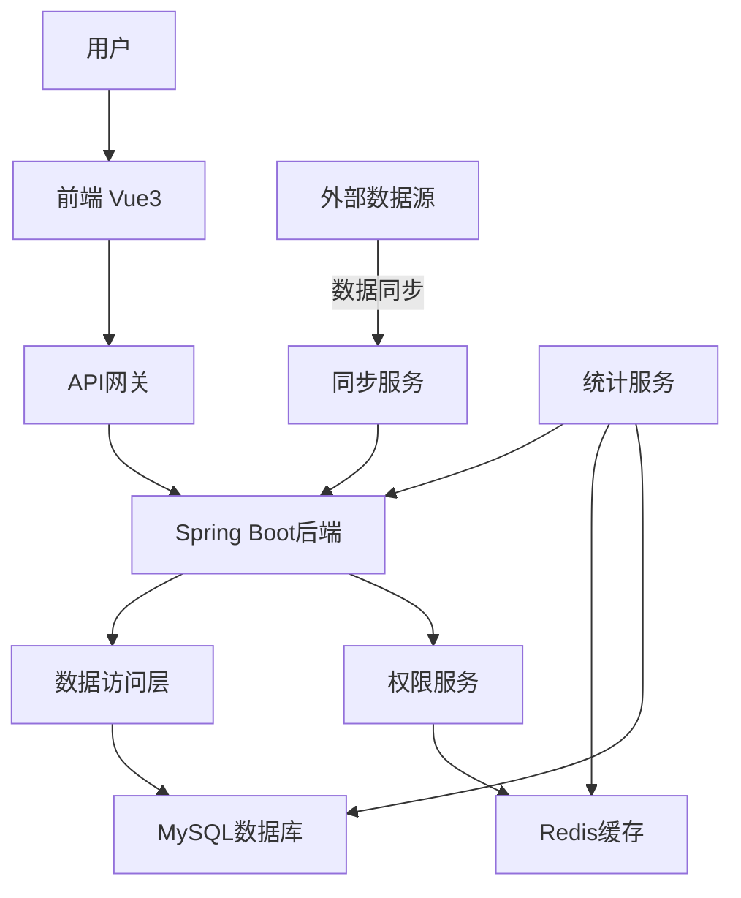
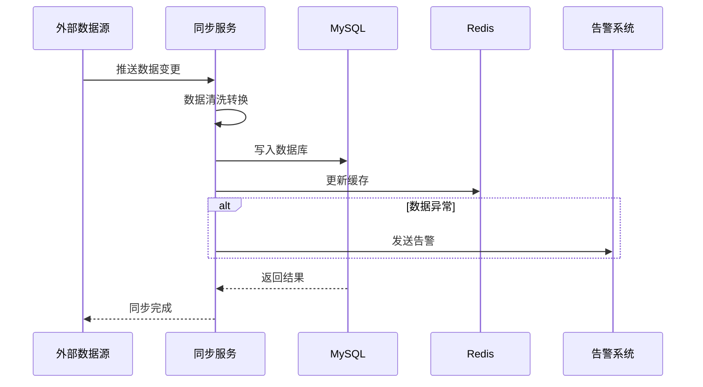
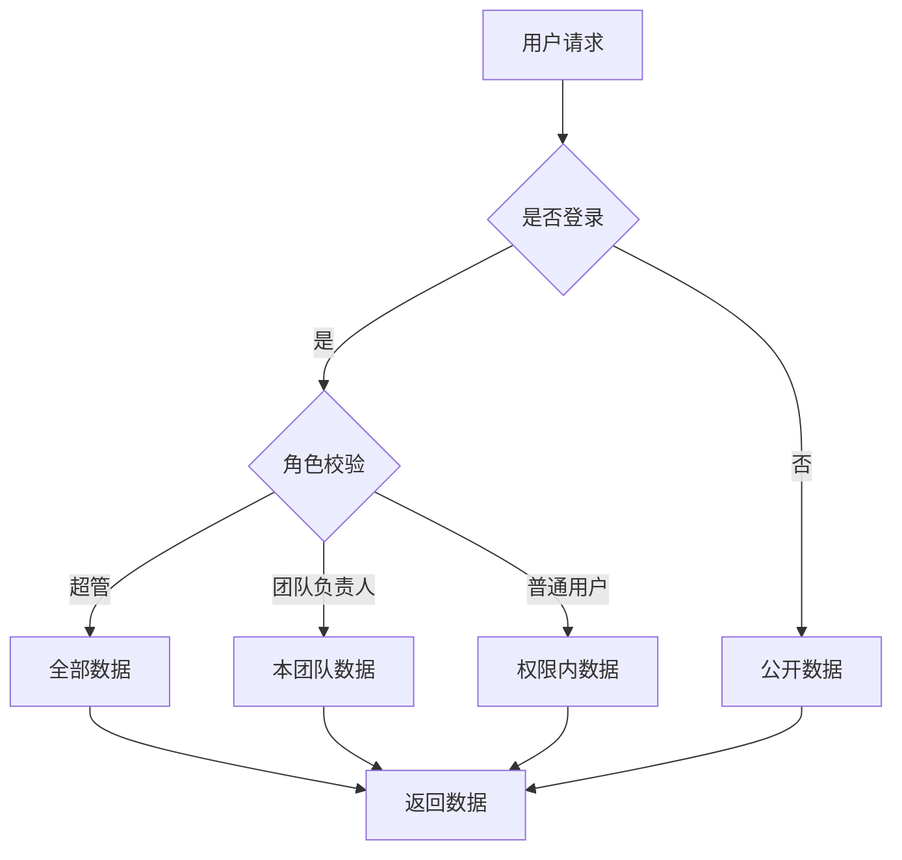

# 软件台账管理平台 - 技术方案设计

## 1 项目概述

### 1.1 项目背景
建立统一的软件台账管理平台，实现软件资产的规范化管理，主要包含软件台账和软件使用关系台账两大核心功能，支持多维度统计分析和可视化展示。

### 1.2 技术栈
- 前端：Vue3 + Element Plus
- 后端：Spring Boot + MyBatis
- 数据库：MySQL 8.0
- 缓存：Redis
- 大数据量处理：分表分库

---

## 2 主要流程设计

### 2.1 整体架构流程

### 2.2 数据同步流程

### 2.3 权限控制流程

---

## 3 库表设计

### 3.1 核心数据表

#### 3.1.1 软件台账表 (software)
| 字段名 | 类型 | 说明 | 备注 |
|--------|------|------|------|
| id | BIGINT | 主键ID | 自增 |
| software_name | VARCHAR(200) | 软件名称 | 唯一索引 |
| manage_type | TINYINT | 管理类型 | 1-商业软件 2-开源软件 3-自研软件 |
| func_type_level1 | VARCHAR(50) | 功能类型一级 | 办公/开发测试/运维管理/系统类 |
| func_type_level2 | VARCHAR(50) | 功能类型二级 | 办公-文字处理等 |
| media_type | TINYINT | 介质类型 | 1-产品类 2-组件类 |
| repo_type | VARCHAR(20) | 仓库类型 | maven/npm/pypi等，仅组件类 |
| owner_id | BIGINT | 负责人ID | 关联user表 |
| open_source_license | VARCHAR(100) | 开源协议 | 仅开源软件 |
| use_limit | VARCHAR(500) | 使用限制 | - |
| description | TEXT | 软件功能介绍 | - |
| manual_url | VARCHAR(500) | 使用手册URL | - |
| created_at | DATETIME | 创建时间 | - |
| updated_at | DATETIME | 更新时间 | - |

#### 3.1.2 软件版本介质表 (software_media)
| 字段名 | 类型 | 说明 | 备注 |
|--------|------|------|------|
| id | BIGINT | 主键ID | 自增 |
| software_id | BIGINT | 软件ID | 外键，关联software表 |
| version | VARCHAR(50) | 软件版本 | - |
| media_name | VARCHAR(200) | 介质名称 | - |
| download_url | VARCHAR(500) | 介质下载地址 | - |
| open_source_license | VARCHAR(100) | 开源协议 | - |
| description | TEXT | 介质描述 | - |
| media_type | VARCHAR(20) | 介质类型 | 安装包/镜像/sdk |
| file_size | BIGINT | 介质大小(字节) | - |
| use_limit | VARCHAR(500) | 使用限制 | - |
| usage_instruction | TEXT | 使用说明 | - |
| created_at | DATETIME | 创建时间 | - |
| updated_at | DATETIME | 更新时间 | - |

#### 3.1.3 终端使用关系表 (terminal_usage) - 分表
| 字段名 | 类型 | 说明 | 备注 |
|--------|------|------|------|
| id | BIGINT | 主键ID | 自增 |
| terminal_mac | VARCHAR(50) | 终端MAC | 分片键 |
| terminal_ip | VARCHAR(50) | 终端IP | 索引 |
| software_name | VARCHAR(200) | 软件名称 | - |
| software_version | VARCHAR(50) | 软件版本 | - |
| is_compliant | TINYINT | 是否合规 | 0-否 1-是 |
| is_blacklist | TINYINT | 是否黑名单 | 0-否 1-是 |
| install_path | VARCHAR(500) | 安装路径 | - |
| install_time | DATETIME | 安装时间 | - |
| data_status | TINYINT | 数据状态 | 1-正常 2-残留 3-未知 |
| created_at | DATETIME | 创建时间 | - |
| updated_at | DATETIME | 更新时间 | - |

**分表策略**：按终端MAC哈希分片，建议16或32个分片

#### 3.1.4 终端设备表 (terminal_device)
| 字段名 | 类型 | 说明 | 备注 |
|--------|------|------|------|
| id | BIGINT | 主键ID | 自增 |
| terminal_mac | VARCHAR(50) | 终端MAC | 唯一索引 |
| terminal_ip | VARCHAR(50) | 终端IP | - |
| network_segment | VARCHAR(50) | 终端网段 | 办公/开发测试/生产 |
| terminal_name | VARCHAR(200) | 终端名称 | - |
| owner_id | BIGINT | 终端负责人ID | 关联user表 |
| owner_team_id | BIGINT | 负责人团队ID | 关联team表 |
| status | TINYINT | 终端状态 | 1-正常 2-已回收 3-未知 |
| created_at | DATETIME | 创建时间 | - |
| updated_at | DATETIME | 更新时间 | - |

#### 3.1.5 应用系统使用关系表-组件类 (app_component_usage) - 分表
| 字段名 | 类型 | 说明 | 备注 |
|--------|------|------|------|
| id | BIGINT | 主键ID | 自增 |
| app_system_name | VARCHAR(200) | 应用系统名称 | 索引 |
| software_name | VARCHAR(200) | 软件名称 | - |
| software_version | VARCHAR(50) | 软件版本 | - |
| is_compliant | TINYINT | 是否合规 | - |
| is_blacklist | TINYINT | 是否黑名单 | - |
| media_type | TINYINT | 介质类型 | - |
| repo_type | VARCHAR(20) | 仓库类型 | - |
| open_source_license | VARCHAR(100) | 开源协议 | - |
| created_at | DATETIME | 创建时间 | - |
| updated_at | DATETIME | 更新时间 | - |

**分表策略**：按应用系统名称哈希分片

#### 3.1.6 应用系统使用关系表-产品类 (app_product_usage) - 分表
| 字段名 | 类型 | 说明 | 备注 |
|--------|------|------|------|
| id | BIGINT | 主键ID | 自增 |
| app_system_name | VARCHAR(200) | 应用系统名称 | 索引 |
| software_name | VARCHAR(200) | 软件名称 | - |
| software_version | VARCHAR(50) | 软件版本 | - |
| is_compliant | TINYINT | 是否合规 | - |
| is_blacklist | TINYINT | 是否黑名单 | - |
| server_ip | VARCHAR(50) | 所在服务器IP | - |
| media_type | TINYINT | 介质类型 | - |
| open_source_license | VARCHAR(100) | 开源协议 | - |
| created_at | DATETIME | 创建时间 | - |
| updated_at | DATETIME | 更新时间 | - |

#### 3.1.7 应用系统表 (app_system)
| 字段名 | 类型 | 说明 | 备注 |
|--------|------|------|------|
| id | BIGINT | 主键ID | 自增 |
| app_system_name | VARCHAR(200) | 应用系统名称 | 唯一索引 |
| owner_id | BIGINT | 负责人ID | 关联user表 |
| team_leader_id | BIGINT | 团队负责人ID | 关联user表 |
| app_type | VARCHAR(50) | 应用系统类型 | - |
| app_level | VARCHAR(20) | 应用系统级别 | - |
| created_at | DATETIME | 创建时间 | - |
| updated_at | DATETIME |更新时间 | - |

#### 3.1.8 服务器使用关系表 (server_usage_pkg/pypi/jar) - 按类型分表
| 字段名 | 类型 | 说明 | 备注 |
|--------|------|------|------|
| id | BIGINT | 主键ID | 自增 |
| server_ip | VARCHAR(50) | 服务器IP | 分片键+索引 |
| server_name | VARCHAR(200) | 服务器名称 | - |
| server_type | VARCHAR(50) | 服务器类型 | - |
| software_name | VARCHAR(200) | 安装软件名称 | - |
| software_version | VARCHAR(50) | 安装软件版本 | - |
| is_compliant | TINYINT | 是否合规 | - |
| is_blacklist | TINYINT | 是否黑名单 | - |
| install_path | VARCHAR(500) | 安装软件位置 | - |
| software_type | VARCHAR(20) | 软件类型 | pkg/pypi/jar |
| extra_fields | JSON | 其他字段 | 根据软件类型不同有差异 |
| created_at | DATETIME | 创建时间 | - |
| updated_at | DATETIME | 更新时间 | - |

**分表策略**：按software_type分为3张表，每张表按server_ip哈希分片

#### 3.1.9 服务器表 (server)
| 字段名 | 类型 | 说明 | 备注 |
|--------|------|------|------|
| id | BIGINT | 主键ID | 自增 |
| server_ip | VARCHAR(50) | 服务器IP | 唯一索引 |
| server_name | VARCHAR(200) | 服务器名称 | - |
| app_system_id | BIGINT | 所属应用系统ID | 关联app_system表 |
| created_at | DATETIME | 创建时间 | - |
| updated_at | DATETIME | 更新时间 | - |

#### 3.1.10 同步任务表 (sync_task)
| 字段名 | 类型 | 说明 | 备注 |
|--------|------|------|------|
| id | BIGINT | 主键ID | 自增 |
| source_type | VARCHAR(50) | 数据源类型 | terminal/app/deploy/server |
| source_name | VARCHAR(200) | 数据源名称 | - |
| status | TINYINT | 同步状态 | 1-同步中 2-成功 3-失败 |
| last_sync_time | DATETIME | 最后同步时间 | - |
| total_count | BIGINT | 数据总量 | - |
| change_count | BIGINT | 变更数量 | - |
| error_message | TEXT | 错误信息 | - |
| created_at | DATETIME | 创建时间 | - |
| updated_at | DATETIME | 更新时间 | - |

#### 3.1.11 用户表 (user)
| 字段名 | 类型 | 说明 | 备注 |
|--------|------|------|------|
| id | BIGINT | 主键ID | 自增 |
| username | VARCHAR(50) | 用户名 | 唯一索引 |
| real_name | VARCHAR(100) | 真实姓名 | - |
| email | VARCHAR(100) | 邮箱 | - |
| role | TINYINT | 角色 | 1-超管 2-团队负责人 3-普通用户 |
| team_id | BIGINT | 团队ID | 关联team表 |
| created_at | DATETIME | 创建时间 | - |
| updated_at | DATETIME | 更新时间 | - |

#### 3.1.12 团队表 (team)
| 字段名 | 类型 | 说明 | 备注 |
|--------|------|------|------|
| id | BIGINT | 主键ID | 自增 |
| team_name | VARCHAR(100) | 团队名称 | 唯一索引 |
| leader_id | BIGINT | 团队负责人ID | 关联user表 |
| created_at | DATETIME | 创建时间 | - |
| updated_at | DATETIME | 更新时间 | - |

---

## 4 接口设计

### 4.1 软件台账接口

| 接口名称 | 请求方式 | 路径 | 说明 |
|---------|---------|------|------|
| 软件列表 | GET | /api/software/list | 分页查询软件列表 |
| 软件详情 | GET | /api/software/{id} | 获取软件详情 |
| 版本介质列表 | GET | /api/software/{id}/media | 获取软件版本介质列表 |
| 软件搜索 | GET | /api/software/search | 关键词搜索软件 |

### 4.2 终端使用关系接口

| 接口名称 | 请求方式 | 路径 | 说明 |
|---------|---------|------|------|
| 终端使用关系列表 | GET | /api/terminal/usage/list | 分页查询终端使用关系 |
| 终端使用关系详情 | GET | /api/terminal/usage/{id} | 获取单条记录详情 |
| 终端统计 | GET | /api/terminal/stats | 终端使用统计 |

### 4.3 应用系统使用关系接口

| 接口名称 | 请求方式 | 路径 | 说明 |
|---------|---------|------|------|
| 应用系统使用关系列表 | GET | /api/app/usage/list | 分页查询应用系统使用关系 |
| 应用系统统计 | GET | /api/app/stats | 应用系统使用统计 |

### 4.4 服务器使用关系接口

| 接口名称 | 请求方式 | 路径 | 说明 |
|---------|---------|------|------|
| 服务器使用关系列表 | GET | /api/server/usage/list | 分页查询服务器使用关系 |
| 服务器统计 | GET | /api/server/stats | 服务器使用统计 |

### 4.5 统计大屏接口

| 接口名称 | 请求方式 | 路径 | 说明 |
|---------|---------|------|------|
| 软件台账统计 | GET | /api/stats/software | 获取软件台账统计 |
| 使用关系统计 | GET | /api/stats/usage | 获取使用关系统计 |
| 同步状态 | GET | /api/sync/status | 获取同步状态 |

---

## 5 非功能设计保证

### 5.1 性能优化

1. **分表分库**
   - 终端使用关系表：按终端MAC哈希分16片
   - 应用系统使用关系表：按应用系统名称哈希分16片
   - 服务器使用关系表：按软件类型分3张表(pkg/pypi/jar)，每张表按server_ip哈希分16片

2. **索引优化**
   - 高频查询字段建立索引
   - 复合索引优化多条件查询
   - 定期分析索引使用情况

3. **缓存策略**
   - Redis缓存热点数据
   - 软件台账数据缓存5分钟
   - 统计数据缓存1分钟

4. **分页优化**
   - 深度分页采用游标分页
   - 总数查询采用近似计数

### 5.2 权限控制

1. **数据级权限**
   - 超管：可查看全部数据
   - 团队负责人：可查看本团队数据
   - 普通用户：根据数据归属查看

2. **API权限校验**
   - 接口调用前进行权限校验
   - 敏感操作需要二次验证

### 5.3 数据同步

1. **增量同步**
   - 采用CDC方式监听数据变更
   - 支持断点续传

2. **同步监控**
   - 实时监控同步状态
   - 异常自动告警
   - 失败重试机制

3. **数据一致性**
   - 定期数据校验
   - 异常数据告警

### 5.4 高可用

1. **服务冗余**
   - 后端服务多实例部署
   - 数据库主从复制

2. **容错处理**
   - 接口超时降级
   - 熔断器保护

---

## 6 任务排期安排

| 任务编号 | 任务内容 | 工期(天) | 里程碑 | 备注 |
|---------|---------|---------|--------|------|
| T01 | 项目初始化、环境搭建 | 2 | - | - |
| T02 | 库表设计及实现 | 3 | 基础架构完成 | - |
| T03 | 软件台账功能开发 | 5 | 核心功能开发 | 列表+详情 |
| T04 | 终端使用关系功能开发 | 5 | 核心功能开发 | 含分表 |
| T05 | 应用系统使用关系功能开发 | 5 | 核心功能开发 | 含分表 |
| T06 | 服务器使用关系功能开发 | 5 | 核心功能开发 | 按类型分表 |
| T07 | 统计大屏开发 | 3 | 数据分析完成 | - |
| T08 | 同步服务开发 | 5 | 数据同步完成 | - |
| T09 | 权限控制开发 | 3 | 安全功能完成 | - |
| T10 | 联调测试 | 5 | 系统测试 | - |
| T11 | 性能优化 | 3 | 优化完成 | - |
| T12 | UAT验收 | 3 | 上线准备 | - |
| T13 | 部署上线 | 2 | 上线 | - |

**预计上线日期**：任务启动后约 45 个工作日

---

## 7 技术风险与应对

| 风险点 | 风险等级 | 应对措施 |
|--------|---------|----------|
| 大数据量查询性能 | 高 | 分表分库 + 索引优化 + 缓存 |
| 多数据源同步一致性 | 中 | CDC + 事务补偿 + 定期校验 |
| 权限控制复杂度 | 中 | 抽象权限服务 + 数据过滤 |
| 实时统计性能 | 低 | 预计算 + 缓存 + 异步处理 |
