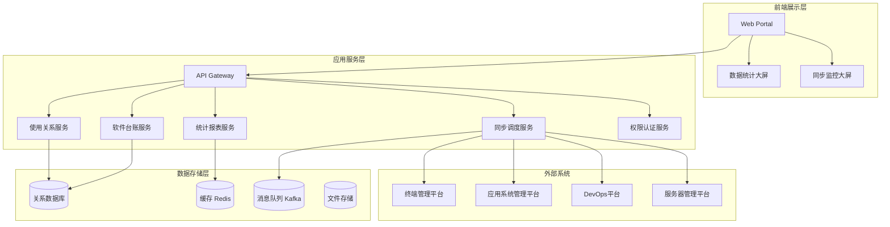
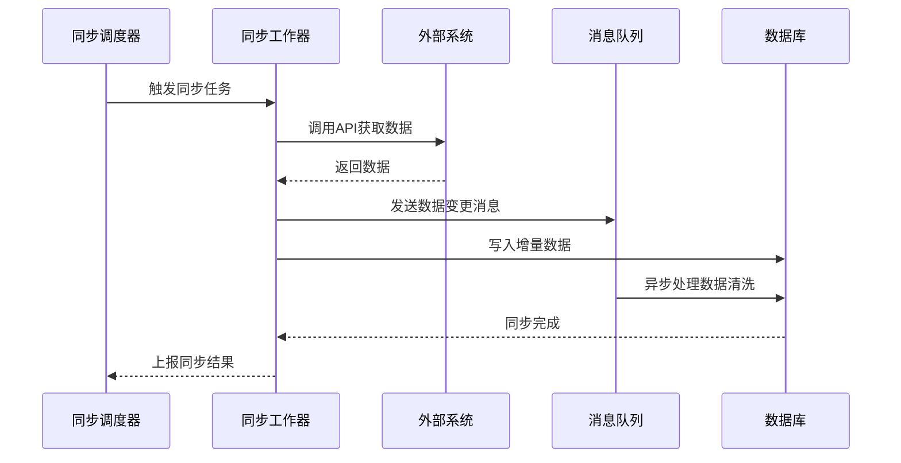
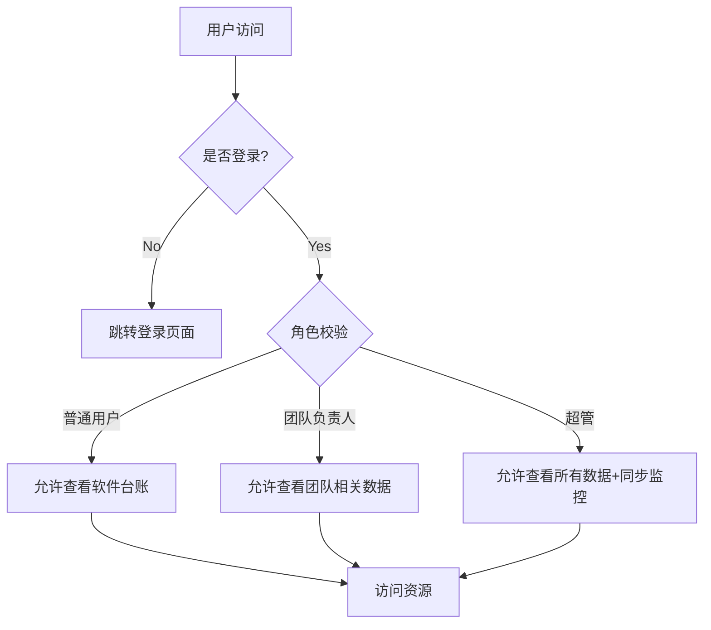

# 软件台账管理平台技术方案设计

## 需求背景
为了对公司软件资产进行统一管理，建立软件台账管理平台，实现软件台账和软件使用关系台账的集中管理，支持多维度查询、筛选、统计，提升软件资产可视化水平，满足不同角色的数据查看和管理需求，并提供可观测能力（数据统计大屏、同步状态监控）。

## 需求要点
1. **软件台账管理**：包含软件基本信息管理和版本介质管理，支持产品类、组件类两种管理类型。
2. **软件使用关系台账管理**：分为终端类、应用系统类、服务器三大类，每类下细分小类别，记录软件使用关系及合规状态。
3. **可观测需求**：提供软件数据统计大屏和同步情况监控大屏，支持多维度统计和告警下钻。
4. **权限需求**：根据不同角色（超管、团队负责人、普通用户）控制数据查看范围。

## 技术方案设计

### 主要流程设计

#### 1. 系统整体架构图

#### 2. 数据同步流程

#### 3. 权限验证流程

### 库表设计

#### 1. 软件台账相关表

**表: software**（软件基本信息）
| 字段名 | 类型 | 说明 | 约束 |
|--------|------|------|------|
| id | BIGINT PRIMARY KEY | 软件ID，自增 | NOT NULL |
| name | VARCHAR(200) | 软件名称 | NOT NULL |
| management_type | ENUM('COMMERCIAL','OPEN_SOURCE','SELF_DEV') | 管理类型：商业、开源、自研 | NOT NULL |
| function_type1 | VARCHAR(50) | 功能类型一级 | NOT NULL |
| function_type2 | VARCHAR(100) | 功能类型二级 | |
| medium_type | ENUM('PRODUCT','COMPONENT') | 介质类型：产品类、组件类 | NOT NULL |
| repo_type | VARCHAR(50) | 仓库类型（仅组件类） | |
| owner | VARCHAR(100) | 软件负责人 | |
| license | VARCHAR(200) | 开源协议（仅开源软件） | |
| usage_restriction | TEXT | 使用限制 | |
| introduction | TEXT | 软件功能介绍 | |
| manual_url | VARCHAR(500) | 使用手册URL | |
| created_at | TIMESTAMP | 创建时间 | DEFAULT CURRENT_TIMESTAMP |
| updated_at | TIMESTAMP | 更新时间 | ON UPDATE CURRENT_TIMESTAMP |

**表: software_version**（软件版本介质）
| 字段名 | 类型 | 说明 | 约束 |
|--------|------|------|------|
| id | BIGINT PRIMARY KEY | 版本ID | NOT NULL |
| software_id | BIGINT | 关联software.id | FOREIGN KEY |
| version | VARCHAR(50) | 软件版本 | NOT NULL |
| medium_name | VARCHAR(200) | 介质名称 | NOT NULL |
| download_url | VARCHAR(500) | 下载地址 | |
| license | VARCHAR(200) | 开源协议 | |
| medium_description | TEXT | 介质描述 | |
| medium_type | ENUM('INSTALLER','IMAGE','SDK','OTHER') | 介质类型 | NOT NULL |
| size | BIGINT | 介质大小（字节） | |
| usage_restriction | TEXT | 使用限制 | |
| usage_instructions | TEXT | 使用说明 | |
| created_at | TIMESTAMP | 创建时间 | DEFAULT CURRENT_TIMESTAMP |

**索引设计**：
- software: idx_name (name), idx_management_type (management_type), idx_function_type1 (function_type1)
- software_version: idx_software_id (software_id), idx_version (version)

#### 2. 终端使用关系相关表

**表: terminal_device**（终端设备数据模型 A2）
| 字段名 | 类型 | 说明 | 约束 |
|--------|------|------|------|
| mac | VARCHAR(20) PRIMARY KEY | 终端MAC地址 | NOT NULL |
| ip | VARCHAR(50) | 终端IP | |
| segment | ENUM('OFFICE','DEV_TEST','PRODUCTION') | 终端网段 | NOT NULL |
| name | VARCHAR(200) | 终端名称 | |
| owner | VARCHAR(100) | 终端负责人 | |
| owner_team | VARCHAR(100) | 终端负责人团队 | |
| status | ENUM('NORMAL','RECYCLED','UNKNOWN') | 终端状态 | DEFAULT 'NORMAL' |
| last_seen | TIMESTAMP | 最后活跃时间 | |

**表: terminal_usage**（终端使用关系数据模型 A1）
| 字段名 | 类型 | 说明 | 约束 |
|--------|------|------|------|
| id | BIGINT PRIMARY KEY | 记录ID | NOT NULL |
| terminal_mac | VARCHAR(20) | 关联terminal_device.mac | FOREIGN KEY |
| software_name | VARCHAR(200) | 使用软件名称 | NOT NULL |
| software_version | VARCHAR(50) | 使用软件版本 | |
| is_compliant | BOOLEAN | 软件是否合规 | DEFAULT TRUE |
| is_blacklist | BOOLEAN | 是否为黑名单软件 | DEFAULT FALSE |
| install_path | VARCHAR(500) | 安装路径 | |
| install_time | TIMESTAMP | 安装时间 | |
| data_status | ENUM('NORMAL','RESIDUAL','UNKNOWN') | 数据状态 | DEFAULT 'NORMAL' |
| created_at | TIMESTAMP | 创建时间 | DEFAULT CURRENT_TIMESTAMP |

**分区策略**：
- terminal_usage 表按 `terminal_mac` 哈希分区，10个分区，缓解2000万数据量压力。
- 建立联合索引: idx_terminal_mac_status (terminal_mac, data_status), idx_software_name (software_name)。

#### 3. 应用系统使用关系相关表

**表: app_system**（应用系统数据模型 B3）
| 字段名 | 类型 | 说明 | 约束 |
|--------|------|------|------|
| name | VARCHAR(200) PRIMARY KEY | 应用系统名称 | NOT NULL |
| owner | VARCHAR(100) | 应用系统负责人 | |
| team_owner | VARCHAR(100) | 应用系统团队负责人 | |
| type | VARCHAR(50) | 应用系统类型 | |
| level | ENUM('CORE','IMPORTANT','NORMAL') | 应用系统级别 | DEFAULT 'NORMAL' |
| created_at | TIMESTAMP | 创建时间 | DEFAULT CURRENT_TIMESTAMP |

**表: app_usage_component**（应用系统使用关系-组件类 B1）
| 字段名 | 类型 | 说明 | 约束 |
|--------|------|------|------|
| id | BIGINT PRIMARY KEY | 记录ID | NOT NULL |
| app_name | VARCHAR(200) | 关联app_system.name | FOREIGN KEY |
| software_name | VARCHAR(200) | 使用软件名称 | NOT NULL |
| software_version | VARCHAR(50) | 使用软件版本 | |
| is_compliant | BOOLEAN | 软件是否合规 | DEFAULT TRUE |
| is_blacklist | BOOLEAN | 是否为黑名单软件 | DEFAULT FALSE |
| medium_type | ENUM('PRODUCT','COMPONENT') | 介质类型 | NOT NULL |
| repo_type | VARCHAR(50) | 仓库类型 | NOT NULL |
| license | VARCHAR(200) | 开源协议 | |
| sync_source | ENUM('DEVOPS','APP_MGMT') | 数据来源 | DEFAULT 'DEVOPS' |
| created_at | TIMESTAMP | 创建时间 | DEFAULT CURRENT_TIMESTAMP |

**表: app_usage_product**（应用系统使用关系-产品类 B2）
| 字段名 | 类型 | 说明 | 约束 |
|--------|------|------|------|
| id | BIGINT PRIMARY KEY | 记录ID | NOT NULL |
| app_name | VARCHAR(200) | 关联app_system.name | FOREIGN KEY |
| software_name | VARCHAR(200) | 使用软件名称 | NOT NULL |
| software_version | VARCHAR(50) | 使用软件版本 | |
| is_compliant | BOOLEAN | 软件是否合规 | DEFAULT TRUE |
| is_blacklist | BOOLEAN | 是否为黑名单软件 | DEFAULT FALSE |
| server_ip | VARCHAR(50) | 所在服务器IP | |
| medium_type | ENUM('PRODUCT','COMPONENT') | 介质类型 | NOT NULL |
| license | VARCHAR(200) | 开源协议 | |
| sync_source | ENUM('DEVOPS','APP_MGMT') | 数据来源 | DEFAULT 'APP_MGMT' |
| created_at | TIMESTAMP | 创建时间 | DEFAULT CURRENT_TIMESTAMP |

**分区策略**：
- app_usage_component 按 `repo_type` 列表分区（maven、npm、pypi等）。
- app_usage_product 按 `app_name` 哈希分区，10个分区。

#### 4. 服务器使用关系相关表

**表: server**（服务器数据模型 C2）
| 字段名 | 类型 | 说明 | 约束 |
|--------|------|------|------|
| ip | VARCHAR(50) PRIMARY KEY | 服务器IP | NOT NULL |
| name | VARCHAR(200) | 服务器名称 | |
| type | VARCHAR(50) | 服务器类型 | |
| app_name | VARCHAR(200) | 所属应用系统 | FOREIGN KEY |
| created_at | TIMESTAMP | 创建时间 | DEFAULT CURRENT_TIMESTAMP |

**表: server_usage_pkg**（服务器使用关系 - pkg 类型）
| 字段名 | 类型 | 说明 | 约束 |
|--------|------|------|------|
| id | BIGINT PRIMARY KEY | 记录ID | NOT NULL |
| server_ip | VARCHAR(50) | 关联server.ip | FOREIGN KEY |
| software_name | VARCHAR(200) | 安装软件名称 | NOT NULL |
| software_version | VARCHAR(50) | 安装软件版本 | |
| is_compliant | BOOLEAN | 软件是否合规 | DEFAULT TRUE |
| is_blacklist | BOOLEAN | 是否为黑名单软件 | DEFAULT FALSE |
| install_path | VARCHAR(500) | 安装位置 | |
| extra_fields | JSON | 其他字段（JSON扩展） | |
| created_at | TIMESTAMP | 创建时间 | DEFAULT CURRENT_TIMESTAMP |

**表: server_usage_jar**（服务器使用关系 - jar 类型）结构同 pkg。
**表: server_usage_pypi**（服务器使用关系 - pypi 类型）结构同 pkg。

**分区策略**：
- 按软件类型分表，每张表按 `server_ip` 范围分区，每个分区约500万数据。

#### 5. 同步任务与监控表

**表: sync_task**（同步任务记录）
| 字段名 | 类型 | 说明 | 约束 |
|--------|------|------|------|
| id | BIGINT PRIMARY KEY | 任务ID | NOT NULL |
| source_system | VARCHAR(50) | 源系统 | NOT NULL |
| status | ENUM('PENDING','RUNNING','SUCCESS','FAILED') | 同步状态 | DEFAULT 'PENDING' |
| total_records | INT | 总记录数 | |
| success_records | INT | 成功记录数 | |
| failed_records | INT | 失败记录数 | |
| error_message | TEXT | 错误信息 | |
| started_at | TIMESTAMP | 开始时间 | |
| finished_at | TIMESTAMP | 结束时间 | |
| created_at | TIMESTAMP | 创建时间 | DEFAULT CURRENT_TIMESTAMP |

**表: data_change_log**（数据变动日志）
| 字段名 | 类型 | 说明 | 约束 |
|--------|------|------|------|
| id | BIGINT PRIMARY KEY | 日志ID | NOT NULL |
| table_name | VARCHAR(50) | 表名 | NOT NULL |
| record_id | VARCHAR(100) | 记录ID | NOT NULL |
| operation | ENUM('INSERT','UPDATE','DELETE') | 操作类型 | NOT NULL |
| change_details | JSON | 变更详情 | |
| changed_by | VARCHAR(100) | 变更者 | |
| changed_at | TIMESTAMP | 变更时间 | DEFAULT CURRENT_TIMESTAMP |

### 接口设计

#### 1. 软件台账接口

**GET /api/software** - 软件列表查询
- 参数: page, size, name, managementType, functionType1, mediumType
- 响应: { total: number, data: Software[] }

**GET /api/software/{id}** - 软件详情
- 响应: SoftwareDetail (包含版本列表)

**GET /api/software/{id}/versions** - 软件版本列表
- 参数: page, size, version, mediumType
- 响应: { total: number, data: SoftwareVersion[] }

#### 2. 使用关系查询接口

**GET /api/usage/terminal** - 终端使用关系列表
- 参数: page, size, terminalMac, softwareName, isCompliant, dataStatus
- 权限: 终端负责人/团队负责人/超管
- 响应: { total: number, data: TerminalUsage[] }

**GET /api/usage/app** - 应用系统使用关系列表
- 参数: page, size, appName, softwareName, mediumType, repoType
- 权限: 应用系统负责人/团队负责人/超管
- 响应: { total: number, data: AppUsage[] }

**GET /api/usage/server** - 服务器使用关系列表
- 参数: page, size, serverIp, softwareName, softwareType
- 权限: 服务器所属应用系统负责人/团队负责人/超管
- 响应: { total: number, data: ServerUsage[] }

#### 3. 统计报表接口

**GET /api/statistics/usage-by-scenario** - 按使用场景统计
- 参数: startDate, endDate
- 响应: { terminal: number, app: number, server: number }

**GET /api/statistics/detailed/{scene}** - 详细统计（终端/应用系统/服务器）
- 参数: scene = terminal|app|server
- 响应: 多维统计结果

**GET /api/statistics/software** - 软件台账统计
- 响应: 各维度统计

#### 4. 同步管理接口（仅超管）

**POST /api/sync/trigger** - 触发同步
- 参数: sourceSystem (terminal|app|server)

**GET /api/sync/tasks** - 同步任务列表
- 参数: page, size, status, sourceSystem

**GET /api/sync/monitoring** - 同步监控数据
- 响应: 实时同步状态、失败原因统计等

### 非功能设计保证

#### 1. 性能保证
- **数据库优化**：大型表分区、读写分离、索引优化。
- **缓存策略**：频繁访问的统计结果缓存到 Redis，TTL 5分钟。
- **异步处理**：数据同步、统计计算等耗时操作通过消息队列异步处理。
- **CDN 加速**：静态资源（软件介质下载）使用 CDN 分发。

#### 2. 可用性保证
- **集群部署**：应用服务无状态，支持水平扩展。
- **负载均衡**：前端通过 Nginx 负载均衡到多个应用实例。
- **数据库主从**：MySQL 主从复制，读操作分流到从库。
- **故障转移**：关键服务健康检查，自动故障转移。

#### 3. 可观测性保证
- **日志集中**：所有服务日志收集到 ELK 栈，便于排查。
- **指标监控**：Prometheus + Grafana 监控系统关键指标（QPS、响应时间、错误率）。
- **链路追踪**：集成 Jaeger 进行分布式链路追踪。
- **告警机制**：同步失败、服务异常等触发邮件、钉钉告警。

#### 4. 安全性保证
- **身份认证**：基于 JWT 的 Token 认证，支持 SSO 集成。
- **权限控制**：RBAC 模型，接口级别细粒度权限。
- **数据加密**：敏感数据传输 HTTPS，数据库字段加密。
- **审计日志**：所有数据变更记录审计日志，可追溯。

### 任务排期安排

| 阶段 | 任务编号 | 任务内容 | 预计工时（人日） | 开始日期 | 结束日期 | 里程碑 | 备注 |
|------|----------|----------|----------------|----------|----------|--------|------|
| 第一阶段 | T1 | 需求分析与技术方案设计 | 5 | 2025-03-01 | 2025-03-05 | 方案评审通过 | 已完成 |
| 第二阶段 | T2 | 数据库设计与搭建 | 8 | 2025-03-06 | 2025-03-15 | 数据库就绪 | 包含分区、索引优化 |
| 第三阶段 | T3 | 后端核心服务开发 | 20 | 2025-03-16 | 2025-04-10 | 接口联调完成 | 软件台账、使用关系服务 |
| 第四阶段 | T4 | 前端页面开发 | 15 | 2025-03-25 | 2025-04-15 | 前后端联调完成 | 基于原型设计 |
| 第五阶段 | T5 | 同步服务开发 | 10 | 2025-04-05 | 2025-04-20 | 同步功能可用 | 与外部系统对接 |
| 第六阶段 | T6 | 统计报表与大屏开发 | 12 | 2025-04-15 | 2025-04-30 | 大屏上线 | ECharts 集成 |
| 第七阶段 | T7 | 权限与安全功能 | 8 | 2025-05-01 | 2025-05-10 | 权限测试通过 | JWT、RBAC |
| 第八阶段 | T8 | 性能优化与测试 | 10 | 2025-05-11 | 2025-05-25 | 性能达标 | 压力测试、调优 |
| 第九阶段 | T9 | 上线部署与监控 | 5 | 2025-05-26 | 2025-05-31 | 正式上线 | 生产环境部署 |
| 总计 | | | 93 | 2025-03-01 | 2025-05-31 | 项目交付 | 约3个月 |

**预计上线日期**：2025年5月31日

### 技术选型建议
- **前端**：Vue 3 + Element Plus + ECharts + Axios
- **后端**：Spring Boot 3 + MyBatis Plus + Spring Security
- **数据库**：MySQL 8.0（分区支持） + Redis 7.0
- **消息队列**：RabbitMQ 或 Apache Kafka
- **部署**：Docker + Kubernetes（可选） + Nginx
- **监控**：Prometheus + Grafana + ELK Stack

## 风险与应对
1. **数据量过大导致查询慢**：已设计分区、分表、索引、缓存策略。
2. **外部系统接口不稳定**：同步服务增加重试机制、熔断降级。
3. **权限模型复杂**：采用成熟 RBAC 框架，充分测试。
4. **大屏数据实时性要求高**：统计结果预计算，增量更新缓存。