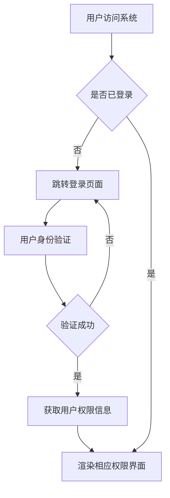
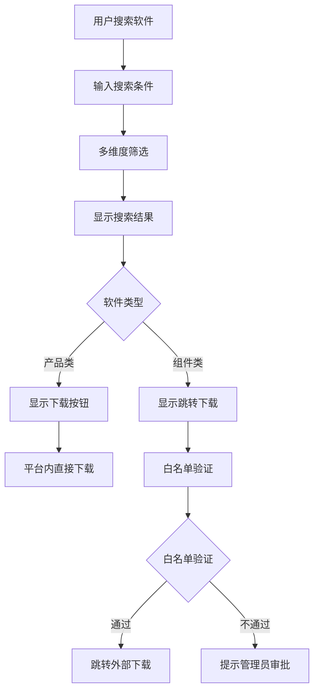
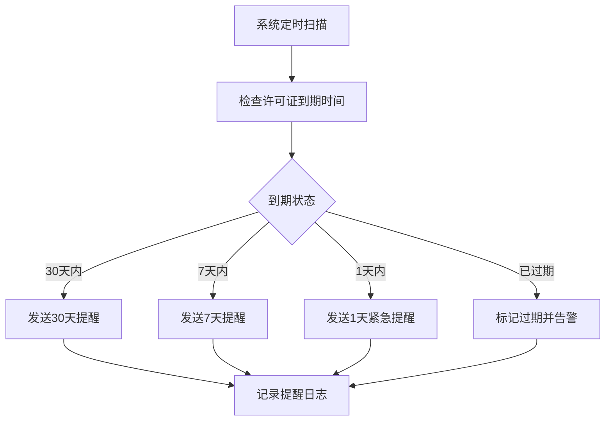

# 软件管理平台技术方案设计

## 需求背景

基于需求分析评审文档和原型设计，为公司建立统一的软件管理平台，实现对商业软件、开源软件、自主软件的统一管理，支持产品类和组件类软件的差异化管理和数据模型。

## 关键需求拆解

### 1. 软件管理差异化需求
- **产品类软件**：独立部署、平台内下载、基于软件名称标识
- **组件类软件**：集成使用、外部链接跳转、基于坐标标识

### 2. 核心用户交互逻辑
- **搜索筛选流程**：多维度筛选 + 实时搜索
- **权限验证流程**：RBAC权限控制 + 操作权限验证
- **下载管理流程**：产品类直接下载 + 组件类白名单跳转
- **评价管理流程**：发布即显示 + 后台管理

### 3. 关键业务流程
- **软件生命周期管理**：录入 → 版本管理 → 许可证监控 → 统计分析
- **用户权限管理**：用户认证 → 角色分配 → 权限验证 → 操作审计

## 主要流程设计

### 1. 用户登录与权限验证流程


### 2. 软件搜索与下载流程


### 3. 许可证管理流程


## 库表设计

### 核心表结构设计

#### 1. 软件主表 (software_info)
```sql
CREATE TABLE software_info (
    id BIGINT PRIMARY KEY AUTO_INCREMENT,
    software_name VARCHAR(255) NOT NULL COMMENT '产品类软件名称',
    component_coordinate VARCHAR(255) COMMENT '组件类软件坐标',
    software_type ENUM('commercial', 'opensource', 'selfdeveloped') NOT NULL COMMENT '软件类型',
    software_category ENUM('product', 'component') NOT NULL COMMENT '软件分类',
    open_source_protocol VARCHAR(100) COMMENT '开源协议',
    description TEXT COMMENT '功能简介',
    usage_scope VARCHAR(500) COMMENT '使用范围',
    function_type VARCHAR(100) COMMENT '功能分类',
    admin_id BIGINT COMMENT '管理员ID',
    status ENUM('active', 'inactive', 'deleted') DEFAULT 'active',
    created_time TIMESTAMP DEFAULT CURRENT_TIMESTAMP,
    updated_time TIMESTAMP DEFAULT CURRENT_TIMESTAMP ON UPDATE CURRENT_TIMESTAMP,
    INDEX idx_software_name (software_name),
    INDEX idx_coordinate (component_coordinate),
    INDEX idx_type_category (software_type, software_category)
) COMMENT '软件信息主表';
```

#### 2. 软件版本表 (software_version)
```sql
CREATE TABLE software_version (
    id BIGINT PRIMARY KEY AUTO_INCREMENT,
    software_id BIGINT NOT NULL COMMENT '关联软件ID',
    version_number VARCHAR(50) NOT NULL COMMENT '版本号',
    download_url VARCHAR(500) COMMENT '下载地址',
    external_url VARCHAR(500) COMMENT '外部下载地址(组件类)',
    media_description TEXT COMMENT '介质描述',
    release_notes TEXT COMMENT '发布说明',
    compatibility_info TEXT COMMENT '兼容性信息',
    dependencies TEXT COMMENT '依赖信息(组件类)',
    file_size BIGINT COMMENT '文件大小(字节)',
    download_count INT DEFAULT 0 COMMENT '下载次数',
    status ENUM('active', 'inactive', 'deleted') DEFAULT 'active',
    created_time TIMESTAMP DEFAULT CURRENT_TIMESTAMP,
    INDEX idx_software_version (software_id, version_number),
    INDEX idx_download_count (download_count DESC)
) COMMENT '软件版本表';
```

#### 3. 许可证管理表 (license_info)
```sql
CREATE TABLE license_info (
    id BIGINT PRIMARY KEY AUTO_INCREMENT,
    software_id BIGINT NOT NULL COMMENT '关联软件ID',
    license_type VARCHAR(100) NOT NULL COMMENT '许可证类型',
    license_file_path VARCHAR(500) COMMENT '许可证文件路径',
    expire_time TIMESTAMP COMMENT '到期时间',
    reminder_config JSON COMMENT '提醒配置',
    status ENUM('valid', 'expired', 'warning') DEFAULT 'valid',
    created_time TIMESTAMP DEFAULT CURRENT_TIMESTAMP,
    updated_time TIMESTAMP DEFAULT CURRENT_TIMESTAMP ON UPDATE CURRENT_TIMESTAMP,
    INDEX idx_software_license (software_id),
    INDEX idx_expire_time (expire_time)
) COMMENT '许可证信息表';
```

#### 4. 用户权限表 (user_info)
```sql
CREATE TABLE user_info (
    id BIGINT PRIMARY KEY AUTO_INCREMENT,
    username VARCHAR(100) NOT NULL UNIQUE COMMENT '用户名',
    email VARCHAR(255) NOT NULL UNIQUE COMMENT '邮箱',
    password_hash VARCHAR(255) NOT NULL COMMENT '密码哈希',
    department_id BIGINT COMMENT '部门ID',
    role_type ENUM('super_admin', 'dept_admin', 'normal_user') DEFAULT 'normal_user',
    status ENUM('active', 'inactive', 'deleted') DEFAULT 'active',
    last_login_time TIMESTAMP COMMENT '最后登录时间',
    created_time TIMESTAMP DEFAULT CURRENT_TIMESTAMP,
    INDEX idx_username (username),
    INDEX idx_email (email),
    INDEX idx_department (department_id)
) COMMENT '用户信息表';
```

#### 5. 外部系统白名单表 (external_whitelist)
```sql
CREATE TABLE external_whitelist (
    id BIGINT PRIMARY KEY AUTO_INCREMENT,
    domain VARCHAR(255) NOT NULL COMMENT '域名',
    url_pattern VARCHAR(500) COMMENT 'URL模式',
    description VARCHAR(500) COMMENT '描述',
    status ENUM('active', 'inactive') DEFAULT 'active',
    approver_id BIGINT COMMENT '审批人ID',
    approve_time TIMESTAMP COMMENT '审批时间',
    created_time TIMESTAMP DEFAULT CURRENT_TIMESTAMP,
    INDEX idx_domain (domain),
    INDEX idx_status (status)
) COMMENT '外部系统白名单表';
```

### 数据模型设计理由
1. **差异化标识设计**：产品类使用software_name，组件类使用component_coordinate，满足不同类型软件的标识需求
2. **分离式版本管理**：独立的版本表支持多版本管理和历史追踪
3. **权限模型设计**：基于RBAC模型，支持超级管理员、部门管理员、普通用户三级权限
4. **白名单安全设计**：独立的白名单表确保外部跳转安全性

## 接口设计

### 1. 软件管理接口

#### 搜索软件列表
- **接口路径**：`GET /api/software/list`
- **接口说明**：支持多维度搜索和筛选的软件列表查询
- **请求参数**：
  - page: 页码 (默认1)
  - size: 每页数量 (默认20)
  - keyword: 搜索关键词
  - type: 软件类型 (commercial/opensource/selfdeveloped)
  - category: 软件分类 (product/component)
  - function_type: 功能分类
- **涉及页面**：软件列表页
- **主要逻辑**：多表关联查询 + 条件筛选 + 分页返回

```json
{
  "code": 200,
  "data": {
    "total": 150,
    "list": [
      {
        "id": 1,
        "software_name": null,
        "component_coordinate": "org.springframework.boot:spring-boot-starter-web",
        "software_type": "opensource",
        "software_category": "component",
        "open_source_protocol": "Apache 2.0",
        "description": "Spring Boot Web启动器",
        "download_count": 1250,
        "latest_version": "3.2.1",
        "license_status": "valid"
      }
    ]
  }
}
```

#### 获取软件详情
- **接口路径**：`GET /api/software/{id}/detail`
- **接口说明**：获取软件完整档案信息
- **请求参数**：id - 软件ID
- **涉及页面**：软件详情页
- **主要逻辑**：关联查询软件基础信息、版本信息、许可证信息、使用统计

#### 软件下载接口
- **接口路径**：`GET /api/software/version/{version_id}/download`
- **接口说明**：产品类软件直接下载
- **请求参数**：version_id - 版本ID
- **涉及页面**：软件详情页
- **主要逻辑**：权限验证 + 下载计数 + 文件流返回

#### 外部跳转验证接口
- **接口路径**：`POST /api/software/version/{version_id}/external-redirect`
- **接口说明**：组件类软件外部链接验证
- **请求参数**：target_url - 目标URL
- **涉及页面**：软件详情页
- **主要逻辑**：白名单验证 + 安全日志记录

### 2. 权限管理接口

#### 用户登录
- **接口路径**：`POST /api/auth/login`
- **接口说明**：用户身份验证和token生成
- **请求参数**：username, password
- **涉及页面**：登录页
- **主要逻辑**：密码验证 + JWT token生成

#### 权限验证
- **接口路径**：`GET /api/auth/permissions`
- **接口说明**：获取当前用户权限信息
- **涉及页面**：所有页面
- **主要逻辑**：token解析 + 权限查询

### 3. 统计分析接口

#### 软件使用统计
- **接口路径**：`GET /api/statistics/usage`
- **接口说明**：获取软件使用统计数据
- **涉及页面**：统计分析页
- **主要逻辑**：定时批量计算 + 图表数据格式化

## 非功能性设计保证

### 1. 性能优化方案
- **数据库优化**：索引优化、读写分离、分页查询优化
- **缓存策略**：Redis缓存热门软件信息、统计数据，设置合理的过期时间
- **文件存储**：CDN加速下载、OSS对象存储，支持大文件分片下载
- **并发控制**：连接池管理、限流降级，支持500+并发用户

### 2. 安全保障方案
- **数据安全**：敏感数据AES加密存储、传输层TLS加密
- **权限安全**：JWT token认证、RBAC权限模型、操作审计日志
- **外部跳转安全**：URL白名单验证、管理员审批流程、安全日志记录
- **防攻击措施**：SQL注入防护、XSS防护、CSRF防护

### 3. 可用性保障
- **服务监控**：Prometheus + Grafana监控，实时监控系统状态
- **日志管理**：ELK日志收集分析，便于问题排查和性能分析
- **告警机制**：许可证到期提醒、系统异常告警、存储空间告警
- **数据备份**：定时数据备份、异地容灾，保证数据安全性

### 4. 数据规模保障
- **存储方案**：支持1000+软件、5000+版本、1000+用户的数据规模
- **搜索优化**：Elasticsearch全文搜索，支持模糊搜索和高级筛选
- **统计计算**：基础数据每小时更新，复杂报告每日凌晨生成
- **扩展性**：微服务架构设计，支持水平扩展

## 任务排期安排

| 任务编号 | 任务内容 | 预计工期 | 时间节点 | 里程碑事项 | 备注 |
|---------|---------|---------|---------|-----------|------|
| T001 | 数据库设计和建表 | 3天 | 第1-3天 | 数据库设计完成 | 包括索引优化 |
| T002 | 用户权限模块开发 | 5天 | 第4-8天 | 权限系统上线 | 支持三级权限 |
| T003 | 软件管理API开发 | 8天 | 第9-16天 | 核心API完成 | 支持CRUD操作 |
| T004 | 搜索筛选功能开发 | 4天 | 第17-20天 | 搜索功能上线 | 支持多维度筛选 |
| T005 | 文件上传下载功能 | 5天 | 第21-25天 | 文件管理完成 | 支持大文件处理 |
| T006 | 外部链接白名单功能 | 3天 | 第26-28天 | 安全验证完成 | 支持审批流程 |
| T007 | 许可证管理功能 | 4天 | 第29-32天 | 许可证监控上线 | 自动提醒功能 |
| T008 | 统计分析模块 | 6天 | 第33-38天 | 统计功能完成 | 定时计算任务 |
| T009 | 前端页面开发 | 10天 | 第39-48天 | 前端界面完成 | 响应式设计 |
| T010 | 系统集成测试 | 5天 | 第49-53天 | 集成测试完成 | 性能安全测试 |
| T011 | 部署上线 | 3天 | 第54-56天 | 系统正式上线 | 生产环境部署 |
| **总计** | **56天** | | | | |

### 关键里程碑
1. **第16天**：核心API功能完成，可进行基础数据操作
2. **第38天**：后端功能全部完成，开始前端开发
3. **第53天**：系统开发完成，进入测试阶段
4. **第56天**：系统正式上线，投入使用

## 预计上线日期：项目启动后第56天