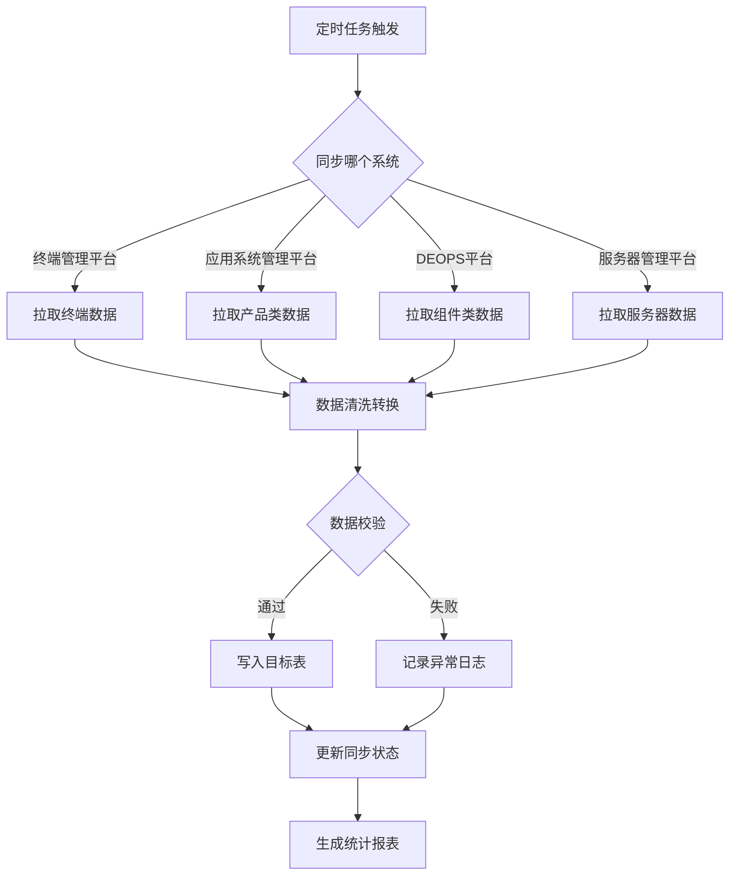
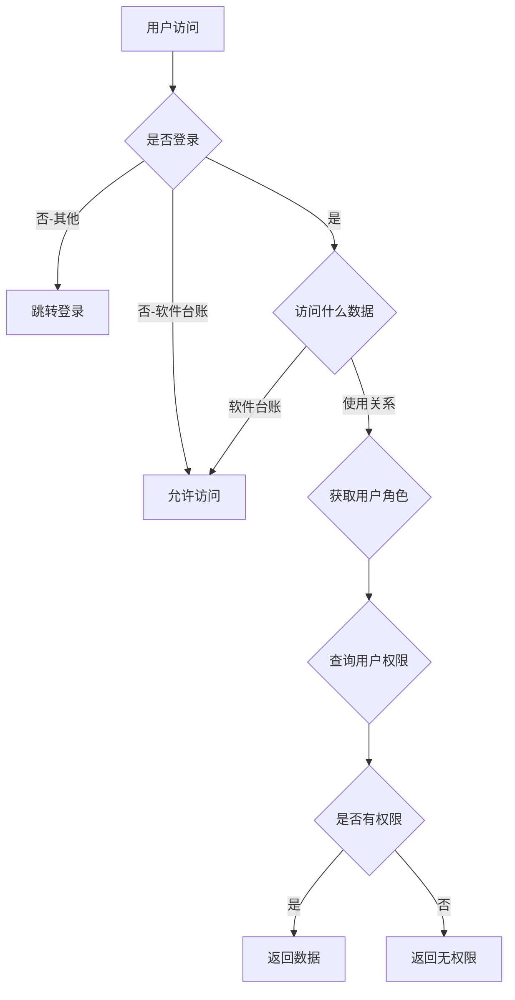
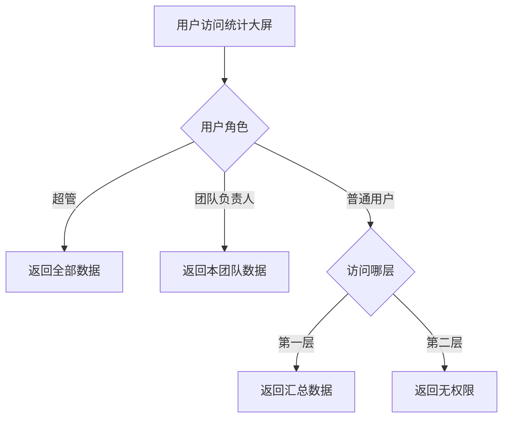

# 软件台账管理平台技术方案设计

## 1. 需求背景

基于需求分析文档，为公司建立统一的软件台账管理平台，实现对商业软件、开源软件、自研软件的统一管理，支持产品类和组件类软件的差异化管理和数据模型，同时追踪终端、应用系统、服务器的 软件使用情况。

## 2. 关键需求拆解

### 2.1 软件管理差异化需求

| 软件类型 | 标识方式 | 下载方式 | 管理重点 |
|----------|----------|----------|----------|
| 产品类 | 软件名称 | 平台内下载 | 版本介质管理 |
| 组件类 | 坐标(groupId:artifactId) | 外部系统跳转 | 仓库地址管理 |

### 2.2 使用关系数据规模

| 数据类型 | 数据量 | 存储策略 |
|----------|--------|----------|
| 终端使用关系(A1) | 2000万条 | 分表存储，按终端MAC哈希分区 |
| 终端设备(A2) | 10万条 | 常规索引 |
| 应用系统使用关系-组件(B1) | 100万条 | 按应用系统分区 |
| 应用系统使用关系-产品(B2) | 100万条 | 按应用系统分区 |
| 应用系统(B3) | 1万条 | 常规索引 |
| 服务器使用关系-jar(C1) | 2000万条 | 独立表 |
| 服务器使用关系-pkg(C1) | 2000万条 | 独立表 |
| 服务器使用关系-pypi(C1) | 500万条 | 独立表 |
| 服务器(C2) | - | 常规索引 |

### 2.3 权限模型

```
权限层级：负责人本人 → 团队负责人 → 超管
- 终端使用关系：终端负责人、团队负责人、超管可查看
- 应用系统使用关系：应用系统负责人、团队负责人、超管可查看
- 服务器使用关系：应用系统负责人、团队负责人、超管可查看
- 同步监控：仅超管可查看
```

## 3. 主要流程设计

### 3.1 数据同步流程


```mermaid
graph TD
    A[定时任务触发] --> B{同步哪个系统}
    B -->|终端管理平台| C[拉取终端数据]
    B -->|应用系统管理平台| D[拉取产品类数据]
    B -->|DEOPS平台| E[拉取组件类数据]
    B -->|服务器管理平台| F[拉取服务器数据]
    
    C --> G[数据清洗转换]
    D --> G
    E --> G
    F --> G
    
    G --> H{数据校验}
    H -->|通过| I[写入目标表]
    H -->|失败| J[记录异常日志]
    
    I --> K[更新同步状态]
    J --> K
    
    K --> L[生成统计报表]
```

### 3.2 权限验证流程


```mermaid
graph TD
    A[用户访问] --> B{是否登录}
    B -->|否-软件台账| C[允许访问]
    B -->|否-其他| D[跳转登录]
    
    B -->|是| E{访问什么数据}
    E -->|软件台账| C
    E -->|使用关系| F{获取用户角色}
    
    F --> G{查询用户权限}
    G --> H{是否有权限}
    H -->|是| I[返回数据]
    H -->|否| J[返回无权限]
```

### 3.3 统计大屏数据获取流程


```mermaid
graph TD
    A[用户访问统计大屏] --> B{用户角色}
    B -->|超管| C[返回全部数据]
    B -->|团队负责人| D[返回本团队数据]
    B -->|普通用户| E{访问哪层}
    E -->|第一层| F[返回汇总数据]
    E -->|第二层| J[返回无权限]
```

## 4. 库表设计

### 4.1 核心表结构

#### 4.1.1 软件主表 (software_info)

```sql
CREATE TABLE software_info (
    id BIGINT PRIMARY KEY AUTO_INCREMENT,
    software_name VARCHAR(255) COMMENT '软件名称',
    component_coordinate VARCHAR(255) COMMENT '组件坐标',
    management_type ENUM('commercial', 'opensource', 'selfdeveloped') NOT NULL COMMENT '管理类型',
    function_type_l1 VARCHAR(100) COMMENT '功能类型一级',
    function_type_l2 VARCHAR(100) COMMENT '功能类型二级',
    media_type ENUM('product', 'component') NOT NULL COMMENT '介质类型',
    repo_type VARCHAR(50) COMMENT '仓库类型:maven/npm/pypi',
    owner_id BIGINT COMMENT '负责人ID',
    open_source_license VARCHAR(100) COMMENT '开源协议',
    usage_restriction VARCHAR(500) COMMENT '使用限制',
    description TEXT COMMENT '功能介绍',
    manual_url VARCHAR(500) COMMENT '手册链接',
    created_time TIMESTAMP DEFAULT CURRENT_TIMESTAMP,
    updated_time TIMESTAMP DEFAULT CURRENT_TIMESTAMP ON UPDATE CURRENT_TIMESTAMP,
    INDEX idx_name (software_name),
    INDEX idx_coordinate (component_coordinate),
    INDEX idx_type (management_type, media_type),
    INDEX idx_owner (owner_id)
) COMMENT '软件信息表';
```

#### 4.1.2 软件版本表 (software_version)

```sql
CREATE TABLE software_version (
    id BIGINT PRIMARY KEY AUTO_INCREMENT,
    software_id BIGINT NOT NULL COMMENT '软件ID',
    version VARCHAR(50) NOT NULL COMMENT '版本号',
    media_name VARCHAR(255) COMMENT '介质名称',
    download_url VARCHAR(500) COMMENT '下载地址',
    external_url VARCHAR(500) COMMENT '外部下载链接',
    open_source_license VARCHAR(100) COMMENT '开源协议',
    media_description TEXT COMMENT '介质描述',
    media_type VARCHAR(50) COMMENT '介质类型:安装包/镜像/sdk',
    file_size BIGINT COMMENT '文件大小字节',
    usage_restriction VARCHAR(500) COMMENT '使用限制',
    usage_instruction TEXT COMMENT '使用说明',
    created_time TIMESTAMP DEFAULT CURRENT_TIMESTAMP,
    INDEX idx_software (software_id, version),
    INDEX idx_version (version)
) COMMENT '软件版本表';
```

#### 4.1.3 终端使用关系表 (terminal_usage) - 分表策略

```sql
-- 按MAC地址哈希分4个表
CREATE TABLE terminal_usage_0 (
    id BIGINT PRIMARY KEY AUTO_INCREMENT,
    terminal_mac VARCHAR(17) NOT NULL COMMENT '终端MAC',
    terminal_ip VARCHAR(15) COMMENT '终端IP',
    software_name VARCHAR(255) NOT NULL COMMENT '软件名称',
    software_version VARCHAR(50) COMMENT '软件版本',
    is_compliant TINYINT DEFAULT 0 COMMENT '是否合规',
    is_blacklist TINYINT DEFAULT 0 COMMENT '是否黑名单',
    install_path VARCHAR(500) COMMENT '安装路径',
    install_time DATETIME COMMENT '安装时间',
    data_status ENUM('normal', 'residual', 'unknown') DEFAULT 'normal' COMMENT '数据状态',
    created_time TIMESTAMP DEFAULT CURRENT_TIMESTAMP,
    updated_time TIMESTAMP DEFAULT CURRENT_TIMESTAMP ON UPDATE CURRENT_TIMESTAMP,
    INDEX idx_mac (terminal_mac),
    INDEX idx_ip (terminal_ip),
    INDEX idx_software (software_name)
) COMMENT '终端使用关系表0';

-- 同样创建 terminal_usage_1, terminal_usage_2, terminal_usage_3
```

#### 4.1.4 终端设备表 (terminal_device)

```sql
CREATE TABLE terminal_device (
    terminal_mac VARCHAR(17) PRIMARY KEY COMMENT '终端MAC',
    terminal_ip VARCHAR(15) COMMENT '终端IP',
    network_segment ENUM('office', 'dev', 'prod') COMMENT '网段',
    terminal_name VARCHAR(100) COMMENT '终端名称',
    owner_id BIGINT COMMENT '负责人ID',
    owner_team VARCHAR(100) COMMENT '团队名称',
    status ENUM('normal', 'recycled', 'unknown') DEFAULT 'normal' COMMENT '状态',
    created_time TIMESTAMP DEFAULT CURRENT_TIMESTAMP,
    updated_time TIMESTAMP DEFAULT CURRENT_TIMESTAMP ON UPDATE CURRENT_TIMESTAMP,
    INDEX idx_owner (owner_id),
    INDEX idx_team (owner_team)
) COMMENT '终端设备表';
```

#### 4.1.5 应用系统使用关系表 (app_usage_component)

```sql
CREATE TABLE app_usage_component (
    id BIGINT PRIMARY KEY AUTO_INCREMENT,
    app_name VARCHAR(255) NOT NULL COMMENT '应用系统名称',
    software_name VARCHAR(255) NOT NULL COMMENT '软件名称',
    software_version VARCHAR(50) COMMENT '软件版本',
    is_compliant TINYINT DEFAULT 0 COMMENT '是否合规',
    is_blacklist TINYINT DEFAULT 0 COMMENT '是否黑名单',
    media_type ENUM('product', 'component') COMMENT '介质类型',
    repo_type VARCHAR(50) COMMENT '仓库类型',
    open_source_license VARCHAR(100) COMMENT '开源协议',
    created_time TIMESTAMP DEFAULT CURRENT_TIMESTAMP,
    updated_time TIMESTAMP DEFAULT CURRENT_TIMESTAMP ON UPDATE CURRENT_TIMESTAMP,
    INDEX idx_app (app_name),
    INDEX idx_software (software_name)
) COMMENT '应用系统使用关系表-组件类';
```

#### 4.1.6 应用系统表 (application_system)

```sql
CREATE TABLE application_system (
    app_name VARCHAR(255) PRIMARY KEY COMMENT '应用系统名称',
    owner_id BIGINT COMMENT '负责人ID',
    team_leader_id BIGINT COMMENT '团队负责人ID',
    app_type VARCHAR(100) COMMENT '系统类型',
    app_level VARCHAR(50) COMMENT '系统级别',
    created_time TIMESTAMP DEFAULT CURRENT_TIMESTAMP,
    updated_time TIMESTAMP DEFAULT CURRENT_TIMESTAMP ON UPDATE CURRENT_TIMESTAMP,
    INDEX idx_owner (owner_id),
    INDEX idx_team_leader (team_leader_id)
) COMMENT '应用系统表';
```

#### 4.1.7 服务器使用关系表 (server_usage_jar/pkg/pypi)

```sql
CREATE TABLE server_usage_jar (
    id BIGINT PRIMARY KEY AUTO_INCREMENT,
    server_ip VARCHAR(15) NOT NULL COMMENT '服务器IP',
    server_name VARCHAR(100) COMMENT '服务器名称',
    server_type VARCHAR(50) COMMENT '服务器类型',
    software_name VARCHAR(255) NOT NULL COMMENT '软件名称',
    software_version VARCHAR(50) COMMENT '软件版本',
    is_compliant TINYINT DEFAULT 0 COMMENT '是否合规',
    is_blacklist TINYINT DEFAULT 0 COMMENT '是否黑名单',
    install_path VARCHAR(500) COMMENT '安装位置',
    extra_fields JSON COMMENT '扩展字段',
    created_time TIMESTAMP DEFAULT CURRENT_TIMESTAMP,
    updated_time TIMESTAMP DEFAULT CURRENT_TIMESTAMP ON UPDATE CURRENT_TIMESTAMP,
    INDEX idx_server (server_ip),
    INDEX idx_software (software_name)
) COMMENT '服务器使用关系表-jar';

-- 同样创建 server_usage_pkg, server_usage_pypi
```

#### 4.1.8 服务器表 (server_info)

```sql
CREATE TABLE server_info (
    server_ip VARCHAR(15) PRIMARY KEY COMMENT '服务器IP',
    server_name VARCHAR(100) COMMENT '服务器名称',
    app_name VARCHAR(255) COMMENT '所属应用系统',
    created_time TIMESTAMP DEFAULT CURRENT_TIMESTAMP,
    updated_time TIMESTAMP DEFAULT CURRENT_TIMESTAMP ON UPDATE CURRENT_TIMESTAMP,
    INDEX idx_app (app_name)
) COMMENT '服务器表';
```

#### 4.1.9 同步日志表 (sync_log)

```sql
CREATE TABLE sync_log (
    id BIGINT PRIMARY KEY AUTO_INCREMENT,
    source_system VARCHAR(50) NOT NULL COMMENT '源系统',
    sync_type ENUM('full', 'increment') COMMENT '同步类型',
    status ENUM('running', 'success', 'failed') COMMENT '状态',
    record_count INT DEFAULT 0 COMMENT '记录数',
    error_message TEXT COMMENT '错误信息',
    start_time DATETIME COMMENT '开始时间',
    end_time DATETIME COMMENT '结束时间',
    created_time TIMESTAMP DEFAULT CURRENT_TIMESTAMP,
    INDEX idx_source (source_system, status),
    INDEX idx_time (start_time)
) COMMENT '同步日志表';
```

#### 4.1.10 用户表 (user_info)

```sql
CREATE TABLE user_info (
    id BIGINT PRIMARY KEY AUTO_INCREMENT,
    username VARCHAR(100) NOT NULL COMMENT '用户名',
    role_type ENUM('super_admin', 'team_leader', 'owner', 'normal') DEFAULT 'normal' COMMENT '角色类型',
    team_name VARCHAR(100) COMMENT '所属团队',
    created_time TIMESTAMP DEFAULT CURRENT_TIMESTAMP,
    updated_time TIMESTAMP DEFAULT CURRENT_TIMESTAMP ON UPDATE CURRENT_TIMESTAMP,
    INDEX idx_username (username),
    INDEX idx_team (team_name)
) COMMENT '用户信息表';
```

### 4.2 设计理由

| 设计决策 | 理由 |
|----------|------|
| 分表存储终端数据 | 2000万条数据，单表查询性能差，按MAC哈希分区可降低单表数据量 |
| 服务器使用关系按类型分表 | jar/pkg/pypi 数据量差异大(500万~2000万)，分开存储便于管理和优化 |
| 独立同步日志表 | 记录同步状态、异常信息，支持同步监控和审计 |
| 扩展字段使用JSON | 服务器使用关系不同软件类型有不同字段，JSON可灵活存储 |

## 5. 接口设计

### 5.1 软件台账接口

#### 5.1.1 获取软件列表

```
接口路径: GET /api/software/list

请求参数:
- page: 页码 (默认1)
- size: 每页数量 (默认20)
- keyword: 搜索关键词
- management_type: 管理类型 (commercial/opensource/selfdeveloped)
- media_type: 介质类型 (product/component)
- function_type: 功能类型
- repo_type: 仓库类型

涉及页面: 软件列表页

返回示例:
{
    "code": 200,
    "data": {
        "total": 1280,
        "list": [
            {
                "id": 1,
                "software_name": "Spring Boot",
                "component_coordinate": "org.springframework.boot:spring-boot",
                "management_type": "opensource",
                "media_type": "component",
                "repo_type": "maven",
                "version_count": 128,
                "owner_name": "张三"
            }
        ]
    }
}
```

#### 5.1.2 获取软件详情

```
接口路径: GET /api/software/{id}/detail

请求参数: id - 软件ID

涉及页面: 软件详情页

返回示例:
{
    "code": 200,
    "data": {
        "id": 1,
        "software_name": "Spring Boot",
        "management_type": "opensource",
        "media_type": "component",
        "repo_type": "maven",
        "function_type_l1": "开发测试",
        "function_type_l2": "开发框架",
        "open_source_license": "Apache 2.0",
        "owner_name": "张三",
        "description": "Spring Boot是...",
        "versions": [...]
    }
}
```

### 5.2 使用关系接口

#### 5.2.1 获取终端使用关系列表

```
接口路径: GET /api/terminal/usage/list

请求参数:
- page, size: 分页参数
- keyword: 搜索关键词 (IP/MAC)
- network_segment: 网段筛选
- data_status: 数据状态
- is_compliant: 合规性筛选

涉及页面: 终端使用关系列表页

权限要求: 终端负责人、团队负责人、超管

返回示例:
{
    "code": 200,
    "data": {
        "total": 20000000,
        "list": [...]
    }
}
```

#### 5.2.2 获取应用系统使用关系列表

```
接口路径: GET /api/app/usage/list

请求参数:
- page, size: 分页参数
- usage_type: 使用类型 (component/product)
- keyword: 搜索关键词
- repo_type: 仓库类型 (仅component)
- is_compliant: 合规性筛选

涉及页面: 应用系统使用关系列表页

权限要求: 应用系统负责人、团队负责人、超管
```

#### 5.2.3 获取服务器使用关系列表

```
接口路径: GET /api/server/usage/list

请求参数:
- page, size: 分页参数
- software_type: 软件类型 (jar/pkg/pypi)
- keyword: 搜索关键词
- app_name: 应用系统名称
- is_compliant: 合规性筛选

涉及页面: 服务器使用关系列表页

权限要求: 应用系统负责人、团队负责人、超管
```

### 5.3 统计接口

#### 5.3.1 获取统计数据

```
接口路径: GET /api/statistics/summary

请求参数:
- level: 数据层级 (1-第一层/2-第二层)

涉及页面: 统计大屏

权限要求:
- level=1: 需登录
- level=2: 超管或团队负责人

返回示例:
{
    "code": 200,
    "data": {
        "usage_stats": {
            "terminal": 20000000,
            "app": 2000000,
            "server": 45000000
        },
        "software_stats": {
            "product": 480,
            "component": 800
        },
        "type_stats": {
            "commercial": 320,
            "opensource": 850,
            "selfdeveloped": 110
        }
    }
}
```

#### 5.3.2 获取同步状态

```
接口路径: GET /api/sync/status

涉及页面: 统计大屏-同步状态

权限要求: 仅超管

返回示例:
{
    "code": 200,
    "data": [
        {
            "source_system": "终端管理平台",
            "status": "success",
            "last_sync_time": "2024-01-15 10:30:00",
            "record_count": 20000000
        },
        ...
    ]
}
```

## 6. 非功能设计保证

### 6.1 性能优化方案

| 优化项 | 方案 |
|--------|------|
| 大数据量查询 | 分表分库 + 读写分离 + 索引优化 |
| 列表查询 | 延迟加载 + 虚拟滚动 |
| 缓存策略 | Redis缓存热点数据，设置TTL |
| 接口限流 | 令牌桶算法，支持500+并发 |
| 异步处理 | 统计报表异步计算，避免阻塞 |

### 6.2 安全方案

| 安全项 | 方案 |
|--------|------|
| 认证授权 | JWT Token + RBAC权限模型 |
| 数据脱敏 | MAC地址、IP 地址脱敏展示 |
| 传输安全 | HTTPS加密传输 |
| 操作审计 | 记录关键操作日志 |

### 6.3 可用性保障

| 保障项 | 方案 |
|--------|------|
| 服务监控 | Prometheus + Grafana |
| 日志管理 | ELK日志收集分析 |
| 数据备份 | 每日全量备份 + 实时增量 |
| 异常告警 | 同步失败、数据异常告警 |

### 6.4 数据规模保障

| 指标 | 目标 |
|------|------|
| 数据存储 | 支持亿级数据存储 |
| 查询响应 | <3秒(大数据量列表) |
| 并发支持 | 500+用户同时在线 |
| 可用性 | 99.9% |

## 7. 任务排期安排

| 任务编号 | 任务内容 | 预计工期 | 时间节点 | 里程碑事项 |
|----------|----------|----------|----------|-------------|
| T001 | 数据库设计与建表 | 3天 | 第1-3天 | 完成分表策略 |
| T002 | 用户权限模块 | 5天 | 第4-8天 | RBAC完成 |
| T003 | 软件台账API | 8天 | 第9-16天 | CRUD完成 |
| T004 | 使用关系API | 10天 | 第17-26天 | 三大类API完成 |
| T005 | 同步服务开发 | 8天 | 第27-34天 | 同步逻辑完成 |
| T006 | 统计模块开发 | 6天 | 第35-40天 | 统计功能完成 |
| T007 | 前端页面开发 | 12天 | 第41-52天 | 页面完成 |
| T008 | 系统集成测试 | 5天 | 第53-57天 | 联调完成 |
| T009 | 部署上线 | 3天 | 第58-60天 | 上线 |

**预计上线日期：项目启动后第60天**

---

## 8. 技术选型建议

| 层级 | 推荐技术 | 理由 |
|------|----------|------|
| 后端框架 | Spring Boot | 成熟稳定，适合大数据量处理 |
| 数据库 | MySQL 8.0 | 支持JSON、分区表 |
| 缓存 | Redis | 高性能缓存热点数据 |
| 搜索 | Elasticsearch | 支持亿级数据全文搜索 |
| 前端 | Vue3/React | 组件化开发，虚拟滚动 |
| 部署 | Docker + K8s | 容器化，支持弹性伸缩 |
